<div style="page-break-after: always; text-align: center; padding-top: 60px;">

<br>


<br>

# CFlux

## ERP & Zeitmanagement System

---

### Umfassendes Benutzerhandbuch

<br><br>

**Version 2.1**

**Februar 2026**

<br><br><br>

| | |
|---|---|
| **Produkt** | CFlux ERP & Zeitmanagement |
| **Dokumenttyp** | Benutzerhandbuch |
| **Version** | 2.1 |
| **Datum** | 14. Februar 2026 |
| **Sprache** | Deutsch |
| **Zielgruppe** | Mitarbeiter, Administratoren, HR |
| **Vertraulichkeit** | Intern |

<br><br>

*© 2026 CFlux Software GmbH — Alle Rechte vorbehalten.*

</div>

<div style="page-break-after: always;"></div>

## 📑 Inhaltsverzeichnis

### 1. [Einführung](#1-einführung)
   - [Was ist CFlux?](#was-ist-cflux)
   - [Systemübersicht](#systemübersicht)
   - [Erste Schritte](#erste-schritte)

### 2. [Bewerbung & Onboarding](#2-bewerbung--onboarding)
   - [Online-Bewerbung](#online-bewerbung)
   - [Bewerber-Portal](#bewerber-portal)
   - [Dokumenten-Upload](#dokumenten-upload)
   - [Bewerbungsstatus](#bewerbungsstatus)

### 3. [Zeiterfassung](#3-zeiterfassung)
   - [Ein- und Ausstempeln](#ein--und-ausstempeln)
   - [Projektbuchung](#projektbuchung)
   - [Zeitübersicht](#zeitübersicht)
   - [Zeitmodelle](#zeitmodelle)

### 4. [Urlaubsverwaltung](#4-urlaubsverwaltung)
   - [Urlaubsantrag stellen](#urlaubsantrag-stellen)
   - [Urlaubsübersicht](#urlaubsübersicht)
   - [Resturlaubsberechnung](#resturlaubsberechnung)

### 5. [Abwesenheiten](#5-abwesenheiten)
   - [Abwesenheit melden](#abwesenheit-melden)
   - [Krankheitsmeldung](#krankheitsmeldung)
   - [Andere Abwesenheiten](#andere-abwesenheiten)

### 6. [E-Learning](#6-e-learning)
   - [Kurskatalog](#kurskatalog)
   - [Kurs starten](#kurs-starten)
   - [Lektionen durcharbeiten](#lektionen-durcharbeiten)
   - [Quizzes absolvieren](#quizzes-absolvieren)
   - [Zertifikate](#zertifikate)

### 7. [Nachrichten-System](#7-nachrichten-system)
   - [Nachrichten empfangen](#nachrichten-empfangen)
   - [Nachricht senden](#nachricht-senden)
   - [Postfächer verwalten](#postfächer-verwalten)

### 8. [Projektverwaltung](#8-projektverwaltung)
   - [Projektübersicht](#projektübersicht)
   - [Projekt-Zeiterfassung](#projekt-zeiterfassung)
   - [Projekt-Reports](#projekt-reports)

### 9. [Rechnungswesen](#9-rechnungswesen)
   - [Rechnungen erstellen](#rechnungen-erstellen)
   - [Rechnungsvorlagen](#rechnungsvorlagen)
   - [QR-Rechnung (Schweiz)](#qr-rechnung-schweiz)

### 10. [Reporting & Statistiken](#10-reporting--statistiken)
   - [Persönliche Reports](#persönliche-reports)
   - [Team-Reports (Admin)](#team-reports-admin)
   - [Export-Funktionen](#export-funktionen)

### 11. [Administration](#11-administration)
   - [Benutzerverwaltung](#benutzerverwaltung)
   - [Benutzer-Avatar](#benutzer-avatar)
   - [Benutzergruppen](#benutzergruppen)
   - [Berechtigungen](#berechtigungen)
   - [Abteilungen](#abteilungen)
   - [Organigramm](#organigramm)
   - [Modulverwaltung](#modulverwaltung)
   - [Stellenfunktionen](#stellenfunktionen)
   - [System-Einstellungen](#system-einstellungen)
   - [System-Logs](#system-logs)

### 12. [Weitere Module](#12-weitere-module)
   - [Intranet](#intranet)
   - [Bestellungen](#bestellungen)
   - [Checklisten](#checklisten)
   - [News-Verwaltung](#news-verwaltung)
   - [Medien](#medien)
   - [Incident Management (EHS)](#incident-management-ehs)
   - [Stammdaten](#stammdaten)
   - [Geräte](#geräte)
   - [Kostenstellen](#kostenstellen)
   - [Lagerbestand](#lagerbestand)
   - [Lohnabrechnung](#lohnabrechnung)
   - [Mahnwesen](#mahnwesen)
   - [Reisekosten](#reisekosten)
   - [Workflows](#workflows)
   - [Compliance](#compliance)
   - [Standorte](#standorte)
   - [Geschäftsbericht](#geschäftsbericht)
   - [Projektplanung](#projektplanung)

### 13. [Tipps & Tricks](#13-tipps--tricks)
   - [Tastenkombinationen](#tastenkombinationen)
   - [Best Practices](#best-practices)
   - [Häufige Fragen](#häufige-fragen)

<div style="page-break-before: always;"></div>

# 1. Einführung

## Was ist CFlux?

CFlux ist ein umfassendes **Enterprise Resource Planning (ERP) System** mit Fokus auf **Zeiterfassung**, **Projektmanagement** und **Personalverwaltung**. Das System wurde speziell für den **Schweizer Markt** entwickelt und erfüllt alle relevanten gesetzlichen Anforderungen (ArG/ArGV 1, OR).

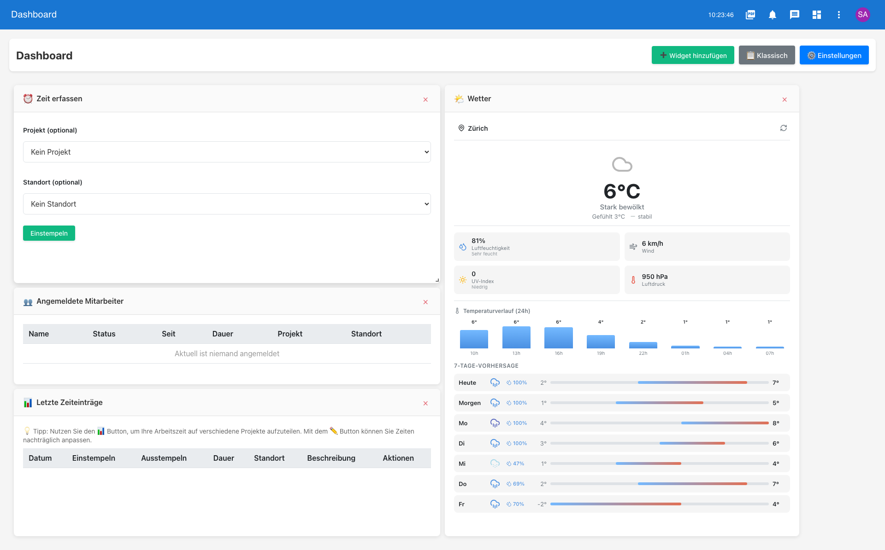

### Hauptfunktionen

✅ **Zeiterfassung** - Präzise Arbeitszeiterfassung mit Ein-/Ausstempeln  
✅ **Projektmanagement** - Projekte verwalten und Zeit darauf buchen  
✅ **Projektplanung** - Gantt-Diagramme und Meilensteinplanung  
✅ **Urlaubsverwaltung** - Urlaubsanträge stellen und genehmigen  
✅ **Abwesenheitsmanagement** - Krankmeldungen und andere Abwesenheiten  
✅ **Bewerber-Portal** - Online-Bewerbungen und Onboarding  
✅ **E-Learning** - Kurse, Lektionen, Quizzes und Zertifikate  
✅ **Nachrichten** - Internes Kommunikationssystem  
✅ **Bestellungen** - Bestellwesen mit mehrstufigem Workflow  
✅ **Checklisten** - Vorlagenbasierte Prüflisten und Aufgabenlisten  
✅ **News-Verwaltung** - Interne Nachrichten und Ankündigungen  
✅ **Medien** - Zentrale Medienverwaltung und Galerie  
✅ **Reporting** - Umfassende Statistiken und Auswertungen  
✅ **Rechnungswesen** - Rechnungen mit Schweizer QR-Code  
✅ **Compliance** - Automatische Überwachung gesetzlicher Vorgaben  
✅ **Intranet** - Dokumentenverwaltung mit Versionierung  
✅ **Kostenstellen** - Kostenstellenverwaltung und -zuordnung  
✅ **Lagerbestand** - Inventar- und Bestandsverwaltung  
✅ **Geräte** - Geräteverwaltung und -zuordnung  
✅ **Organigramm** - Visuelle Organisationsstruktur mit Avataren  
✅ **Benutzer-Avatare** - Profilbilder mit automatischer Größenanpassung  

### Für wen ist CFlux?

**Mitarbeiter:**
- Zeiterfassung und Projektbuchung
- Urlaubsanträge und Abwesenheiten
- E-Learning-Kurse absolvieren
- Interne Kommunikation

**Administratoren:**
- Benutzerverwaltung
- Genehmigungsprozesse
- Reporting und Statistiken
- System-Konfiguration

**HR-Abteilung:**
- Bewerbermanagement
- Onboarding neuer Mitarbeiter
- Personalakten pflegen
- Compliance überwachen

**Bewerber:**
- Online-Bewerbung einreichen
- Dokumente hochladen
- Bewerbungsstatus verfolgen
- Interview-Termine einsehen

## Systemübersicht

CFlux besteht aus mehreren integrierten Modulen:

| Modul | Beschreibung | Benutzer |
|-------|-------------|----------|
| **Zeiterfassung** | Ein-/Ausstempeln, Projektbuchung | Alle |
| **Urlaub** | Urlaubsanträge, Genehmigungen | Alle |
| **Abwesenheiten** | Krankmeldungen, sonstige Abwesenheiten | Alle |
| **Projekte** | Projektverwaltung, Zeitauswertung | Alle/Admin |
| **Projektplanung** | Gantt-Diagramme, Meilensteinplanung | Admin |
| **Bewerber** | Online-Bewerbungen, Onboarding | HR/Admin |
| **E-Learning** | Kurse, Quizzes, Zertifikate | Alle |
| **Nachrichten** | Interne Kommunikation | Alle |
| **Bestellungen** | Bestellwesen mit 8-Stufen-Workflow | Alle/Admin |
| **Checklisten** | Vorlagenbasierte Prüflisten | Alle |
| **News** | Interne Nachrichten und Ankündigungen | Alle/Admin |
| **Medien** | Medienverwaltung und Galerie | Alle |
| **Rechnungen** | Rechnungserstellung, QR-Code | Admin |
| **Mahnwesen** | Zahlungserinnerungen | Admin |
| **Reports** | Statistiken und Auswertungen | Alle/Admin |
| **Geschäftsbericht** | Unternehmenskennzahlen | Admin |
| **Intranet** | Dokumentenverwaltung | Alle |
| **EHS** | Arbeitssicherheit, Vorfälle | EHS-Team |
| **Stammdaten** | Kunden, Lieferanten, Artikel | Admin |
| **Geräte** | Geräteverwaltung und -zuordnung | Admin |
| **Kostenstellen** | Kostenstellen verwalten | Admin |
| **Lagerbestand** | Inventar- und Bestandsverwaltung | Admin |
| **Lohnabrechnung** | Lohndaten, Abrechnungen | HR |
| **Reisekosten** | Spesenerfassung | Alle |
| **Workflows** | Automatisierte Prozesse | Admin |
| **Compliance** | Gesetzliche Vorgaben | Admin |
| **Standorte** | Mehrere Firmenstandorte verwalten | Admin |
| **Abteilungen** | Organisationsstruktur | Admin |
| **Organigramm** | Visuelle Darstellung mit Avataren | Alle |
| **Stellenfunktionen** | Berufsbezeichnungen verwalten | Admin |
| **System-Logs** | Systemprotokollierung | Admin |

## Erste Schritte

### Landing Page

Beim ersten Aufruf von CFlux sehen Sie die Landing Page:

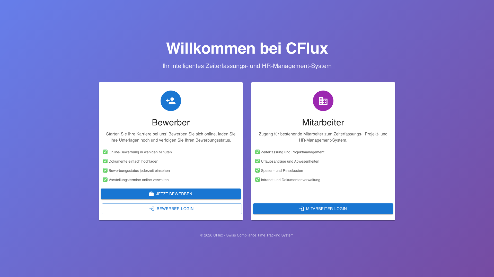

**Zwei Wege ins System:**

**1️⃣ Für Bewerber:**
- 🎯 **Jetzt bewerben** - Neue Bewerbung einreichen
- 🔐 **Bewerber-Login** - Zugang zum Bewerber-Portal

**2️⃣ Für Mitarbeiter:**
- 💼 **Mitarbeiter-Login** - Zugang zum Zeiterfassungssystem

### Anmeldung als Mitarbeiter

**Schritt 1:** Klicken Sie auf **"Mitarbeiter-Login"**

**Schritt 2:** Geben Sie Ihre Zugangsdaten ein:
- **E-Mail-Adresse:** Ihre Firmen-E-Mail
- **Passwort:** Ihr persönliches Passwort

**Schritt 3:** Klicken Sie auf **"Anmelden"**

✅ Sie werden zum Dashboard weitergeleitet!

### Dashboard-Übersicht

Nach der Anmeldung sehen Sie Ihr persönliches Dashboard:


**Dashboard-Bereiche:**

1. **Status-Anzeige** (oben)
   - ⏱️ Aktueller Einstempelstatus
   - 🕐 Heutige Arbeitszeit
   - 📊 Wochenübersicht

2. **Schnellaktionen** (Mitte)
   - ▶️ Einstempeln / Ausstempeln
   - 🏖️ Urlaub beantragen
   - 🏥 Abwesenheit melden
   - 📝 Nachricht schreiben

3. **Übersichten** (unten)
   - 📅 Nächste Termine
   - 📨 Neue Nachrichten
   - 🎓 Offene E-Learning-Kurse
   - 📋 Aktuelle Projekte

4. **Navigation** (links)
   - Zeiterfassung
   - Urlaub & Abwesenheiten
   - E-Learning
   - Nachrichten
   - Projekte
   - Berichte
   - Mein Profil

### Passwort ändern

**Beim ersten Login:**
1. Sie werden aufgefordert, Ihr Passwort zu ändern
2. Geben Sie ein **neues, sicheres Passwort** ein
3. Bestätigen Sie das Passwort
4. Klicken Sie auf **"Passwort ändern"**

**Später:**
1. Klicken Sie auf Ihr **Profil** (oben rechts)
2. Wählen Sie **"Profil bearbeiten"**
3. Klicken Sie auf **"Passwort ändern"**
4. Geben Sie Ihr **altes Passwort** ein
5. Geben Sie Ihr **neues Passwort** ein (2x)
6. Klicken Sie auf **"Speichern"**

**Passwort-Anforderungen:**
- Mindestens 8 Zeichen
- Mindestens 1 Großbuchstabe
- Mindestens 1 Kleinbuchstabe
- Mindestens 1 Zahl

<div style="page-break-before: always;"></div>

# 2. Bewerbung & Onboarding

## Online-Bewerbung

Sie möchten sich bei uns bewerben? Der gesamte Bewerbungsprozess läuft online über CFlux!

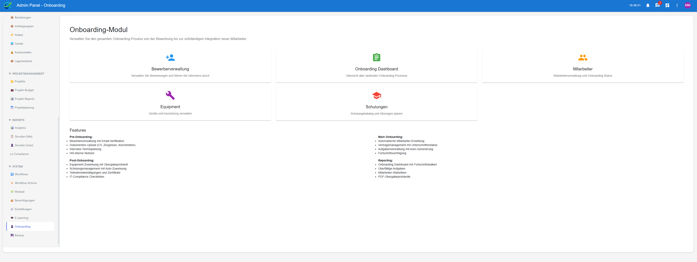

### Schritt 1: Registrierung

**So bewerben Sie sich:**

1. Öffnen Sie die CFlux Landing Page
2. Klicken Sie auf **"Jetzt bewerben"**
3. Füllen Sie das Bewerbungsformular aus:

**Erforderliche Angaben:**
- ✅ **Vorname**
- ✅ **Nachname**
- ✅ **E-Mail-Adresse** (muss gültig sein!)
- ✅ **Telefonnummer**
- ✅ **Gewünschte Position** (z.B. "Softwareentwickler")

4. Klicken Sie auf **"Bewerbung absenden"**

✅ **Erfolgsmeldung:** Sie erhalten eine Bestätigungs-E-Mail!

### Schritt 2: E-Mail verifizieren

**Wichtig:** Sie müssen Ihre E-Mail-Adresse bestätigen!

1. Öffnen Sie Ihr E-Mail-Postfach
2. Suchen Sie die E-Mail von **CFlux** mit Betreff: _"Bitte bestätigen Sie Ihre E-Mail-Adresse"_
3. Klicken Sie auf den **Bestätigungslink** in der E-Mail
4. Sie werden zurück zu CFlux weitergeleitet

✅ **Ihre E-Mail-Adresse ist nun verifiziert!**

💡 **Tipp:** Überprüfen Sie auch Ihren Spam-Ordner, falls die E-Mail nicht ankommt.

## Bewerber-Portal

Nach der E-Mail-Verifizierung können Sie sich im Bewerber-Portal anmelden:

### Anmeldung im Bewerber-Portal

1. Klicken Sie auf der Landing Page auf **"Bewerber-Login"**
2. Geben Sie Ihre **E-Mail-Adresse** ein (mit der Sie sich registriert haben)
3. Klicken Sie auf **"Anmelden"**

✅ Sie werden zu Ihrem persönlichen Bewerber-Dashboard weitergeleitet!

### Bewerber-Dashboard

Im Bewerber-Portal sehen Sie:

**📊 Fortschrittsbalken:**
- Zeigt an, welche Dokumente Sie bereits hochgeladen haben
- 100% = Vollständige Bewerbung

**📄 Ihre Daten:**
- Name, E-Mail, Telefon
- Position, für die Sie sich beworben haben
- Bewerbungsdatum

**📎 Dokumente:**
- Liste Ihrer hochgeladenen Dokumente
- Upload-Button für neue Dokumente
- Löschen-Button für jedes Dokument

**📅 Interview-Termine:**
- Falls Sie zu einem Gespräch eingeladen wurden
- Datum, Uhrzeit, Ort
- Ansprechpartner

**📊 Bewerbungsstatus:**
- **NEU** - Bewerbung eingegangen
- **IN BEARBEITUNG** - HR prüft Ihre Unterlagen
- **INTERVIEW** - Sie wurden zu einem Gespräch eingeladen
- **ZUSAGE** - Glückwunsch! 🎉
- **ABSAGE** - Leider keine Zusage

## Dokumenten-Upload

Eine vollständige Bewerbung umfasst mindestens 3 Dokumente:

### Pflicht-Dokumente

1. **Lebenslauf (CV)**
2. **Anschreiben (Cover Letter)**
3. **Zeugnisse (Certificates)**

### Zusätzliche Dokumente (optional)

- Diplome
- Referenzschreiben
- Portfolio
- Arbeitszeugnisse
- Weitere relevante Dokumente

### Dokument hochladen

**Schritt-für-Schritt:**

1. Klicken Sie im Bewerber-Portal auf **"+ Dokument hochladen"**
2. Ein Dialog öffnet sich
3. Wählen Sie den **Dokumenttyp** aus der Dropdown-Liste:
   - CV (Lebenslauf)
   - Cover Letter (Anschreiben)
   - Certificate (Zeugnis)
   - Other (Sonstiges)
4. Klicken Sie auf **"Datei auswählen"**
5. Wählen Sie die Datei von Ihrem Computer aus
6. Klicken Sie auf **"Hochladen"**

✅ **Das Dokument erscheint sofort in Ihrer Dokumentenliste!**

**Erlaubte Dateiformate:**
- PDF (.pdf) - **empfohlen!**
- Word (.doc, .docx)
- Bilder (.jpg, .png)

**Maximale Dateigröße:** 10 MB pro Datei

### Dokument löschen

Falls Sie ein Dokument austauschen möchten:

1. Klicken Sie auf das **🗑️ Löschen-Symbol** neben dem Dokument
2. Bestätigen Sie mit **"Ja, löschen"**
3. Das Dokument wird entfernt
4. Laden Sie das neue Dokument hoch

## Bewerbungsstatus

### Status-Übersicht

Ihr aktueller Status wird im Bewerber-Portal angezeigt:

| Status | Bedeutung | Nächster Schritt |
|--------|-----------|------------------|
| 🆕 **NEU** | Bewerbung eingegangen | Wir prüfen Ihre Unterlagen |
| 📋 **IN BEARBEITUNG** | HR prüft Bewerbung | Warten auf Rückmeldung |
| 🗓️ **INTERVIEW** | Interview geplant | Termin erscheint im Portal |
| ✅ **ZUSAGE** | Sie sind eingestellt! | Onboarding-Prozess startet |
| ❌ **ABSAGE** | Leider keine Zusage | Bewerbung für andere Stellen |

### E-Mail-Benachrichtigungen

Sie erhalten automatisch E-Mails bei:

- ✉️ Statusänderung Ihrer Bewerbung
- ✉️ Einladung zu einem Interview
- ✉️ Zusage oder Absage
- ✉️ Rückfragen des HR-Teams

### Interview-Termine

Wenn Sie zu einem Interview eingeladen werden:

**Im Bewerber-Portal sehen Sie:**
- 📅 **Datum und Uhrzeit**
- 📍 **Ort** (Adresse oder Video-Link)
- 👤 **Ansprechpartner**
- 📝 **Hinweise** (z.B. "Bitte bringen Sie Portfolio mit")

**Vorbereitung:**
- Bestätigen Sie den Termin per E-Mail
- Bereiten Sie sich auf das Gespräch vor
- Seien Sie pünktlich!

<div style="page-break-before: always;"></div>

# 3. Zeiterfassung

Die Zeiterfassung ist das Herzstück von CFlux. Hier erfassen Sie Ihre täglichen Arbeitszeiten und buchen diese auf Projekte.

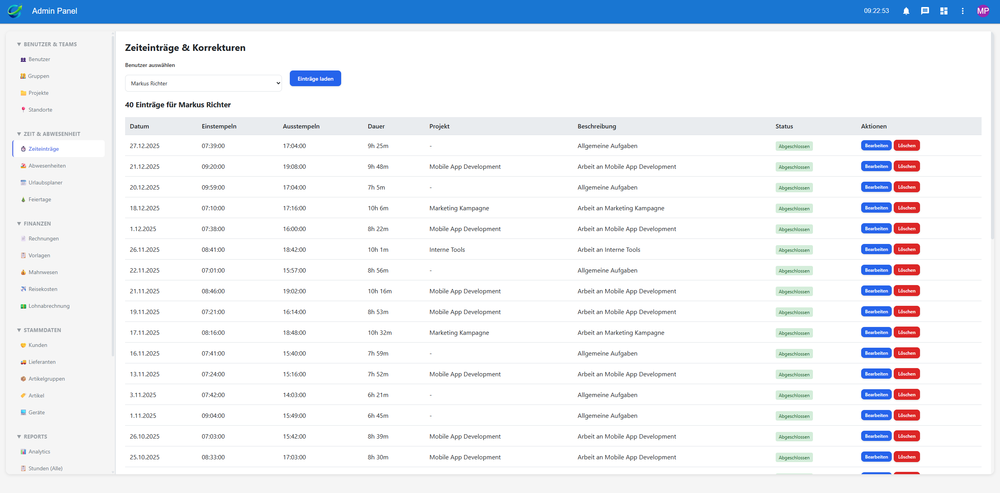

## Ein- und Ausstempeln

### Einstempeln (Arbeitsbeginn)

**So stempeln Sie ein:**

1. Öffnen Sie das **Dashboard**
2. Klicken Sie auf den großen **"▶️ Einstempeln"** Button
3. Optional: Wählen Sie ein **Projekt** aus
4. Klicken Sie auf **"Bestätigen"**

✅ **Sie sind jetzt eingestempelt!**

**Was passiert:**
- Die Uhr läuft ab jetzt
- Der Button ändert sich zu **"⏸️ Ausstempeln"**
- Ihre aktuelle Arbeitszeit wird angezeigt
- Der Status zeigt **"Eingestempelt seit HH:MM"**

### Ausstempeln (Arbeitsende)

**So stempeln Sie aus:**

1. Klicken Sie auf **"⏸️ Ausstempeln"**
2. Überprüfen Sie die **gebuchte Zeit**
3. Optional: Fügen Sie eine **Notiz** hinzu (z.B. "Meeting mit Kunde")
4. Klicken Sie auf **"Bestätigen"**

✅ **Sie sind jetzt ausgestempelt!**

**Was passiert:**
- Die Arbeitszeit wird gespeichert
- Die Zeit wird dem gewählten Projekt zugeordnet
- Der Eintrag erscheint in Ihrer Zeitübersicht
- Der Button ändert sich zurück zu **"▶️ Einstempeln"**

### Wichtige Hinweise

⚠️ **Nur EIN aktiver Zeiteintrag:**
- Sie können nicht mehrfach gleichzeitig eingestempelt sein
- Stempeln Sie aus, bevor Sie wieder einstempeln

⚠️ **Pausenzeiten:**
- Bei mehr als 6 Stunden Arbeitszeit ist eine Pause Pflicht (Schweizer ArG)
- CFlux warnt Sie automatisch
- Stempeln Sie für Pausen aus und wieder ein

⚠️ **Maximale Arbeitszeit:**
- Maximal 10 Stunden pro Tag (konfigurierbar)
- CFlux blockiert weiteres Einstempeln bei Überschreitung

## Projektbuchung

### Projekt beim Einstempeln wählen

**Best Practice:**

1. Beim **Einstempeln** erscheint ein Dropdown-Menü
2. Wählen Sie das **Projekt** aus, an dem Sie arbeiten werden
3. Stempeln Sie ein

✅ Die Zeit wird automatisch auf dieses Projekt gebucht!

### Projekt wechseln

**Während der Arbeit das Projekt wechseln:**

1. **Ausstempeln** (beendet aktuelles Projekt)
2. Sofort wieder **Einstempeln**
3. Neues **Projekt wählen**

**Alternative:** Nachträgliche Korrektur durch Admin

### Projektzuordnung prüfen

**In der Zeitübersicht sehen Sie:**
- Jeder Zeiteintrag zeigt das zugeordnete Projekt
- Einträge ohne Projekt sind **rot markiert**
- Hover über Projekt-Name zeigt Details

## Zeitübersicht

### Persönliche Zeiteinträge

**Zeitübersicht öffnen:**

1. Navigieren Sie zu **"Zeiterfassung"** im Menü
2. Sie sehen eine Tabelle mit Ihren Zeiteinträgen

**Angezeigt werden:**
- 📅 **Datum** - Wann haben Sie gearbeitet?
- ⏰ **Einstempelzeit** - Wann haben Sie begonnen?
- ⏰ **Ausstempelzeit** - Wann haben Sie geendet?
- ⏱️ **Dauer** - Wie lange haben Sie gearbeitet?
- 📁 **Projekt** - Welchem Projekt zugeordnet?
- 📝 **Notiz** - Ihre Beschreibung

### Zeiteinträge filtern

**Filter-Optionen:**

**Nach Zeitraum:**
- Heute
- Diese Woche
- Dieser Monat
- Benutzerdefiniert (Von-Bis)

**Nach Projekt:**
- Alle Projekte
- Spezifisches Projekt

**Nach Status:**
- Eingestempelt
- Ausgestempelt

### Zeiteinträge exportieren

**Export als Excel/CSV:**

1. Wählen Sie den **Zeitraum**
2. Klicken Sie auf **"📥 Export"**
3. Wählen Sie das Format:
   - Excel (.xlsx)
   - CSV (.csv)
   - PDF
4. Die Datei wird heruntergeladen

✅ Perfekt für persönliche Aufzeichnungen!

## Zeitmodelle

CFlux unterstützt verschiedene Arbeitszeitmodelle:

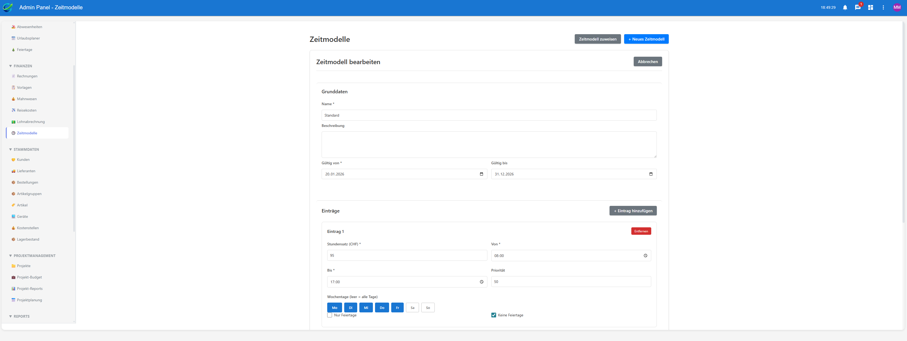

### Verfügbare Zeitmodelle

**1. Standard-Arbeitszeit**
- Feste Arbeitszeiten (z.B. 08:00 - 17:00)
- 8 Stunden pro Tag
- 40 Stunden pro Woche

**2. Gleitzeit**
- Flexible Start- und Endzeiten
- Kernarbeitszeit (z.B. 10:00 - 15:00)
- Zeitkonto (Plus/Minus-Stunden)

**3. Teilzeit**
- Reduzierte Wochenstunden (z.B. 50%, 80%)
- Angepasste Soll-Stunden

**4. Schichtarbeit**
- Verschiedene Schichten (Früh, Spät, Nacht)
- Zuschläge für Nacht-/Feiertagsarbeit

### Zeitmodell anzeigen

**Ihr Zeitmodell sehen:**

1. Gehen Sie zu **"Mein Profil"**
2. Unter **"Arbeitszeitmodell"** sehen Sie:
   - Modell-Name
   - Soll-Stunden pro Tag/Woche
   - Kernarbeitszeit (falls Gleitzeit)
   - Überstunden-Regelung

### Zeitkonto (bei Gleitzeit)

**Zeitkonto-Anzeige:**

Im Dashboard sehen Sie:
- ⏱️ **Aktueller Saldo:** +/- Stunden
- 📊 **Monatsübersicht:** Soll vs. Ist
- 📈 **Entwicklung:** Grafik über Zeit

**Beispiel:**
- Soll: 40h/Woche
- Ist: 42h/Woche
- Zeitkonto: +2h

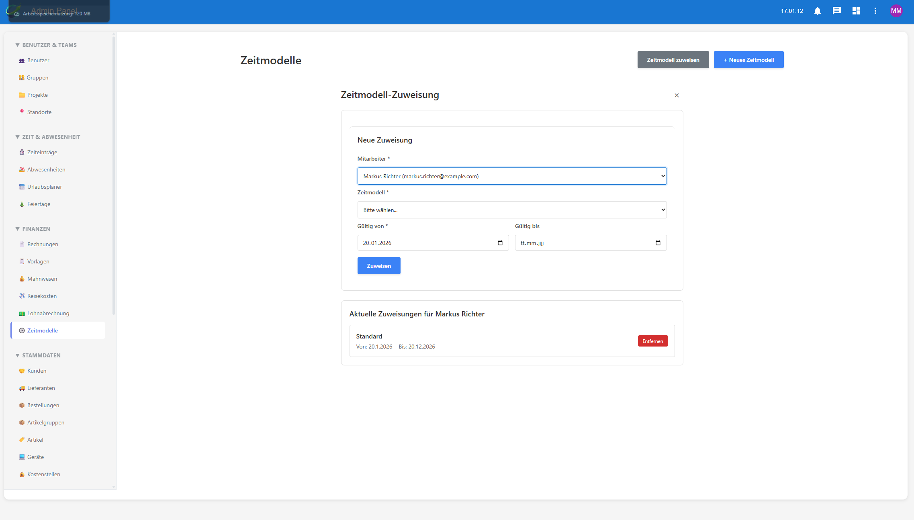

<div style="page-break-before: always;"></div>

# 4. Urlaubsverwaltung

Verwalten Sie Ihren Urlaub einfach und transparent über CFlux.

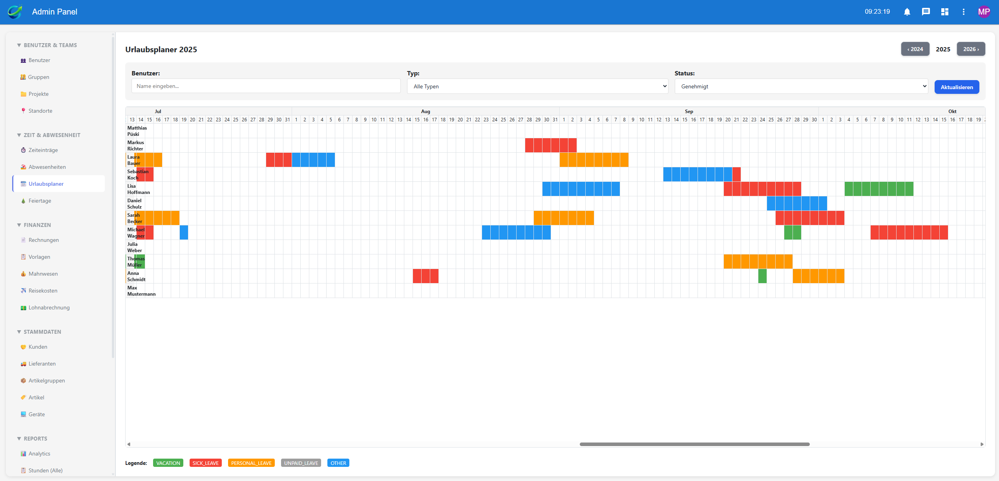

## Urlaubsantrag stellen

### Neuen Urlaubsantrag erstellen

**Schritt-für-Schritt:**

1. Navigieren Sie zu **"Urlaub"** im Menü
2. Klicken Sie auf **"+ Neuer Urlaubsantrag"**
3. Füllen Sie das Formular aus:

**Erforderliche Angaben:**
- 📅 **Von-Datum:** Erster Urlaubstag
- 📅 **Bis-Datum:** Letzter Urlaubstag
- 🕐 **Ganztags / Halbtags:**
  - Ganztags: Ganzer Tag frei
  - Halbtags: Vormittag oder Nachmittag
- 📝 **Begründung:** Kurze Beschreibung (optional)

4. Klicken Sie auf **"Antrag einreichen"**

✅ **Ihr Antrag wurde eingereicht und wird geprüft!**

### Was passiert dann?

**Workflow:**

1. **Antrag eingereicht** → Status: **PENDING** (Ausstehend)
2. **Admin wird benachrichtigt** → E-Mail an Vorgesetzten
3. **Admin prüft Antrag** → Genehmigung oder Ablehnung
4. **Sie erhalten Bescheid** → E-Mail-Benachrichtigung
5. **Status aktualisiert:**
   - ✅ **APPROVED** (Genehmigt) - Urlaub wird abgezogen
   - ❌ **REJECTED** (Abgelehnt) - Keine Änderung

### Antrag zurückziehen

**Antrag vor Genehmigung zurückziehen:**

1. Gehen Sie zu **"Urlaub"**
2. Finden Sie Ihren **Antrag** (Status: PENDING)
3. Klicken Sie auf **"🗑️ Zurückziehen"**
4. Bestätigen Sie mit **"Ja"**

✅ Der Antrag wird gelöscht!

## Urlaubsübersicht

### Urlaubskontingent

**Ihre Urlaubstage im Überblick:**

Im Dashboard oder unter **"Urlaub"** sehen Sie:

```
📊 Urlaubskontingent 2026:

Gesamt:        25 Tage
Genommen:       8 Tage
Geplant:        5 Tage (ausstehende Anträge)
Verfügbar:     12 Tage
```

**Erklärung:**
- **Gesamt:** Ihre jährlichen Urlaubstage
- **Genommen:** Bereits genehmigter und verbrauchter Urlaub
- **Geplant:** Anträge mit Status PENDING
- **Verfügbar:** Noch buchbare Urlaubstage

### Urlaubskalender

**Kalender-Ansicht:**

1. Klicken Sie auf **"📅 Kalenderansicht"**
2. Sie sehen:
   - 🟢 **Genehmigte Urlaubstage** (grün)
   - 🟡 **Ausstehende Anträge** (gelb)
   - 🔴 **Abgelehnte Anträge** (rot)
   - 🔵 **Urlaub von Kollegen** (blau, falls sichtbar)

### Urlaubshistorie

**Alle Ihre Urlaubsanträge:**

1. Gehen Sie zu **"Urlaub"**
2. Tab: **"Meine Anträge"**
3. Sie sehen eine Liste aller Anträge:
   - Datum
   - Anzahl Tage
   - Status
   - Genehmigt von (falls APPROVED)
   - Begründung

**Filter:**
- Alle Anträge
- Nur genehmigte
- Nur ausstehende
- Nur abgelehnte

## Resturlaubsberechnung

### Automatische Berechnung

CFlux berechnet automatisch:

**Urlaubsanspruch:**
- Basierend auf Arbeitszeitmodell
- Bei Teilzeit: Anteiliger Urlaub
- Bei Eintritt während Jahr: Pro-rata-Berechnung

**Beispiel Teilzeit:**
```
Vollzeit-Urlaub: 25 Tage
Arbeitspensum:   80%
Ihr Urlaub:      20 Tage (25 × 0.8)
```

**Beispiel Eintritt am 1. Juli:**
```
Vollzeit-Urlaub: 25 Tage
Restjahr:        6 Monate (Juli - Dezember)
Ihr Urlaub:      12.5 Tage (25 × 6/12)
```

### Resturlaub ins neue Jahr

**Was passiert mit Resturlaub?**

- **Standard:** Resturlaub verfällt am 31. Dezember
- **Übertrag möglich:** Falls vom Admin genehmigt
- **Maximum:** Meist 5 Tage Übertrag

**Im Januar sehen Sie:**
```
Urlaubskontingent 2026:
Gesamt:              25 Tage
+ Übertrag aus 2025:  3 Tage
Total verfügbar:     28 Tage
```

### Feiertage

**Feiertage werden automatisch berücksichtigt:**

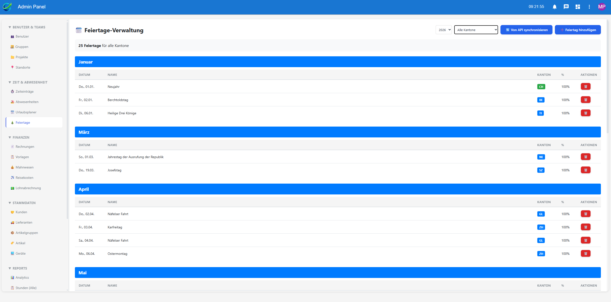

- Schweizer Feiertage sind hinterlegt
- Kantonale Feiertage (je nach Standort)
- Feiertage zählen NICHT als Urlaubstage

**Beispiel:**
- Urlaub von 20. - 24. Dezember (5 Tage)
- 25. Dezember ist Weihnachten (Feiertag)
- → Nur 5 Urlaubstage werden abgezogen, nicht 6!

<div style="page-break-before: always;"></div>

# 5. Abwesenheiten

Für andere Abwesenheiten als Urlaub (Krankheit, Arzttermine, etc.) gibt es das Abwesenheitsmanagement.

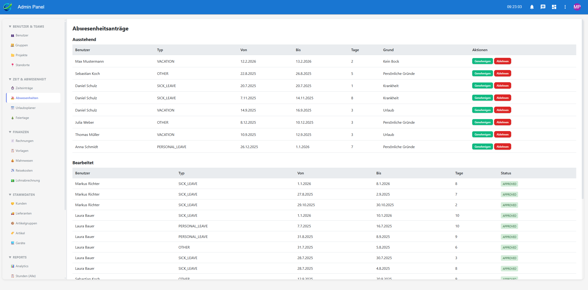

## Abwesenheit melden

### Neue Abwesenheit erfassen

**Schritt-für-Schritt:**

1. Navigieren Sie zu **"Abwesenheiten"** im Menü
2. Klicken Sie auf **"+ Neue Abwesenheit"**
3. Füllen Sie das Formular aus:

**Erforderliche Angaben:**
- 📋 **Typ:** Art der Abwesenheit (siehe unten)
- 📅 **Von-Datum:** Erster Tag
- 📅 **Bis-Datum:** Letzter Tag
- 🕐 **Ganztags / Halbtags**
- 📝 **Beschreibung:** Grund (optional)
- 📎 **Anhang:** Arztzeugnis, falls erforderlich (optional)

4. Klicken Sie auf **"Abwesenheit melden"**

✅ **Ihre Abwesenheit wurde erfasst!**

### Abwesenheitstypen

CFlux unterstützt verschiedene Abwesenheitstypen:

| Typ | Symbol | Beschreibung | Genehmigung nötig? |
|-----|--------|--------------|-------------------|
| **Krankheit** | 🏥 | Krankheitsbedingte Abwesenheit | Nein, aber Zeugnis ab 3 Tagen |
| **Arzttermin** | 🩺 | Arzt-, Zahnarzt-, Therapietermin | Nein |
| **Persönliche Gründe** | 👤 | Familiäre Gründe, Umzug, etc. | Ja |
| **Weiterbildung** | 🎓 | Schulungen, Kurse, Seminare | Ja |
| **Home Office** | 🏠 | Arbeit von zu Hause | Je nach Firma-Policy |
| **Militär/Zivilschutz** | 🎖️ | Militärdienst, Zivilschutz | Nein (gesetzlich) |
| **Sonstiges** | 📋 | Andere Gründe | Ja |

## Krankheitsmeldung

### Krankmeldung erfassen

**Bei Krankheit:**

1. **So schnell wie möglich** melden (idealerweise vor Arbeitsbeginn)
2. Gehen Sie zu **"Abwesenheiten"**
3. Klicken Sie auf **"+ Neue Abwesenheit"**
4. Wählen Sie Typ: **"🏥 Krankheit"**
5. Geben Sie das **Datum** an (Von-Bis)
6. Optional: **Beschreibung** (z.B. "Grippe")
7. **Arztzeugnis hochladen** (ab 3 Tagen Pflicht!)
8. Klicken Sie auf **"Abwesenheit melden"**

✅ **Ihr Vorgesetzter wird automatisch informiert!**

### Arztzeugnis hochladen

**Bei längerer Krankheit (ab 3 Tagen):**

1. Scannen oder fotografieren Sie Ihr **Arztzeugnis**
2. Bei der Erfassung der Abwesenheit:
   - Klicken Sie auf **"📎 Datei anhängen"**
   - Wählen Sie das Arztzeugnis aus
   - Hochladen
3. Das Zeugnis ist nun mit der Abwesenheit verknüpft

**Nachträgliches Hochladen:**

1. Gehen Sie zu **"Abwesenheiten"**
2. Finden Sie Ihre **Krankmeldung**
3. Klicken Sie auf **"✏️ Bearbeiten"**
4. Laden Sie das **Arztzeugnis** hoch
5. Speichern

### Genesung melden

**Früher gesund als erwartet?**

1. Gehen Sie zu **"Abwesenheiten"**
2. Finden Sie Ihre **Krankmeldung**
3. Klicken Sie auf **"✏️ Bearbeiten"**
4. Ändern Sie das **Bis-Datum** auf den tatsächlichen letzten Krankheitstag
5. Klicken Sie auf **"Speichern"**

✅ **Die Abwesenheit wird korrigiert!**

## Andere Abwesenheiten

### Home Office

**Home Office melden:**

Falls in Ihrer Firma Home Office gemeldet werden muss:

1. Gehen Sie zu **"Abwesenheiten"**
2. Klicken Sie auf **"+ Neue Abwesenheit"**
3. Wählen Sie Typ: **"🏠 Home Office"**
4. Geben Sie das **Datum** an
5. Klicken Sie auf **"Abwesenheit melden"**

✅ **Home Office ist erfasst, Sie arbeiten normal!**

**Wichtig:** Stempeln Sie trotzdem ein/aus wie gewohnt!

### Weiterbildung

**Schulung/Seminar melden:**

1. Gehen Sie zu **"Abwesenheiten"**
2. Klicken Sie auf **"+ Neue Abwesenheit"**
3. Wählen Sie Typ: **"🎓 Weiterbildung"**
4. Geben Sie das **Datum** an
5. **Beschreibung:** Name der Schulung/des Seminars
6. Optional: **Anhang** (Bestätigung, Programm)
7. Klicken Sie auf **"Abwesenheit melden"**

✅ **Ihr Vorgesetzter wird zur Genehmigung aufgefordert!**

### Militär/Zivilschutz

**Militärdienst melden:**

1. Gehen Sie zu **"Abwesenheiten"**
2. Klicken Sie auf **"+ Neue Abwesenheit"**
3. Wählen Sie Typ: **"🎖️ Militär/Zivilschutz"**
4. Geben Sie das **Datum** an (Diensttermin)
5. **Anhang:** Marschbefehl (PDF)
6. Klicken Sie auf **"Abwesenheit melden"**

✅ **Keine Genehmigung nötig (gesetzlich geregelt)!**

### Abwesenheitsübersicht

**Alle Ihre Abwesenheiten:**

1. Gehen Sie zu **"Abwesenheiten"**
2. Sie sehen eine Tabelle mit:
   - 📅 Datum (Von - Bis)
   - 📋 Typ
   - ⏱️ Dauer (Tage)
   - 📝 Beschreibung
   - ✅/⏳ Status (Genehmigt/Ausstehend)

**Filter:**
- Nach Typ
- Nach Zeitraum
- Nach Status

<div style="page-break-before: always;"></div>

# 6. E-Learning

CFlux beinhaltet eine vollständige E-Learning-Plattform für interne Schulungen und Weiterbildungen.

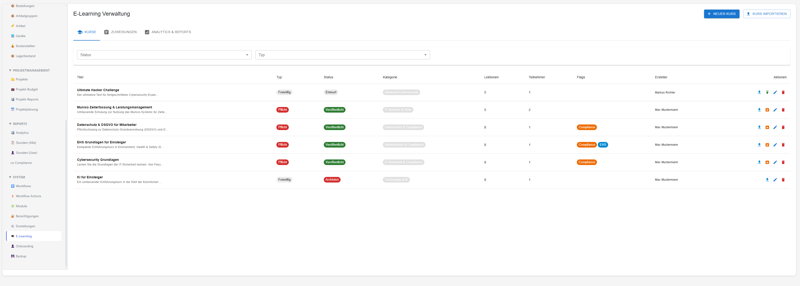

## Kurskatalog

### Kurse durchsuchen

**Verfügbare Kurse anzeigen:**

1. Navigieren Sie zu **"E-Learning"** im Menü
2. Sie sehen den **Kurskatalog**

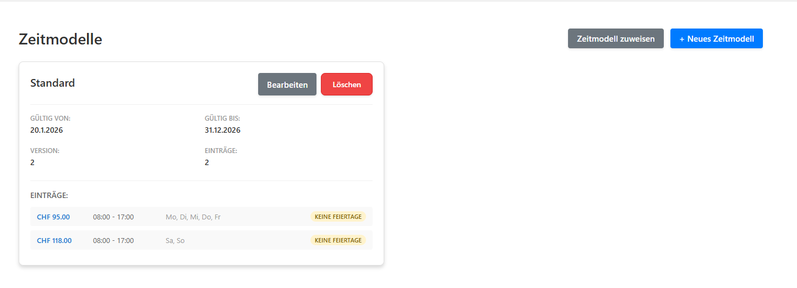

**Kurs-Informationen:**
- 📚 **Kurstitel**
- 📝 **Beschreibung**
- ⏱️ **Dauer** (geschätzte Zeit)
- 🎯 **Kategorie** (z.B. "IT", "HR", "Sicherheit")
- ⭐ **Schwierigkeit** (Anfänger, Fortgeschritten, Experte)
- 👥 **Teilnehmer** (Anzahl)
- ✅ **Status:** "Verfügbar" oder "Gebucht"

### Kurse filtern

**Filter-Optionen:**

- **Nach Kategorie:**
  - IT & Technologie
  - HR & Personal
  - Arbeitssicherheit (EHS)
  - Compliance & Datenschutz
  - Soft Skills
  - Fachliche Themen

- **Nach Status:**
  - Verfügbar (noch nicht gebucht)
  - In Bearbeitung (gestartet)
  - Abgeschlossen (zertifiziert)

- **Nach Schwierigkeit:**
  - Anfänger
  - Fortgeschritten
  - Experte

### Kursdetails anzeigen

**Mehr über einen Kurs erfahren:**

1. Klicken Sie auf einen **Kurs-Titel**
2. Sie sehen die **Detailseite:**

**Informationen:**
- 📖 Vollständige Beschreibung
- 📋 Lernziele
- 📚 Anzahl Lektionen
- ❓ Anzahl Quiz-Fragen
- 🏆 Zertifikat verfügbar?
- 👨‍🏫 Erstellt von (Autor)
- 📅 Erstellt am / Aktualisiert am

**Aktionen:**
- **"📥 Kurs buchen"** - Kurs starten
- **"↩️ Zurück"** - Zurück zum Katalog

## Kurs starten

### Kurs buchen

**So buchen Sie einen Kurs:**

1. Öffnen Sie die **Kursdetails**
2. Klicken Sie auf **"📥 Kurs buchen"**
3. Bestätigung: **"Möchten Sie diesen Kurs wirklich buchen?"**
4. Klicken Sie auf **"Ja, buchen"**

✅ **Der Kurs ist nun gebucht und in "Meine Kurse" verfügbar!**

### Meine Kurse

**Gebuchte Kurse anzeigen:**

1. Gehen Sie zu **"E-Learning"**
2. Tab: **"Meine Kurse"**
3. Sie sehen alle Ihre gebuchten Kurse:

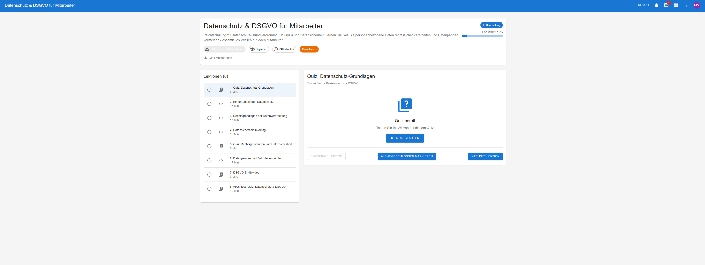

**Pro Kurs sehen Sie:**
- 📚 Kurstitel
- 📊 **Fortschritt:** X% abgeschlossen
- ⏱️ **Verbleibende Zeit:** Geschätzt
- 📅 **Gebucht am:** Datum
- 🏆 **Zertifikat:** Verfügbar/Nicht verfügbar
- **Button:** "➡️ Fortsetzen" oder "🏁 Zertifikat herunterladen"

## Lektionen durcharbeiten

### Kurs-Dashboard

**Kurs öffnen:**

1. Klicken Sie in "Meine Kurse" auf **"➡️ Fortsetzen"**
2. Sie gelangen zum **Kurs-Dashboard**

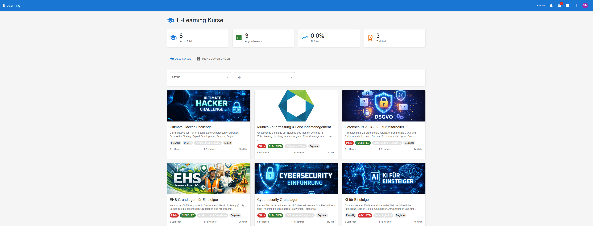

**Dashboard-Elemente:**
- 📚 **Lektionen-Liste** (links)
- 📖 **Aktuelle Lektion** (Mitte)
- 📊 **Fortschrittsbalken** (oben)
- ➡️ **Nächste Lektion** (Button unten)

### Lektion durcharbeiten

**Lektions-Aufbau:**

Eine Lektion besteht aus:
1. **Titel und Beschreibung**
2. **Lerninhalt:**
   - Text (formatiert mit Überschriften, Listen, etc.)
   - Bilder / Grafiken
   - Videos (falls vorhanden)
   - PDFs zum Download (falls vorhanden)
3. **Zusammenfassung**
4. **Button:** "➡️ Nächste Lektion"

**Lektion abschließen:**

1. Lesen/schauen Sie sich den **Inhalt** vollständig an
2. Scrollen Sie nach unten
3. Klicken Sie auf **"➡️ Nächste Lektion"**

✅ **Die Lektion wird als "abgeschlossen" markiert!**

**Fortschritt:**
- ✅ Abgeschlossene Lektionen haben einen grünen Haken
- 📖 Aktuelle Lektion ist hervorgehoben
- 🔒 Nachfolgende Lektionen sind gesperrt (bis vorherige abgeschlossen)

### Lektion wiederholen

**Bereits abgeschlossene Lektion nochmal ansehen:**

1. Klicken Sie in der **Lektionen-Liste** (links) auf eine **abgeschlossene Lektion**
2. Sie können den Inhalt erneut durchgehen
3. Mit **"➡️ Zurück zum aktuellen Stand"** gelangen Sie zur nächsten offenen Lektion

## Quizzes absolvieren

### Quiz starten

**Nach bestimmten Lektionen erscheint ein Quiz:**

1. Sie haben alle Lektionen eines Abschnitts abgeschlossen
2. Es erscheint: **"🎯 Quiz: [Titel]"**
3. Klicken Sie auf **"Quiz starten"**

**Quiz-Einführung:**
- 📋 Anzahl Fragen
- ⏱️ Zeit (falls Zeitlimit)
- 🎯 Mindestpunktzahl zum Bestehen (z.B. 80%)
- 🔄 Anzahl Versuche (z.B. 3)

4. Klicken Sie auf **"Los geht's!"**

### Fragen beantworten

**Quiz-Oberfläche:**

**Pro Frage:**
1. **Fragenummer:** "Frage 1 von 10"
2. **Fortschrittsbalken**
3. **Fragetext:** Die eigentliche Frage
4. **Antwortoptionen:** Multiple-Choice (4-5 Optionen)
   - ☐ Option A
   - ☐ Option B
   - ☐ Option C
   - ☐ Option D
5. **Button:** "➡️ Nächste Frage"

**Beantwortung:**
1. Lesen Sie die Frage aufmerksam
2. Wählen Sie die **richtige Antwort** (nur eine!)
3. Klicken Sie auf **"➡️ Nächste Frage"**

**Wichtig:** Keine Korrekturen möglich! Überlegen Sie gut!

### Quiz abschließen

**Nach der letzten Frage:**

1. Klicken Sie auf **"🏁 Quiz abschließen"**
2. Bestätigen Sie: **"Quiz wirklich abschließen?"**
3. Klicken Sie auf **"Ja, abschließen"**

**Auswertung:**

Sie sehen sofort:
- ✅ **Punkte:** X von Y erreicht
- 📊 **Prozent:** XX% richtig
- 🎯 **Ergebnis:**
  - ✅ **Bestanden!** (≥ Mindestpunktzahl)
  - ❌ **Nicht bestanden** (< Mindestpunktzahl)
- 📋 **Detaillierte Auswertung:**
  - Frage 1: ✅ Richtig
  - Frage 2: ❌ Falsch (Richtige Antwort: ...)
  - Frage 3: ✅ Richtig
  - ...

### Quiz wiederholen (bei Nichtbestehen)

**Falls Sie nicht bestanden haben:**

1. Sie sehen: **"Sie haben X von Y Versuchen verbraucht"**
2. Klicken Sie auf **"🔄 Quiz wiederholen"**
3. **Tipp:** Wiederholen Sie die Lektionen nochmal!
4. Starten Sie das Quiz erneut

**Nach 3 fehlgeschlagenen Versuchen:**
- Quiz wird gesperrt
- Wenden Sie sich an Ihren Vorgesetzten / E-Learning-Admin

## Zertifikate

### Kurs abschließen

**Kurs vollständig abgeschlossen:**

Wenn Sie:
- ✅ Alle Lektionen durchgearbeitet haben
- ✅ Alle Quizzes bestanden haben (≥ Mindestpunktzahl)

→ Erscheint: **"🎉 Herzlichen Glückwunsch! Kurs abgeschlossen!"**

### Zertifikat herunterladen

**So erhalten Sie Ihr Zertifikat:**

1. Gehen Sie zu **"Meine Kurse"**
2. Bei abgeschlossenen Kursen sehen Sie: **"🏆 Zertifikat verfügbar"**
3. Klicken Sie auf **"📥 Zertifikat herunterladen"**
4. Das Zertifikat wird als **PDF** heruntergeladen

**Zertifikats-Inhalt:**
- 🏢 Firmen-Logo
- 📚 Kurstitel
- 👤 Ihr Name
- 📅 Abschlussdatum
- 🏆 **"Hat den Kurs erfolgreich abgeschlossen"**
- ✅ **QR-Code** zur Verifikation (kann von Dritten gescannt werden)
- 🔐 Zertifikats-ID (eindeutig)

### Zertifikate verwalten

**Alle Ihre Zertifikate:**

1. Gehen Sie zu **"E-Learning"**
2. Tab: **"Meine Zertifikate"**
3. Sie sehen eine Liste:
   - 📚 Kurs
   - 📅 Abschlussdatum
   - 🎯 Ergebnis (Prozent)
   - 📥 **Download-Button**

**Zertifikat erneut herunterladen:**
- Klicken Sie auf **"📥 Download"** neben dem gewünschten Kurs

<div style="page-break-before: always;"></div>

# 7. Nachrichten-System

CFlux beinhaltet ein internes Nachrichten-System für sichere Kommunikation zwischen Mitarbeitern.

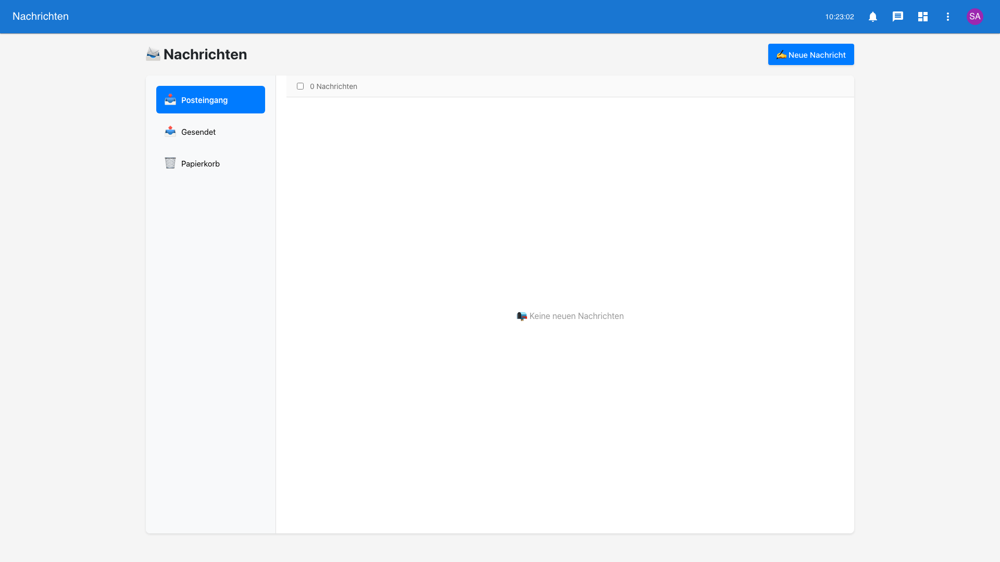

## Nachrichten empfangen

### Posteingang

**Neue Nachrichten anzeigen:**

1. Navigieren Sie zu **"Nachrichten"** im Menü
2. Standard-Ansicht: **Posteingang**

**Sie sehen:**
- 📨 Liste aller empfangenen Nachrichten
- 🔴 **Ungelesen:** Fettgedruckt
- ✅ **Gelesen:** Normal
- 🔔 **Badge:** Anzahl ungelesener Nachrichten (in Navigation)

**Pro Nachricht:**
- 👤 **Von:** Absender (Name)
- 📋 **Betreff:** Nachrichtentitel
- 📅 **Datum:** Wann gesendet
- 📝 **Vorschau:** Erste Zeilen der Nachricht

### Nachricht öffnen

**Nachricht lesen:**

1. Klicken Sie auf eine **Nachricht**
2. Die Nachricht öffnet sich:

**Ansicht:**
- 👤 **Von:** [Name] <email>
- 📅 **Gesendet:** Datum und Uhrzeit
- 📋 **Betreff:** [Titel]
- 📝 **Nachricht:** Vollständiger Text (formatiert)

**Aktionen:**
- **"↩️ Antworten"** - Antwort an Absender
- **"🗑️ Löschen"** - In Papierkorb verschieben
- **"✉️ Als ungelesen markieren"** - Zurück zu ungelesen

### Als gelesen/ungelesen markieren

**Nachricht als gelesen markieren:**
- Wird automatisch gemacht beim Öffnen
- Oder: Rechtsklick → "Als gelesen markieren"

**Nachricht als ungelesen markieren:**
- In geöffneter Nachricht: Klick auf **"✉️ Als ungelesen markieren"**
- In Liste: Rechtsklick → "Als ungelesen markieren"

## Nachricht senden

### Neue Nachricht erstellen

**So senden Sie eine Nachricht:**

1. Klicken Sie auf **"✏️ Neue Nachricht"**
2. Ein Formular öffnet sich:

**Felder:**
- 👤 **An:** Empfänger auswählen
- 📋 **Betreff:** Titel der Nachricht
- 📝 **Nachricht:** Nachrichtentext

3. Füllen Sie alle Felder aus
4. Klicken Sie auf **"📤 Senden"**

✅ **Nachricht wurde gesendet!**

### Empfänger auswählen

**Empfänger-Dropdown:**

1. Klicken Sie auf das **"An:"-Feld**
2. Eine Liste aller Mitarbeiter erscheint:
   - 👤 Name
   - 📧 E-Mail
   - 🏢 Abteilung
3. Wählen Sie einen **Empfänger** aus
4. Oder: Tippen Sie den **Namen** ein (Auto-Complete)

**Mehrere Empfänger:**
- Aktuell nicht unterstützt
- Senden Sie separate Nachrichten

### Rich-Text-Editor

**Nachrichtentext formatieren:**

Der Editor unterstützt:
- **Fett** - Strg+B
- _Kursiv_ - Strg+I
- ~~Durchgestrichen~~
- [Links](https://example.com)
- Listen (nummeriert/Aufzählung)
- Absätze

**Formatierung anwenden:**
1. Markieren Sie den **Text**
2. Klicken Sie auf das **Format-Icon** (B, I, U, etc.)
3. Oder: Nutzen Sie **Tastenkombinationen**

### Antworten

**Auf eine Nachricht antworten:**

1. Öffnen Sie die **Nachricht**
2. Klicken Sie auf **"↩️ Antworten"**
3. Ein Nachrichtenformular öffnet sich:
   - **An:** Ist bereits ausgefüllt (Absender)
   - **Betreff:** "Re: [Original-Betreff]"
   - **Nachricht:** Zitat der Original-Nachricht am Ende
4. Schreiben Sie Ihre **Antwort**
5. Klicken Sie auf **"📤 Senden"**

## Postfächer verwalten

### Postfach-Ordner

CFlux hat 3 Standard-Ordner:

**📥 Posteingang:**
- Alle empfangenen Nachrichten
- Standard-Ansicht

**📤 Gesendet:**
- Alle von Ihnen gesendeten Nachrichten
- Kopie jeder gesendeten Nachricht

**🗑️ Papierkorb:**
- Gelöschte Nachrichten
- Werden nach 30 Tagen permanent gelöscht

### Zwischen Ordnern wechseln

**Ordner öffnen:**

1. Klicken Sie in der **linken Navigation** auf:
   - **"📥 Posteingang"**
   - **"📤 Gesendet"**
   - **"🗑️ Papierkorb"**
2. Die Nachrichten des Ordners werden angezeigt

### Nachrichten löschen

**Nachricht in Papierkorb verschieben:**

**In Liste:**
1. Rechtsklick auf **Nachricht**
2. Wählen Sie **"🗑️ Löschen"**

**In Nachricht:**
1. Öffnen Sie die **Nachricht**
2. Klicken Sie auf **"🗑️ Löschen"**

✅ **Nachricht wurde in Papierkorb verschoben!**

### Nachrichten wiederherstellen

**Aus Papierkorb wiederherstellen:**

1. Öffnen Sie den **"🗑️ Papierkorb"**
2. Rechtsklick auf **Nachricht**
3. Wählen Sie **"♻️ Wiederherstellen"**

✅ **Nachricht ist zurück im Posteingang!**

### Papierkorb leeren

**Alle Nachrichten permanent löschen:**

1. Öffnen Sie den **"🗑️ Papierkorb"**
2. Klicken Sie auf **"🗑️ Papierkorb leeren"**
3. Bestätigen Sie: **"Wirklich alle Nachrichten permanent löschen?"**
4. Klicken Sie auf **"Ja, löschen"**

⚠️ **Achtung:** Diese Aktion kann nicht rückgängig gemacht werden!

### Ungelesene Nachrichten

**Badge-Anzeige:**

In der **Navigation** (links) sehen Sie:
```
📨 Nachrichten (3)
```

Die Zahl **(3)** zeigt **3 ungelesene Nachrichten** an.

**Badge verschwindet, wenn:**
- Alle Nachrichten gelesen sind
- Oder: Nachrichten als gelesen markiert wurden

<div style="page-break-before: always;"></div>

# 8. Projektverwaltung

Verwalten Sie Projekte und buchen Sie Ihre Arbeitszeit darauf.

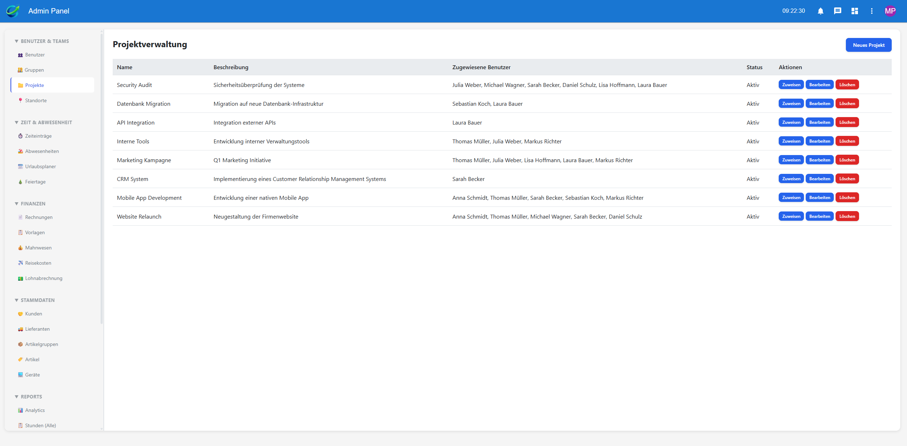

## Projektübersicht

### Alle Projekte anzeigen

**So sehen Sie Projekte:**

1. Navigieren Sie zu **"Projekte"** im Menü
2. Sie sehen eine **Liste aller Projekte**

**Als normaler Benutzer:**
- Sie sehen nur **Ihre zugewiesenen Projekte**

**Als Admin:**
- Sie sehen **alle Projekte** der Firma

**Pro Projekt:**
- 📁 **Projekt-Name**
- 🏢 **Kunde** (falls zugeordnet)
- 📅 **Start-/Enddatum**
- ✅ **Status:** Aktiv / Inaktiv / Abgeschlossen
- 👥 **Mitarbeiter:** Anzahl zugewiesene Personen
- ⏱️ **Gebuchte Zeit:** Gesamt-Stunden

### Projektdetails anzeigen

**Details eines Projekts öffnen:**

1. Klicken Sie auf einen **Projekt-Namen**
2. Die **Detailseite** öffnet sich:

**Informationen:**
- 📋 **Beschreibung**
- 🏢 **Kunde**
- 📅 **Zeitraum** (Start - Ende)
- 💰 **Budget** (falls definiert)
- ⏱️ **Gebuchte Zeit vs. Budget**
- 📊 **Fortschritt** (%)
- 👥 **Team-Mitglieder** (Liste)

**Tabs:**
- **Übersicht** - Projekt-Infos
- **Zeiteinträge** - Alle gebuchten Zeiten
- **Berichte** - Statistiken und Reports

## Projekt-Zeiterfassung

### Zeit auf Projekt buchen

**Zeit erfassen mit Projektbuchung:**

1. **Dashboard:** Klicken Sie auf **"▶️ Einstempeln"**
2. Im Dialog: Wählen Sie **Projekt** aus Dropdown
3. Klicken Sie auf **"Bestätigen"**
4. Arbeiten Sie am Projekt
5. **Ausstempeln:** Zeit wird automatisch auf Projekt gebucht

✅ **Zeit ist auf Projekt gebucht!**

### Projektzeiten anzeigen

**Ihre Zeit auf einem Projekt:**

1. Gehen Sie zu **"Projekte"**
2. Öffnen Sie ein **Projekt**
3. Tab: **"Zeiteinträge"**
4. Sie sehen:
   - 👤 **Mitarbeiter** (bei Admin: alle, sonst nur Sie)
   - 📅 **Datum**
   - ⏱️ **Dauer**
   - 📝 **Beschreibung**

**Filtern:**
- Nach Mitarbeiter (Admin)
- Nach Zeitraum
- Export als Excel/PDF

## Projekt-Reports

### Projekt-Statistiken

**Statistiken eines Projekts:**

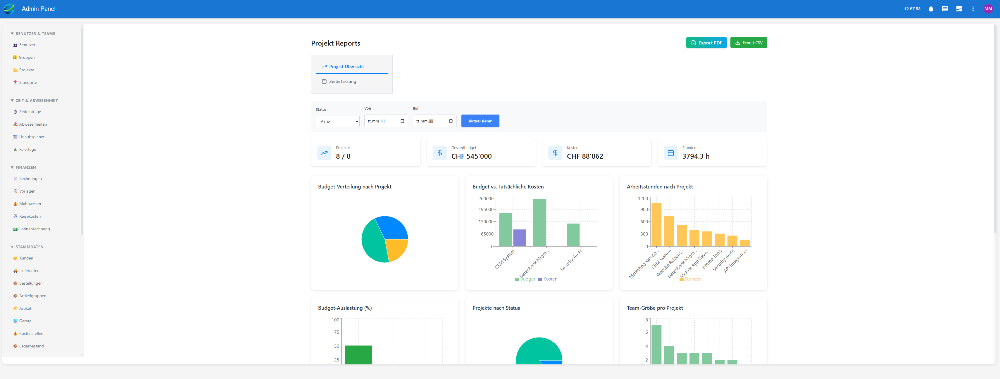

1. Öffnen Sie ein **Projekt**
2. Tab: **"Berichte"**

**Angezeigt werden:**
- 📊 **Zeitauslastung:**
  - Gebuchte Stunden
  - Budget-Stunden
  - Verbleibende Stunden
  - Überschreitung (falls vorhanden)

- 👥 **Team-Auslastung:**
  - Pro Mitarbeiter: Gebuchte Stunden
  - Balkendiagramm

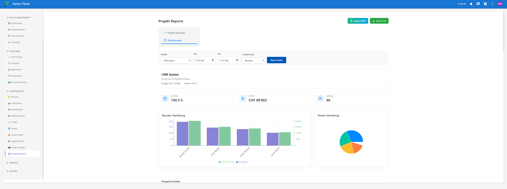

- 📅 **Zeitverlauf:**
  - Gebuchte Stunden pro Tag/Woche/Monat
  - Liniendiagramm

- 💰 **Budget-Status:**
  - Budgetiert vs. Tatsächlich
  - Prozentuale Auslastung
  - Ampel (Grün/Gelb/Rot)

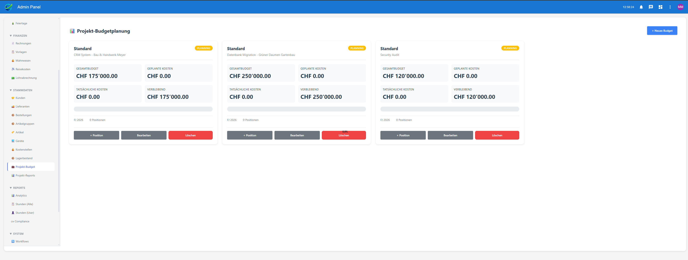

### Reports exportieren

**Report als PDF/Excel exportieren:**

1. In Projekt-Berichten: Klicken Sie auf **"📥 Export"**
2. Wählen Sie Format:
   - **PDF** - Formatierter Bericht mit Grafiken
   - **Excel** - Rohdaten für eigene Analysen
3. Wählen Sie Zeitraum (optional)
4. Klicken Sie auf **"Exportieren"**

✅ **Datei wird heruntergeladen!**

<div style="page-break-before: always;"></div>

# 9. Rechnungswesen

Erstellen und verwalten Sie Rechnungen direkt in CFlux.

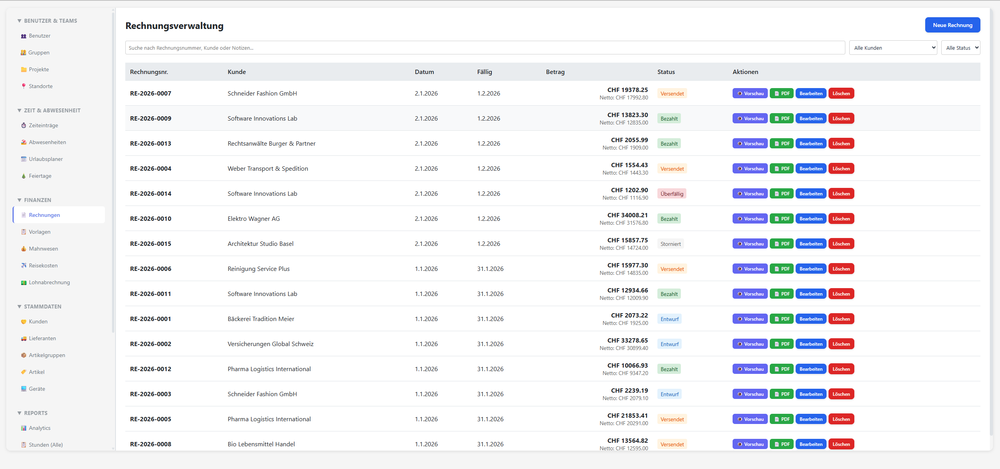

## Rechnungen erstellen

### Neue Rechnung

**So erstellen Sie eine Rechnung:**

1. Navigieren Sie zu **"Rechnungen"** im Menü
2. Klicken Sie auf **"+ Neue Rechnung"**
3. Füllen Sie das Formular aus:

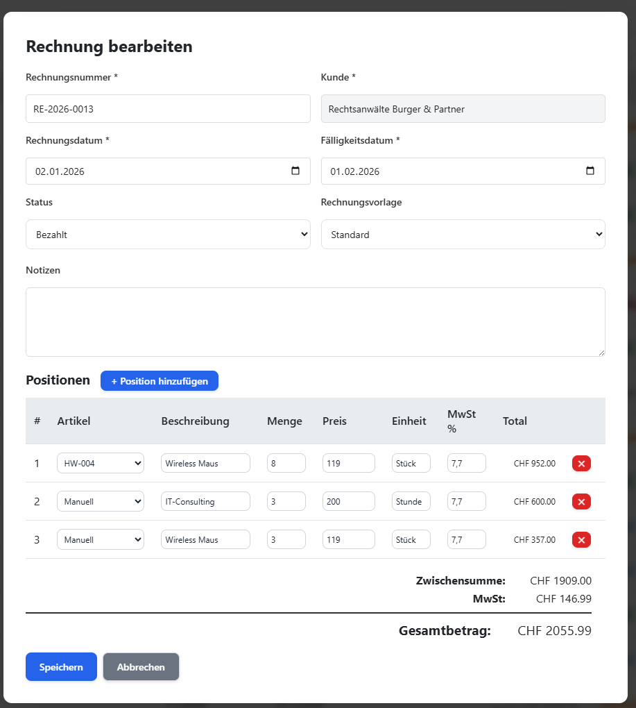

**Allgemeine Angaben:**
- 🏢 **Kunde:** Kunde aus Dropdown wählen
- 📅 **Rechnungsdatum:** Standard: Heute
- 📅 **Fälligkeitsdatum:** z.B. +30 Tage
- 💰 **Währung:** CHF (Standard)

**Rechnungspositionen:**
Für jede Position:
- 📝 **Beschreibung:** Was wurde geleistet?
- 🔢 **Menge:** Anzahl (z.B. 10 Stunden)
- 💵 **Einzelpreis:** Preis pro Einheit (CHF)
- 🔢 **Gesamt:** Wird automatisch berechnet

**Position hinzufügen:**
- Klicken Sie auf **"+ Position hinzufügen"**

**MWST:**
- ✅ **MWST aktivieren** (Checkbox)
- 🔢 **MWST-Satz:** 7.7% (Standard Schweiz) oder 2.5% (reduziert)

**Bemerkungen:**
- 📝 Freitext für Zahlungsbedingungen, etc.

4. Klicken Sie auf **"💾 Speichern"**

✅ **Rechnung wurde erstellt!**

### Zeitbuchungen verknüpfen

**Zeiteinträge in Rechnung übernehmen:**

1. Bei **"Rechnungspositionen"**: Klicken Sie auf **"📅 Aus Zeitbuchungen"**
2. Ein Dialog öffnet sich:
   - Wählen Sie **Projekt**
   - Wählen Sie **Zeitraum** (Von-Bis)
   - Wählen Sie **Mitarbeiter** (oder "Alle")
3. Klicken Sie auf **"Laden"**
4. Sie sehen alle Zeiteinträge des Zeitraums
5. **Wählen Sie die zu verrechnenden Einträge** (Checkboxen)
6. Klicken Sie auf **"Übernehmen"**

✅ **Positionen werden automatisch erstellt:**
- Beschreibung: Projekt-Name + Datum
- Menge: Stunden
- Einzelpreis: Ihr Stundensatz (aus Projekt oder System-Einstellung)

### Rechnung bearbeiten

**Bestehende Rechnung ändern:**

1. Gehen Sie zu **"Rechnungen"**
2. Finden Sie die **Rechnung** (Status: DRAFT)
3. Klicken Sie auf **"✏️ Bearbeiten"**
4. Nehmen Sie Änderungen vor
5. Klicken Sie auf **"💾 Speichern"**

⚠️ **Nur Rechnungen im Status DRAFT können bearbeitet werden!**

## Rechnungsvorlagen

### Vorlage auswählen

CFlux unterstützt verschiedene Rechnungsvorlagen:

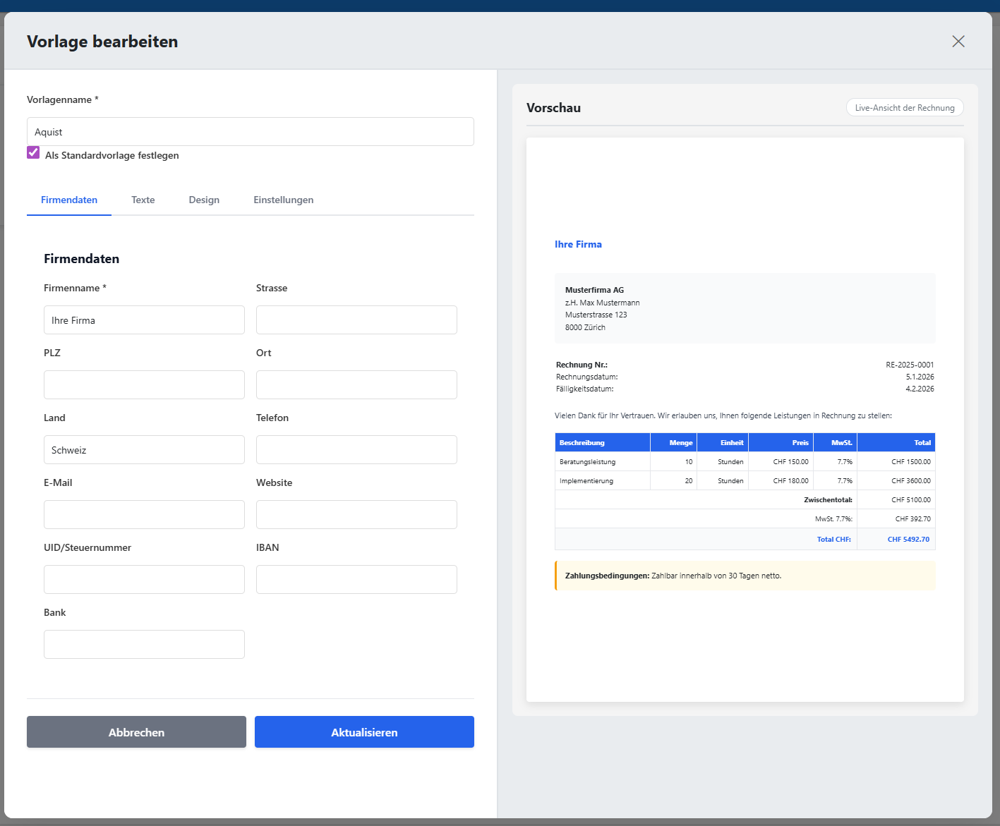

**Verfügbare Vorlagen:**
- **Standard** - Klassisches Layout
- **Modern** - Minimalistisches Design
- **Schweiz** - Mit QR-Rechnung
- **Individuell** - Eigene Vorlage

**Vorlage ändern:**

1. Beim Erstellen/Bearbeiten einer Rechnung
2. Klicken Sie auf **"🎨 Vorlage"**
3. Wählen Sie eine **Vorlage** aus Galerie
4. **Vorschau** wird aktualisiert

### Vorlage anpassen (Admin)

**Eigene Vorlage erstellen:**

1. Gehen Sie zu **"Administration" → "Rechnungsvorlagen"**
2. Klicken Sie auf **"+ Neue Vorlage"**
3. **Visueller Editor:**
   - Platzieren Sie Elemente (Logo, Adresse, Positionen, etc.)
   - Passen Sie Farben, Schriften an
   - Vorschau in Echtzeit
4. Klicken Sie auf **"Speichern"**

✅ **Vorlage ist für alle Benutzer verfügbar!**

## QR-Rechnung (Schweiz)

### Schweizer QR-Code generieren

**Automatische QR-Code-Generierung:**

Bei Rechnungen mit **Währung = CHF**:
1. QR-Code wird automatisch generiert
2. Enthält:
   - IBAN Ihrer Firma
   - Betrag
   - Referenznummer
   - Empfänger-Adresse

**QR-Rechnung erstellen:**

1. Erstellen Sie eine **normale Rechnung**
2. Wählen Sie Vorlage: **"Schweiz"**
3. Der QR-Code erscheint automatisch unten rechts
4. **PDF exportieren:** QR-Code ist scanbar!

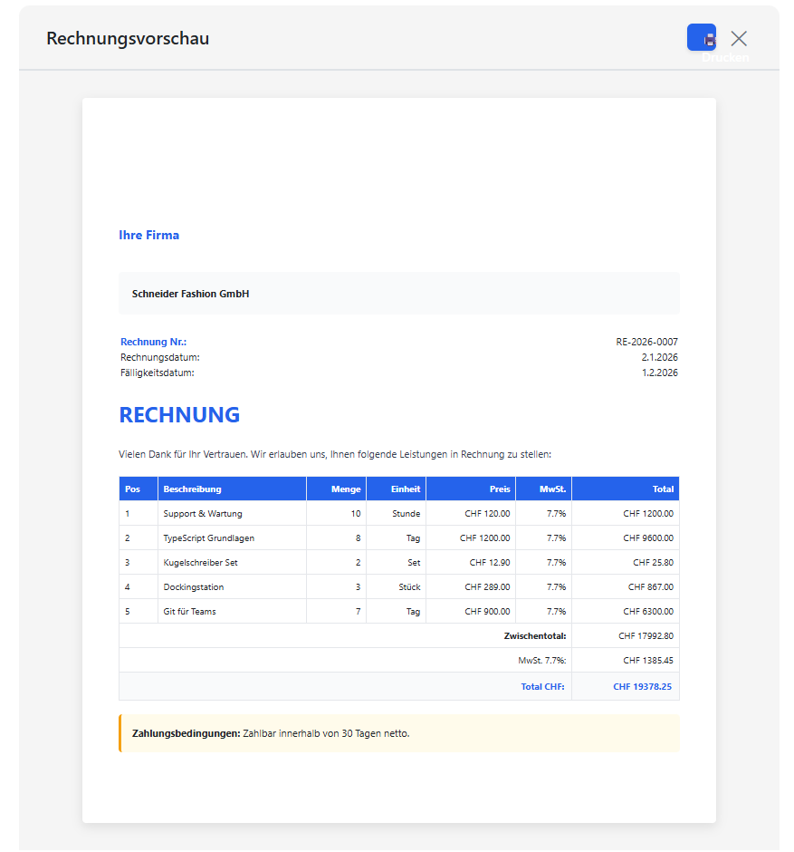

### IBAN hinterlegen

**Firma-IBAN eintragen:**

1. Gehen Sie zu **"Administration" → "System-Einstellungen"**
2. Tab: **"Finanzen"**
3. Tragen Sie ein:
   - ✅ **IBAN:** CHxx xxxx xxxx xxxx xxxx x
   - ✅ **Bank-Name:** z.B. "PostFinance"
4. Klicken Sie auf **"Speichern"**

✅ **IBAN wird für alle QR-Rechnungen verwendet!**

### Rechnung versenden

**Rechnung per E-Mail senden:**

1. Öffnen Sie die **Rechnung**
2. Klicken Sie auf **"📧 Versenden"**
3. Dialog öffnet sich:
   - **An:** Kunden-E-Mail (automatisch)
   - **Betreff:** "Rechnung Nr. XYZ"
   - **Nachricht:** Standardtext (anpassbar)
4. Klicken Sie auf **"Senden"**

✅ **Rechnung wird als PDF-Anhang versendet!**

**Status ändert sich automatisch:**
- DRAFT → **SENT** (Versendet)

### Zahlungsstatus verfolgen

**Rechnung als bezahlt markieren:**

1. Gehen Sie zu **"Rechnungen"**
2. Finden Sie die **Rechnung** (Status: SENT)
3. Klicken Sie auf **"💰 Bezahlt"**
4. Geben Sie **Zahlungsdatum** ein
5. Klicken Sie auf **"Speichern"**

✅ **Status ändert sich zu PAID (Bezahlt)!**

**Mahnungen:**
- Überfällige Rechnungen werden **rot** markiert
- Automatische Erinnerungs-E-Mails (falls konfiguriert)

<div style="page-break-before: always;"></div>

# 10. Reporting & Statistiken

Umfassende Reports und Statistiken für Auswertungen.

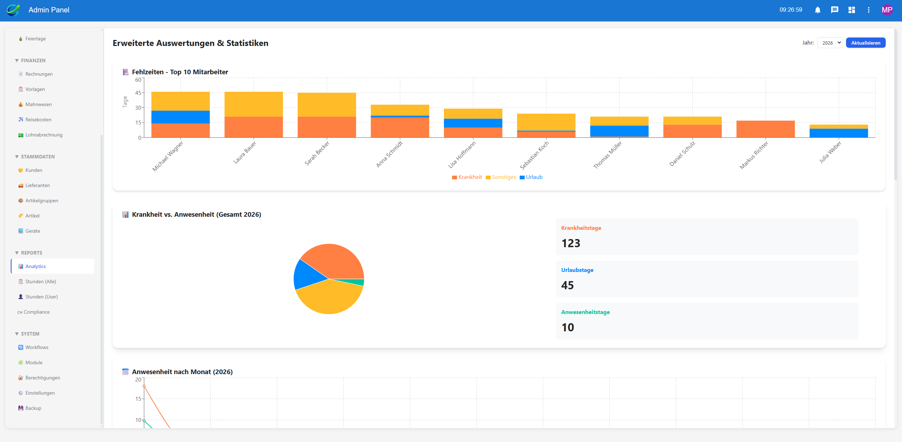

## Persönliche Reports

### Meine Arbeitszeit

**Eigene Arbeitszeitübersicht:**

1. Navigieren Sie zu **"Berichte"** im Menü
2. Tab: **"Meine Arbeitszeit"**

**Angezeigt werden:**

**Übersicht:**
- 📊 **Heute:** X Stunden
- 📊 **Diese Woche:** X Stunden
- 📊 **Dieser Monat:** X Stunden
- 📊 **Dieses Jahr:** X Stunden

**Grafiken:**
- **Liniendiagramm:** Arbeitsstunden pro Tag (letzte 30 Tage)
- **Balkendiagramm:** Stunden pro Projekt
- **Kreisdiagramm:** Zeitverteilung (Projekte)

### Filter anwenden

**Zeitraum wählen:**

1. Klicken Sie auf **"📅 Zeitraum"**
2. Wählen Sie:
   - **Heute**
   - **Gestern**
   - **Diese Woche**
   - **Letzter Monat**
   - **Dieses Jahr**
   - **Benutzerdefiniert:** Von-Bis Datum
3. Report aktualisiert sich automatisch

### Export

**Report exportieren:**

1. Klicken Sie auf **"📥 Exportieren"**
2. Wählen Sie Format:
   - **PDF** - Formatierter Bericht mit Grafiken
   - **Excel** - Rohdaten für eigene Analysen
   - **CSV** - Für Import in andere Systeme
3. Datei wird heruntergeladen

## Team-Reports (Admin)

Als Administrator haben Sie Zugriff auf Team-weite Reports:

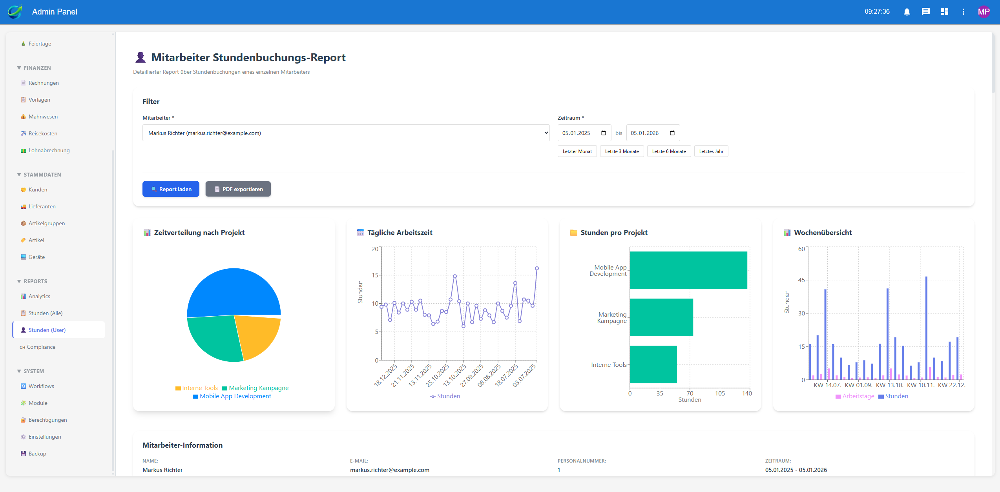

### Mitarbeiter-Übersicht

**Team-Arbeitszeiten:**

1. Gehen Sie zu **"Berichte"**
2. Tab: **"Team-Übersicht"**

**Tabelle zeigt:**
- 👤 **Mitarbeiter-Name**
- ⏱️ **Heutige Arbeitszeit**
- 📊 **Wochenarbeitszeit**
- 📊 **Monatsarbeitszeit**
- 🕐 **Überstunden** (+/- Stunden)
- ✅ **Status** (Eingestempelt/Ausgestempelt)

**Filtern:**
- Nach Abteilung
- Nach Zeitraum
- Nach Status

### Projekt-Auswertungen

**Alle Projekte auswerten:**

1. Tab: **"Projekt-Reports"**
2. Sie sehen alle Projekte:
   - 📁 Projekt-Name
   - ⏱️ Gebuchte Stunden (Gesamt)
   - 💰 Budget-Status (%)
   - 👥 Mitarbeiter-Anzahl
   - 📊 Fortschritt (%)

**Drill-Down:**
- Klicken Sie auf ein Projekt für Details
- Sie sehen:
  - Zeitverteilung pro Mitarbeiter
  - Zeitverlauf (Diagramm)
  - Kosten-Übersicht

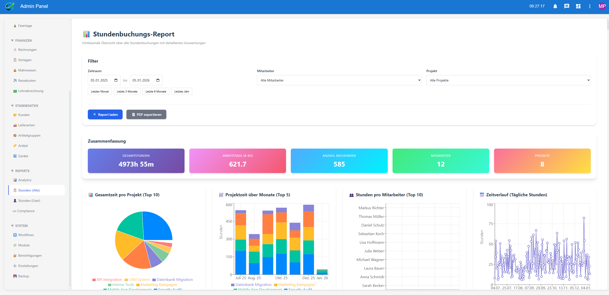

### Abwesenheiten-Report

**Abwesenheiten im Team:**

1. Tab: **"Abwesenheiten"**
2. Sie sehen:
   - 👤 Mitarbeiter
   - 📅 Datum (Von-Bis)
   - 📋 Typ (Urlaub, Krankheit, etc.)
   - ⏱️ Dauer (Tage)
   - ✅ Status

**Statistiken:**
- **Urlaub:** X Tage gesamt
- **Krankheit:** X Tage gesamt
- **Durchschnitt:** X Tage pro Mitarbeiter
- **Krankenquote:** XX%

### Urlaubsplanung

**Urlaubskalender (Team):**

1. Tab: **"Urlaubsplanung"**
2. **Kalender-Ansicht:**
   - Alle Urlaubstage des Teams
   - Farbcodiert nach Mitarbeiter
   - **Konflikte:** Rot markiert (zu wenig Mitarbeiter anwesend)

**Export:**
- Als PDF für Aushang
- Als Excel für Planung

## Export-Funktionen

### Daten exportieren

**Allgemeine Export-Funktion:**

1. In jedem Report: Klicken Sie auf **"📥 Exportieren"**
2. Wählen Sie:
   - **Format:** PDF, Excel, CSV
   - **Zeitraum:** Von-Bis
   - **Filter:** z.B. nur bestimmte Mitarbeiter
3. Klicken Sie auf **"Exportieren"**

### PDF-Export

**PDF mit Grafiken:**
- Professionelles Layout
- Firmen-Logo und -Adresse
- Alle Grafiken und Tabellen
- Seitenzahlen

**Verwendung:**
- Archivierung
- Präsentationen
- Berichte an Geschäftsleitung

### Excel-Export

**Excel mit Rohdaten:**
- Alle Daten als Tabelle
- Kein Formatierung (reine Daten)
- Für eigene Pivot-Tabellen
- Formeln und Diagramme selbst erstellen

**Verwendung:**
- Eigene Analysen
- Weiterverarbeitung
- Import in andere Systeme

### CSV-Export

**CSV für Datenimport:**
- Kommagetrennte Werte
- Universell lesbar
- Für Import in andere Software

<div style="page-break-before: always;"></div>

# 11. Administration

Für Administratoren: Verwaltung des gesamten Systems.

## Benutzerverwaltung

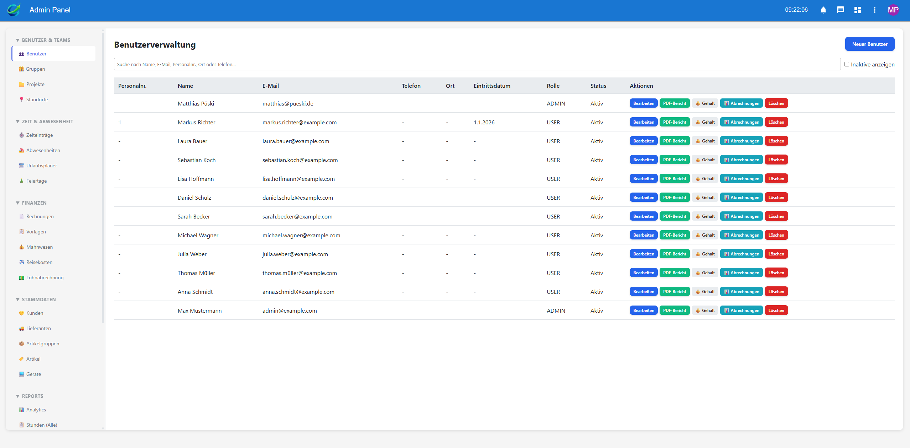

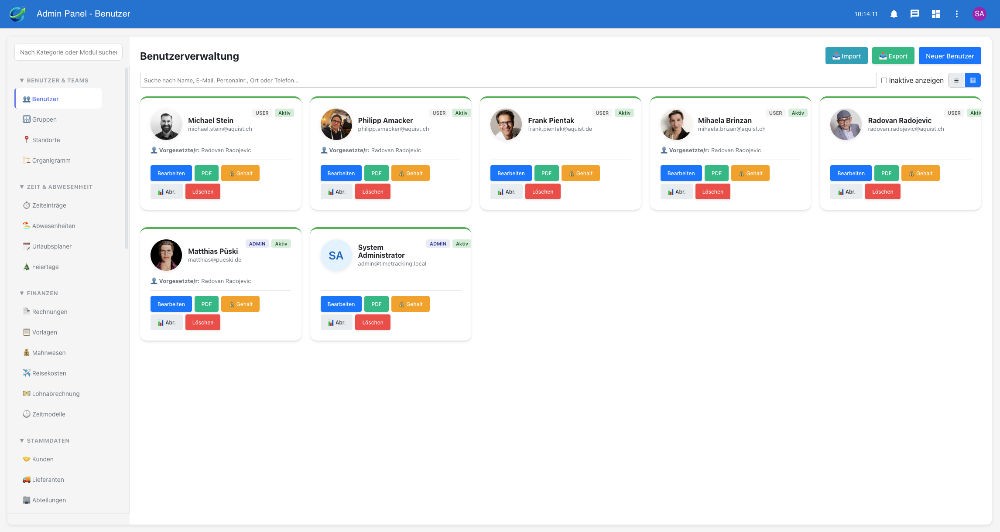

### Ansichtsmodus

**Die Benutzerliste unterstützt zwei Ansichtsmodi:**

- **☰ Tabellenansicht** - Klassische Listendarstellung mit allen Details
- **▦ Kartenansicht** - Visuelle Karten mit Avatar, Name, Rolle und Status (Standardansicht)

**Zwischen Ansichten wechseln:**

1. Oben rechts neben der Suchleiste finden Sie die **Umschalter-Buttons** (☰ / ▦)
2. Klicken Sie auf das gewünschte **Symbol**
3. Die Ansicht wechselt sofort

**Kartenansicht zeigt pro Benutzer:**
- 🖼️ **Avatar** (Profilbild oder Initialen-Platzhalter, 72px)
- 👤 **Vorname und Nachname**
- 📧 **E-Mail-Adresse**
- 🏷️ **Rolle** (ADMIN / USER, farblich hervorgehoben)
- ✅/🚫 **Status** (Aktiv / Inaktiv)
- 🏢 **Abteilung** und **Standort**
- 🔧 **Aktionsbuttons** (Bearbeiten, Passwort zurücksetzen, etc.)

### Benutzer erstellen

**Neuen Benutzer anlegen:**

1. Navigieren Sie zu **"Verwaltung" → "Benutzer"**
2. Klicken Sie auf **"+ Neuer Benutzer"**
3. Füllen Sie das Formular aus:

**Erforderliche Angaben:**
- ✅ **E-Mail:** Muss eindeutig sein
- ✅ **Vorname**
- ✅ **Nachname**
- ✅ **Rolle:** USER oder ADMIN
- ✅ **Urlaubstage:** z.B. 25
- ✅ **Zeitmodell:** Standard / Gleitzeit / Teilzeit
- Optional: **Abteilung**, **Vorgesetzter**

4. **Initiales Passwort:** System generiert automatisch
5. Klicken Sie auf **"Erstellen"**

✅ **Benutzer erhält E-Mail mit Zugangsdaten!**

### Benutzer bearbeiten

**Bestehenden Benutzer ändern:**

1. Finden Sie den **Benutzer** in der Liste
2. Klicken Sie auf **"✏️ Bearbeiten"**
3. Ändern Sie gewünschte Felder
4. Klicken Sie auf **"Speichern"**

**Änderbare Felder:**
- Name, E-Mail
- Rolle (USER ↔ ADMIN)
- Urlaubstage
- Zeitmodell
- Abteilung, Vorgesetzter
- Status (Aktiv/Inaktiv)

### Benutzer deaktivieren

**Benutzer vorübergehend deaktivieren:**

1. Finden Sie den **Benutzer**
2. Klicken Sie auf **"🚫 Deaktivieren"**
3. Bestätigen Sie

✅ **Benutzer kann sich nicht mehr anmelden!**

**Reaktivieren:**
- Klicken Sie auf **"✅ Aktivieren"**

### Passwort zurücksetzen

**Passwort für Benutzer zurücksetzen:**

1. Finden Sie den **Benutzer**
2. Klicken Sie auf **"🔑 Passwort zurücksetzen"**
3. Ein **neues Passwort** wird generiert
4. **Zeigen Sie dem Benutzer** das Passwort
   (oder: E-Mail-Versand, falls konfiguriert)

✅ **Benutzer muss Passwort beim nächsten Login ändern!**

## Benutzer-Avatar

### Avatar hochladen

**Profilbild für einen Benutzer hochladen:**

1. Öffnen Sie das **Benutzer-Detail** (Klick auf Bearbeiten-Button)
2. Im Tab **"Basis"** sehen Sie oben den **Avatar-Bereich**
3. Klicken Sie auf **"📷 Avatar hochladen"**
4. Wählen Sie ein **Bild** von Ihrem Computer

**Automatische Verarbeitung:**
- 🔄 Das Bild wird automatisch auf **200 × 200 Pixel** zugeschnitten
- 📐 Bilder werden zentriert und proportional beschnitten (*cover-crop*)
- 🖼️ Konvertierung ins effiziente **WebP-Format** (Qualität 85%)
- 📁 Speicherung unter `uploads/avatars/`

**Unterstützte Formate:**
- JPEG / JPG
- PNG
- WebP
- GIF

**Maximale Dateigröße:** 5 MB (vor Verarbeitung)

✅ **Avatar wird sofort in der Kartenansicht und im Organigramm angezeigt!**

### Avatar löschen

**Bestehendes Profilbild entfernen:**

1. Öffnen Sie das **Benutzer-Detail**
2. Neben dem aktuellen Avatar: Klicken Sie auf **"🗑️ Avatar löschen"**
3. Das Bild wird entfernt

✅ **Statt des Bildes werden wieder die Initialen angezeigt!**

### Avatar-Anzeige

**Der Avatar wird an folgenden Stellen angezeigt:**

- 👤 **Benutzer-Kartenansicht** (72px, rund)
- 🏗️ **Organigramm** (in jedem Knoten)
- 📋 **Benutzer-Detail-Modal** (großes Vorschaubild)
- 🔝 **Navigation** (falls konfiguriert)

**Ohne Avatar:**
- Es werden die **Initialen** des Benutzers (Vorname + Nachname) als farbiger Platzhalter angezeigt

## Benutzergruppen

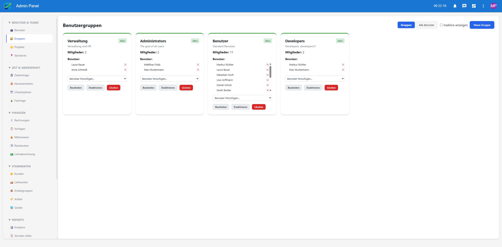

### Gruppe erstellen

**Neue Benutzergruppe:**

1. Gehen Sie zu **"Verwaltung" → "Benutzergruppen"**
2. Klicken Sie auf **"+ Neue Gruppe"**
3. Füllen Sie aus:
   - **Name:** z.B. "Entwickler", "HR-Team"
   - **Beschreibung:** Zweck der Gruppe
4. Klicken Sie auf **"Erstellen"**

### Benutzer zu Gruppen zuweisen

**Gruppenmitgliedschaft verwalten:**

1. Öffnen Sie eine **Gruppe**
2. Tab: **"Mitglieder"**
3. Klicken Sie auf **"+ Mitglied hinzufügen"**
4. Wählen Sie **Benutzer** aus Liste
5. Klicken Sie auf **"Hinzufügen"**

✅ **Benutzer ist nun Mitglied der Gruppe!**

**Benutzer entfernen:**
- Klicken Sie auf **"🗑️ Entfernen"** neben Benutzer

## Berechtigungen

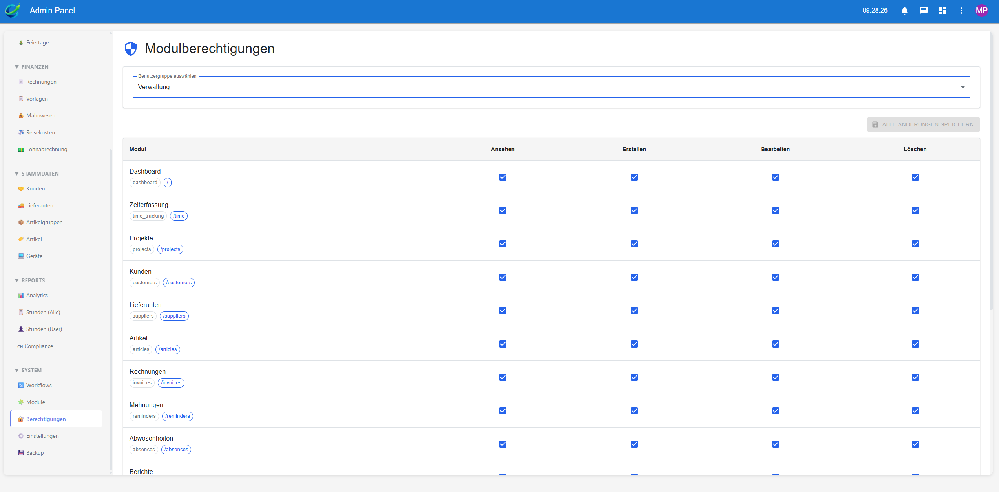

### Modulbasierte Berechtigungen

**Berechtigungen pro Gruppe vergeben:**

1. Öffnen Sie eine **Benutzergruppe**
2. Tab: **"Berechtigungen"**
3. Sie sehen alle **Module**:

**Pro Modul:**
- 👁️ **Ansehen** (View) - Daten einsehen
- ➕ **Erstellen** (Create) - Neue Einträge
- ✏️ **Bearbeiten** (Edit) - Vorhandenes ändern
- 🗑️ **Löschen** (Delete) - Einträge löschen

4. **Haken setzen** für gewünschte Berechtigungen
5. Klicken Sie auf **"Speichern"**

✅ **Alle Gruppenmitglieder erhalten diese Berechtigungen!**

### Beispiel: HR-Gruppe

| Modul | Ansehen | Erstellen | Bearbeiten | Löschen |
|-------|---------|-----------|-----------|---------|
| **Zeiterfassung** | ✅ | ❌ | ✅ | ❌ |
| **Urlaub** | ✅ | ❌ | ✅ | ❌ |
| **Abwesenheiten** | ✅ | ❌ | ✅ | ❌ |
| **Benutzer** | ✅ | ✅ | ✅ | ❌ |
| **Bewerber** | ✅ | ✅ | ✅ | ✅ |
| **E-Learning** | ✅ | ✅ | ✅ | ✅ |
| **Rechnungen** | ❌ | ❌ | ❌ | ❌ |

## Abteilungen

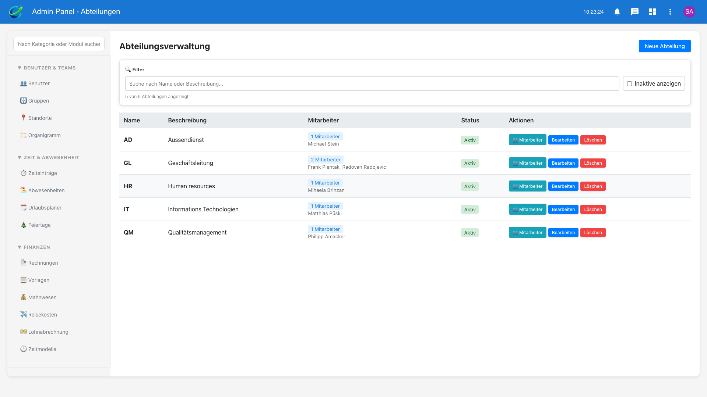

**Abteilungen strukturieren Ihre Organisation:**

### Abteilung erstellen

1. Gehen Sie zu **"Verwaltung" → Tab "Abteilungen"**
2. Klicken Sie auf **"+ Neue Abteilung"**
3. Geben Sie ein:
   - **Name:** z.B. "Entwicklung", "Vertrieb", "HR"
   - **Beschreibung:** Zweck der Abteilung
   - **Leiter:** Verantwortliche Person (optional)
4. Klicken Sie auf **"Erstellen"**

### Mitarbeiter zuweisen

1. Im **Benutzer-Detail** (Bearbeiten)
2. Wählen Sie die **Abteilung** im Dropdown-Feld
3. Speichern

✅ **Der Mitarbeiter erscheint nun in der entsprechenden Abteilung im Organigramm!**

## Organigramm

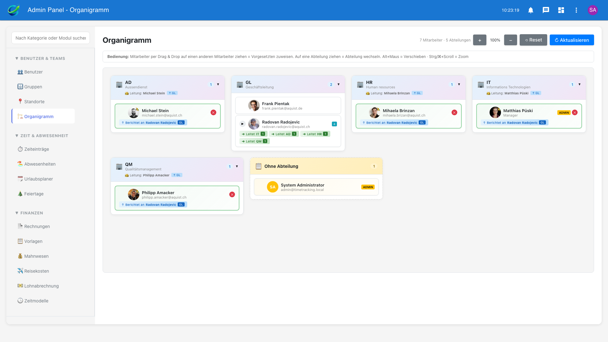

**Visuelle Darstellung der Organisationsstruktur:**

### Organigramm anzeigen

1. Gehen Sie zu **"Verwaltung" → Tab "Organigramm"**
2. Das Organigramm wird als **Baumstruktur** dargestellt

**Pro Knoten sehen Sie:**
- 🖼️ **Avatar** (Profilbild oder Initialen)
- 👤 **Name** des Mitarbeiters
- 🏢 **Abteilung**
- 📋 **Stellenfunktion**
- 🔗 **Berichtslinien** (Vorgesetzter → Mitarbeiter)

### Hierarchie verwalten

**Berichtslinien festlegen:**

1. Im **Benutzer-Detail** (Bearbeiten)
2. Wählen Sie den **Vorgesetzten** im Dropdown-Feld
3. Speichern
4. Die Hierarchie wird automatisch im Organigramm aktualisiert

✅ **Avatare werden direkt in den Organigramm-Knoten angezeigt!**

## Modulverwaltung

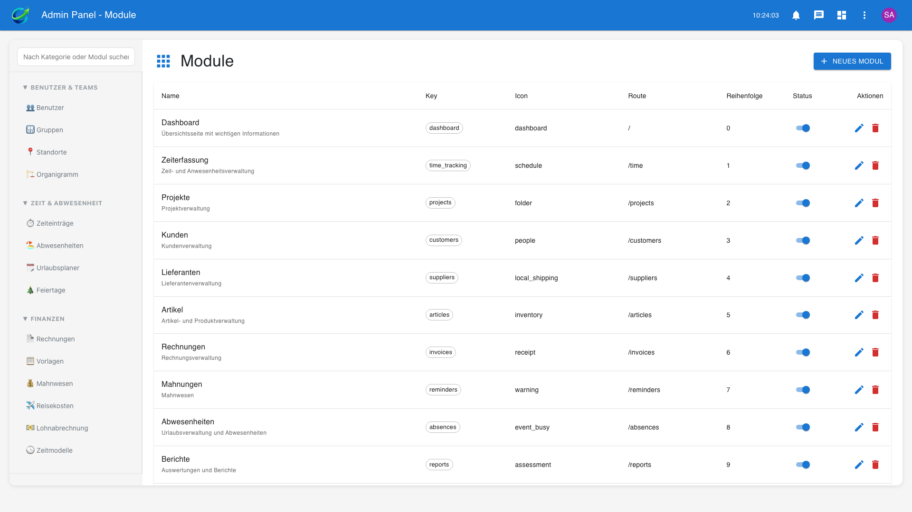

### Module aktivieren/deaktivieren

**Module ein-/ausschalten:**

1. Gehen Sie zu **"Verwaltung" → "Module"**
2. Sie sehen alle verfügbaren Module
3. **Toggle-Switch** neben jedem Modul:
   - 🟢 **An** - Modul ist aktiv
   - 🔴 **Aus** - Modul ist deaktiviert

**Module deaktivieren:**
- Klicken Sie auf den **Switch**
- Modul wird ausgeblendet für alle Benutzer

✅ **Nützlich für schrittweise Einführung!**

### Modul-Konfiguration

**Modul-Einstellungen anpassen:**

1. Klicken Sie auf ein **Modul**
2. Sie sehen **Modul-spezifische Einstellungen**

**Beispiel: Zeiterfassung**
- Max. Arbeitszeit/Tag: 10h
- Pausenregelung: Pflicht ab 6h
- Projektbuchung: Pflicht / Optional
- Nachträgliche Korrekturen: Nur Admin / Alle

3. Nehmen Sie Änderungen vor
4. Klicken Sie auf **"Speichern"**

## System-Einstellungen

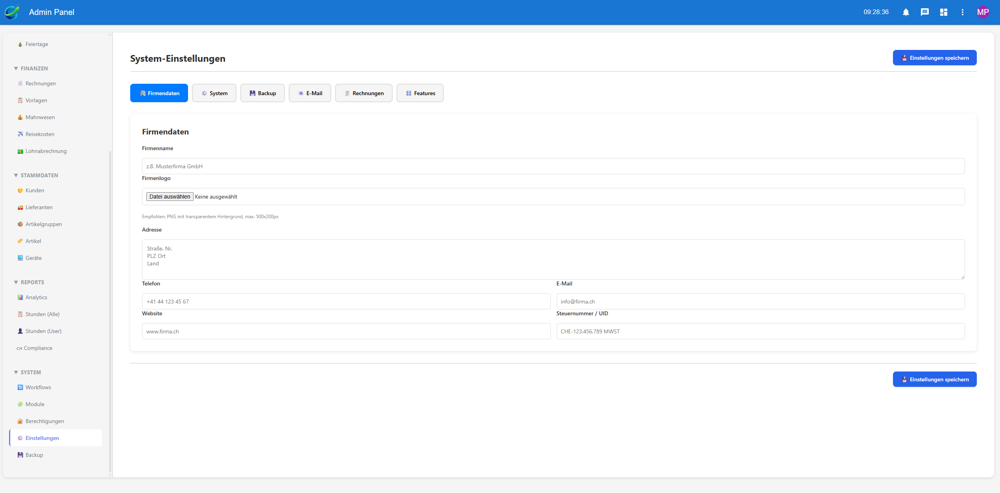

### Allgemeine Einstellungen

**Firmen-Daten:**

1. Gehen Sie zu **"Verwaltung" → "System-Einstellungen"**
2. Tab: **"Firma"**

**Einstellungen:**
- 🏢 **Firmenname**
- 📍 **Adresse**
- 📞 **Telefon**
- 📧 **E-Mail**
- 🌐 **Website**
- 🏦 **IBAN** (für QR-Rechnungen)
- 🔢 **MWST-Nummer**
- 🖼️ **Logo** (Upload)

### E-Mail-Konfiguration

**E-Mail-Versand einrichten:**

Tab: **"E-Mail"**

**SMTP-Server:**
- 📧 **SMTP-Host:** z.B. smtp.gmail.com
- 🔐 **SMTP-Port:** 587 (Standard)
- 👤 **Benutzername**
- 🔑 **Passwort**
- 📨 **Absender-E-Mail**
- 📝 **Absender-Name**

**Test-E-Mail senden:**
- Klicken Sie auf **"📧 Test-E-Mail senden"**
- Geben Sie Ihre E-Mail ein
- Überprüfen Sie Posteingang

### Zeiterfassung-Einstellungen

Tab: **"Zeiterfassung"**

**Konfiguration:**
- ⏰ **Max. Arbeitszeit/Tag:** 10 Stunden
- ☕ **Pausenregelung:**
  - Pause ab: 6 Stunden
  - Mindest-Pausendauer: 30 Minuten
- 📁 **Projektbuchung:** Pflicht / Optional
- ✏️ **Nachträgliche Korrekturen:** Nur Admin / Alle (bis X Tage)
- 🕐 **Überstunden:** Aktiviert / Deaktiviert
- 📊 **Zeitkonto-System:** Aktiviert / Deaktiviert

### Urlaubseinstellungen

Tab: **"Urlaub"**

**Konfiguration:**
- 📅 **Standard-Urlaubstage:** 25 (pro Jahr, Vollzeit)
- 📆 **Übertrag ins neue Jahr:** Erlaubt / Verboten
- 🔢 **Max. Übertrag:** 5 Tage
- ⚠️ **Mindesturlaubsantrag:** 2 Wochen im Voraus
- 🔔 **Genehmigung nötig:** Ja / Nein (Auto-Genehmigung)

### Feiertage

Tab: **"Feiertage"**

**Feiertage verwalten:**

1. Sie sehen alle **hinterlegten Feiertage**
2. **Nach Kanton** gefiltert (falls mehrere Standorte)

**Feiertag hinzufügen:**
- Klicken Sie auf **"+ Neuer Feiertag"**
- **Datum**, **Name**, **Kanton** eingeben
- Speichern

**Standard-Feiertage importieren:**
- Klicken Sie auf **"Schweizer Feiertage importieren"**
- Wählen Sie **Kanton**
- Alle Feiertage werden automatisch eingefügt

### Backup & Wiederherstellung

Tab: **"Backup"**

**Manuelles Backup:**

1. Klicken Sie auf **"🔄 Backup jetzt erstellen"**
2. Backup wird erstellt (kann einige Minuten dauern)
3. Backup wird in **Backup-Liste** angezeigt
4. **Download:** Klicken Sie auf **"📥 Herunterladen"**

**Automatische Backups:**
- ✅ **Automatisches Backup:** Aktiviert
- 🕐 **Zeitplan:** Täglich um 02:00 Uhr
- 🔢 **Aufbewahrung:** 30 Tage

**Wiederherstellung:**

1. Klicken Sie auf **"♻️ Wiederherstellen"** neben Backup
2. **Warnung:** Alle aktuellen Daten werden überschrieben!
3. Bestätigen Sie: **"Ja, wiederherstellen"**
4. System wird wiederhergestellt und neu gestartet

⚠️ **Nur in Notfällen verwenden!**

## Stellenfunktionen

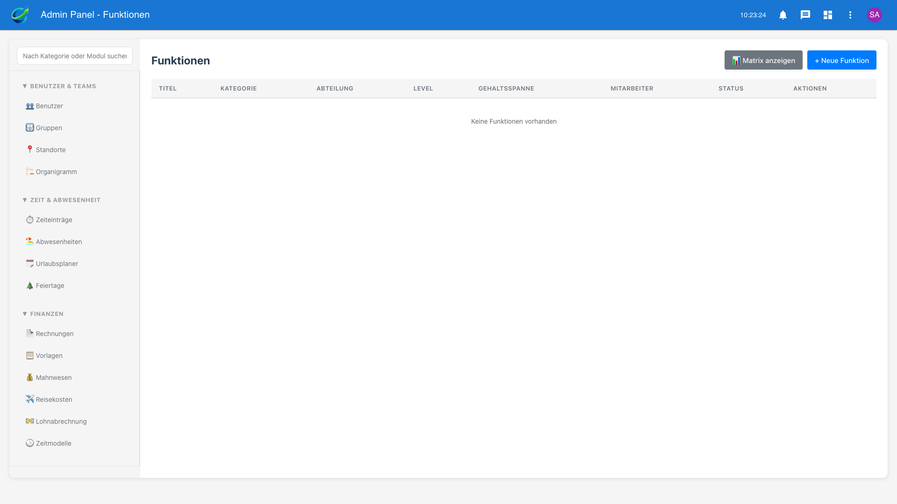

**Berufsbezeichnungen und Stellenfunktionen verwalten:**

### Funktion erstellen

1. Gehen Sie zu **"Verwaltung" → Tab "Funktionen"**
2. Klicken Sie auf **"+ Neue Funktion"**
3. Geben Sie ein:
   - **Bezeichnung:** z.B. "Software-Entwickler", "Projektleiter", "Team Lead"
   - **Beschreibung:** Aufgabenbeschreibung (optional)
4. Klicken Sie auf **"Erstellen"**

### Funktion zuweisen

1. Im **Benutzer-Detail** (Bearbeiten)
2. Wählen Sie die **Stellenfunktion** im Dropdown-Feld
3. Speichern

✅ **Die Funktion wird im Organigramm und in der Kartenansicht angezeigt!**

## System-Logs

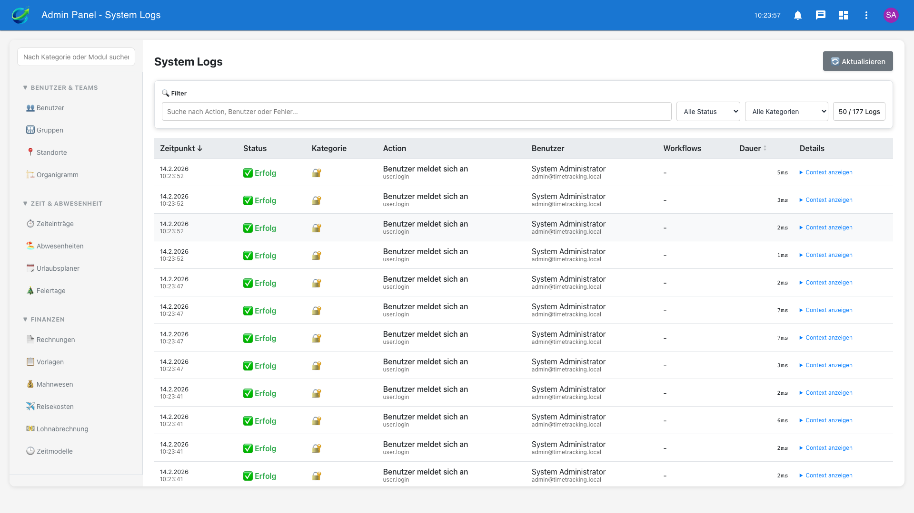

**Systemprotokollierung für Administratoren:**

### Logs einsehen

1. Gehen Sie zu **"Verwaltung" → Tab "System-Logs"**
2. Sie sehen chronologisch alle System-Ereignisse

**Protokollierte Aktionen:**
- 🔑 **Login-Versuche** (erfolgreich/fehlgeschlagen)
- 👤 **Benutzer-Änderungen** (Erstellen, Bearbeiten, Deaktivieren)
- ⏱️ **Zeiteinträge** (Korrekturen, Löschungen)
- 📋 **Modul-Zugriffe** und Berechtigungsänderungen
- 🔧 **System-Konfigurationsänderungen**

**Filter:**
- Nach Datum/Zeitraum
- Nach Benutzer
- Nach Aktion/Typ
- Nach Schweregrad

✅ **Wichtig für Audit-Trail und Compliance-Nachweis!**

<div style="page-break-before: always;"></div>

# 12. Weitere Module

CFlux beinhaltet viele weitere spezialisierte Module:

## Intranet

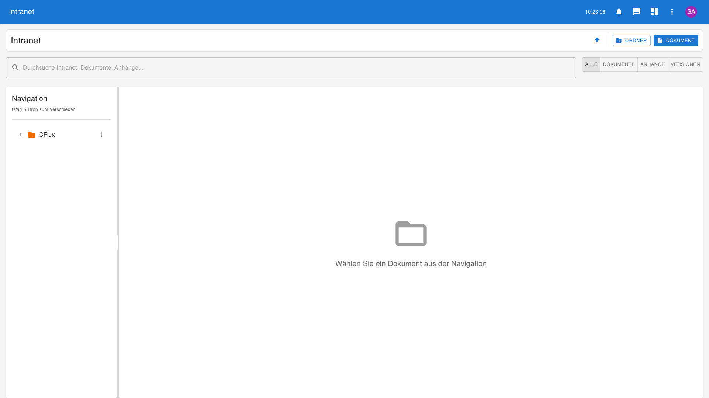

**Internes Dokumenten-Management:**

- 📁 Hierarchische Dokument-Struktur
- 📝 Rich-Text-Editor für Inhalte
- 📎 Datei-Anhänge mit Versionierung
- 🔐 Gruppen-basierte Zugriffsrechte
- 🔍 Volltext-Suche über alle Dokumente
- 📊 Dokumenten-Statistiken

**Verwendung:**
- Internes Wiki
- Prozess-Dokumentationen
- Formulare und Vorlagen
- Anleitungen und Handbücher

## Bestellungen

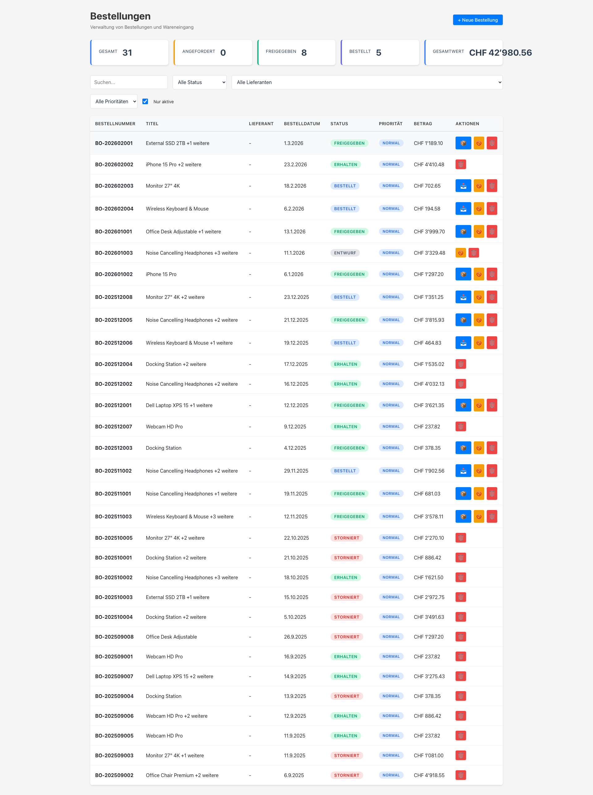

**Bestellwesen mit mehrstufigem Workflow:**

### Bestellung erstellen

1. Navigieren Sie zu **"Bestellungen"** im Menü
2. Klicken Sie auf **"+ Neue Bestellung"**
3. Füllen Sie das Formular aus:
   - 🏭 **Lieferant:** Lieferant auswählen
   - 📝 **Beschreibung:** Bestellgrund
   - 📦 **Positionen:** Artikel, Menge, Einzelpreis
4. Klicken Sie auf **"Erstellen"**

✅ **Bestellnummer wird automatisch generiert (Format: BO-XXXXXX)!**

### 8-Stufen-Workflow

Jede Bestellung durchläuft einen strukturierten Workflow:

| Stufe | Status | Beschreibung |
|-------|--------|--------------|
| 1 | **Entwurf** (Draft) | Bestellung in Bearbeitung |
| 2 | **Angefragt** (Requested) | Bestellung eingereicht |
| 3 | **Genehmigt** (Approved) | Von Vorgesetztem genehmigt |
| 4 | **Bestellt** (Ordered) | Beim Lieferanten bestellt |
| 5 | **Teillieferung** (Partially Received) | Teilweise geliefert |
| 6 | **Erhalten** (Received) | Vollständig geliefert |
| 7 | **Storniert** (Cancelled) | Bestellung abgebrochen |
| 8 | **Abgelehnt** (Rejected) | Nicht genehmigt |

### Lieferungen erfassen

**Bei Teillieferungen:**

1. Öffnen Sie die **Bestellung**
2. Klicken Sie auf **"📦 Lieferung erfassen"**
3. Geben Sie **gelieferte Mengen** pro Position ein
4. Klicken Sie auf **"Speichern"**

✅ **Status wechselt automatisch zu "Teillieferung" oder "Erhalten"!**

### Bestellübersicht (Admin)

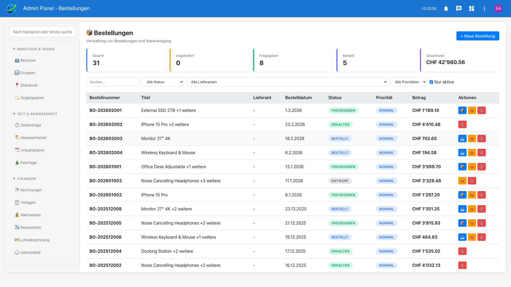

In der Verwaltung sehen Admins:
- 📊 Alle Bestellungen mit Status-Filter
- 💰 Gesamtwerte und Budgets
- 📅 Liefertermine
- ✅ Genehmigungsaktionen

## Checklisten

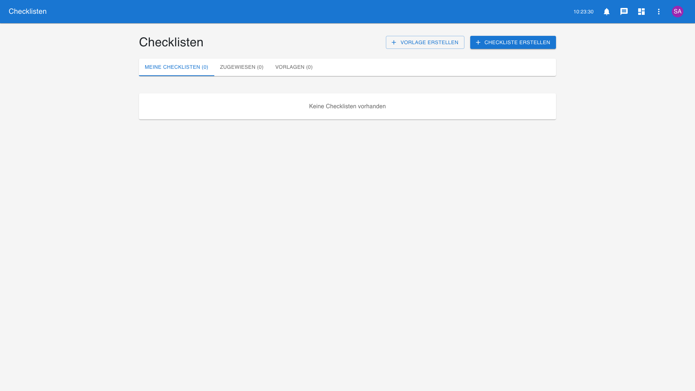

**Vorlagenbasierte Prüflisten und Aufgabenlisten:**

### Vorlagen erstellen (Admin)

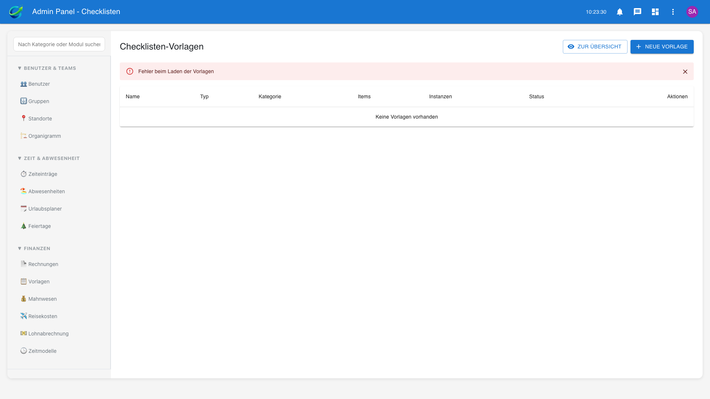

1. Navigieren Sie zu **"Checklisten"** im Menü
2. Klicken Sie auf **"+ Neue Vorlage"**
3. Füllen Sie aus:
   - **Titel:** z.B. "Tägliche Sicherheitsprüfung"
   - **Beschreibung:** Zweck der Checkliste
   - **Kategorie:** Zuordnung
4. Fügen Sie **Prüfpunkte** hinzu:
   - 📝 Bezeichnung des Prüfpunkts
   - ✅ Typ (Checkbox, Text-Eingabe, Ja/Nein)
   - ⚠️ Pflichtfeld (Ja/Nein)
5. Klicken Sie auf **"Speichern"**

### Checkliste ausfüllen

1. Navigieren Sie zu **"Checklisten"**
2. Klicken Sie auf **"+ Neue Checkliste"** (aus Vorlage)
3. Wählen Sie eine **Vorlage** aus
4. Füllen Sie alle **Prüfpunkte** aus:
   - ✅ Checkboxen abhaken
   - 📝 Textfelder ausfüllen
   - 📎 Anhänge hinzufügen (optional)
5. Klicken Sie auf **"Abschließen"**

✅ **Die ausgefüllte Checkliste wird gespeichert und ist für Admins einsehbar!**

### Checklisten-Übersicht

- 📋 Alle erstellten und abgeschlossenen Checklisten
- 📊 Fortschrittsanzeige (X von Y Punkten erledigt)
- 📅 Filter nach Datum, Vorlage, Bearbeiter
- 📥 Export als PDF

## News-Verwaltung

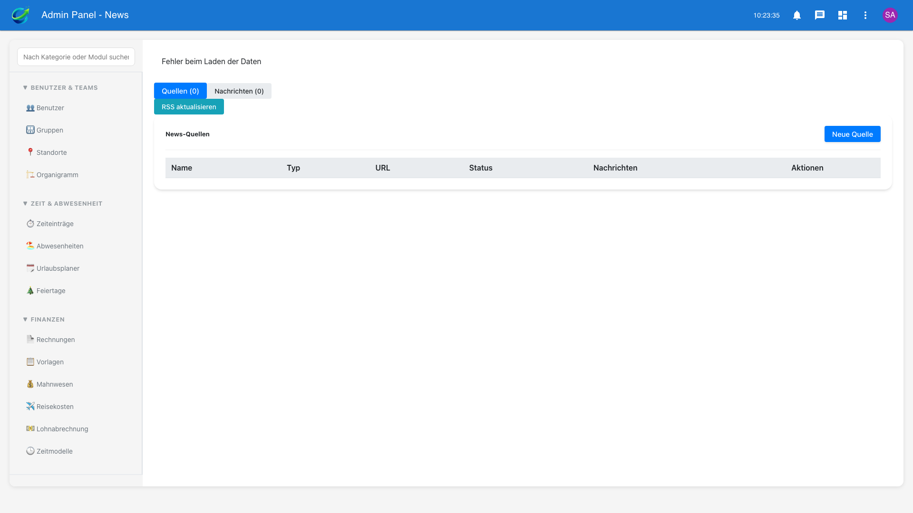

**Interne Nachrichten und Ankündigungen für alle Mitarbeiter:**

### News erstellen (Admin)

1. Gehen Sie zu **"Verwaltung" → Tab "News"**
2. Klicken Sie auf **"+ Neuer Beitrag"**
3. Füllen Sie aus:
   - 📋 **Titel:** Überschrift des Beitrags
   - 📝 **Inhalt:** Rich-Text mit Formatierung
   - 🏷️ **Kategorie:** z.B. "Allgemein", "HR", "IT"
   - 📅 **Veröffentlichungsdatum**
   - 📌 **Angeheftet:** Wichtige Beiträge oben fixieren
4. Klicken Sie auf **"Veröffentlichen"**

### News anzeigen

- News erscheinen auf dem **Dashboard** und/oder im **Menü**
- Neue Beiträge werden markiert
- Ältere Beiträge sind chronologisch sortiert

### News bearbeiten/löschen

1. In der **News-Verwaltung** (Admin)
2. Klicken Sie auf **"✏️ Bearbeiten"** oder **"🗑️ Löschen"**

## Medien

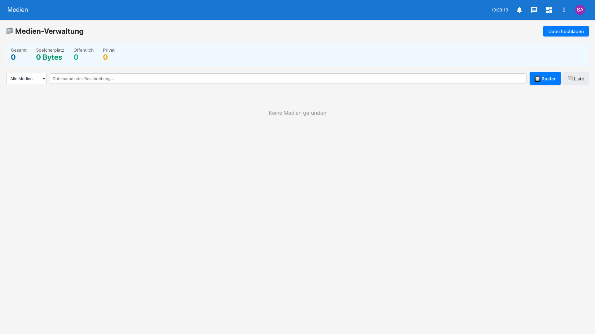

**Zentrale Medienverwaltung und Galerie:**

### Medien hochladen

1. Navigieren Sie zu **"Medien"** im Menü
2. Klicken Sie auf **"+ Hochladen"**
3. Wählen Sie **Dateien** aus (Bilder, PDFs, Dokumente)
4. Optional: **Titel** und **Beschreibung** ergänzen
5. Klicken Sie auf **"Hochladen"**

**Unterstützte Dateitypen:**
- 🖼️ Bilder (JPEG, PNG, WebP, GIF, SVG)
- 📄 Dokumente (PDF, DOC, DOCX, XLS, XLSX)
- 📹 Videos (MP4, WebM)
- 📁 Weitere Dateiformate

### Medien verwalten

- 🔍 **Suche:** Nach Dateinamen oder Beschreibung
- 📁 **Kategorien:** Medien nach Typ filtern
- 📥 **Download:** Dateien herunterladen
- 🗑️ **Löschen:** Nicht mehr benötigte Medien entfernen
- 📋 **Details:** Dateigröße, Format, Hochladedatum

## Incident Management (EHS)

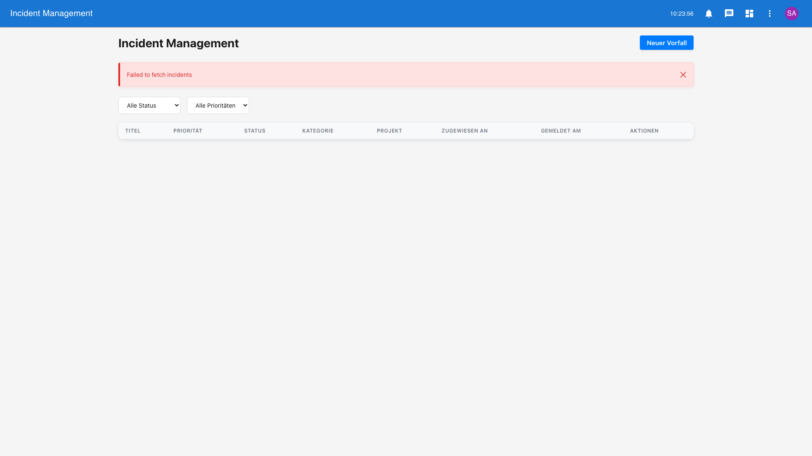

**Arbeitssicherheit & Vorfälle:**

- 🚨 Vorfälle erfassen (Unfälle, Beinahe-Unfälle)
- 📋 Kategorisierung nach Schwere
- 📊 Root-Cause-Analysis
- ✅ Maßnahmen-Tracking
- 🔔 Workflow für Meldung und Bearbeitung
- 📈 Statistiken und Reports

**Verwendung:**
- EHS (Environment, Health, Safety)
- Arbeitsschutz
- Compliance (Unfallmeldepflicht)

## Stammdaten

### Kunden

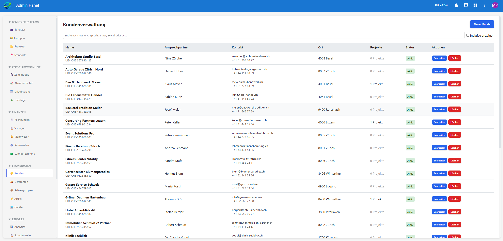

**Kundenverwaltung:**
- 🏢 Firmen-Daten
- 📍 Adressen
- 👤 Ansprechpartner
- 💰 Preislisten / Konditionen
- 📄 Dokumente

### Lieferanten

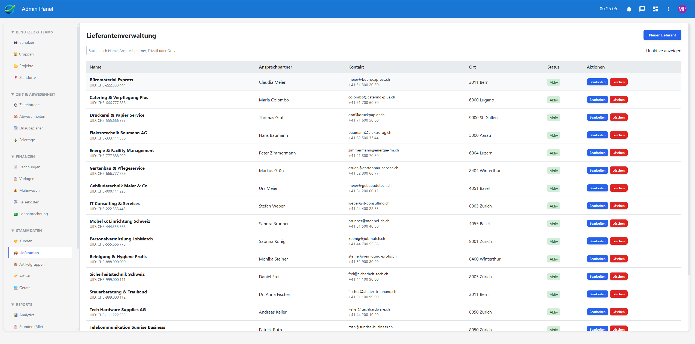

**Lieferantenverwaltung:**
- 🏭 Lieferanten-Stammdaten
- 📦 Produkte / Dienstleistungen
- 💵 Preise und Konditionen
- 📄 Verträge

### Artikel

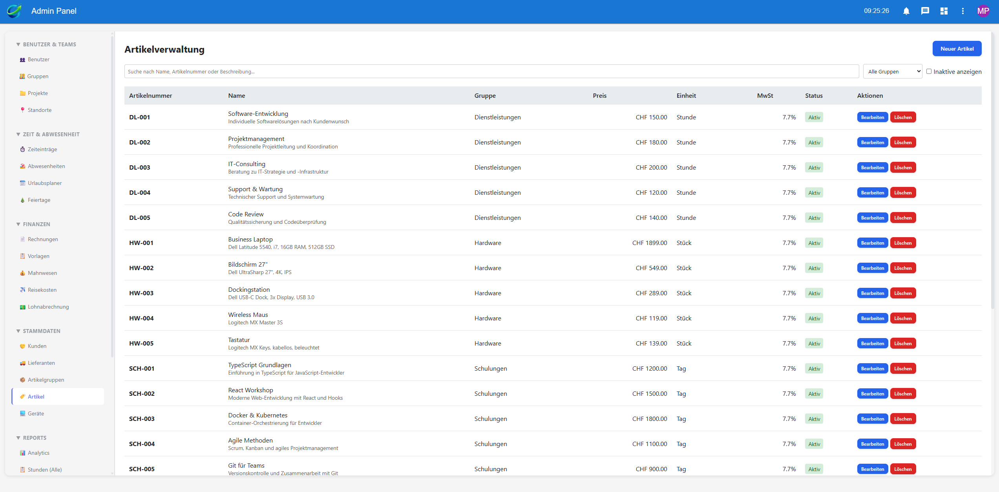

**Artikelverwaltung:**
- 📦 Produkte / Artikel
- 🔢 Artikelnummern / Barcodes
- 💰 Preise (Einkauf/Verkauf)
- 📊 Lagerbestand
- 📁 Artikelgruppen

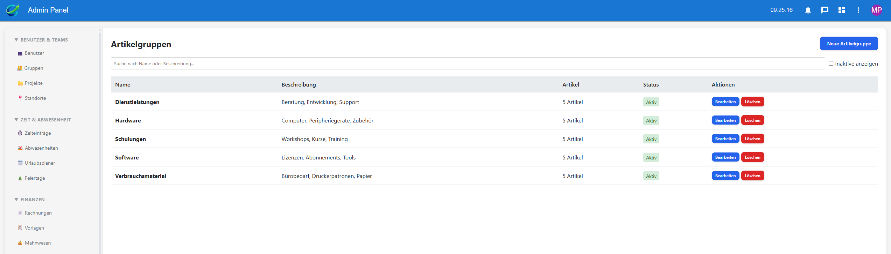

## Geräte

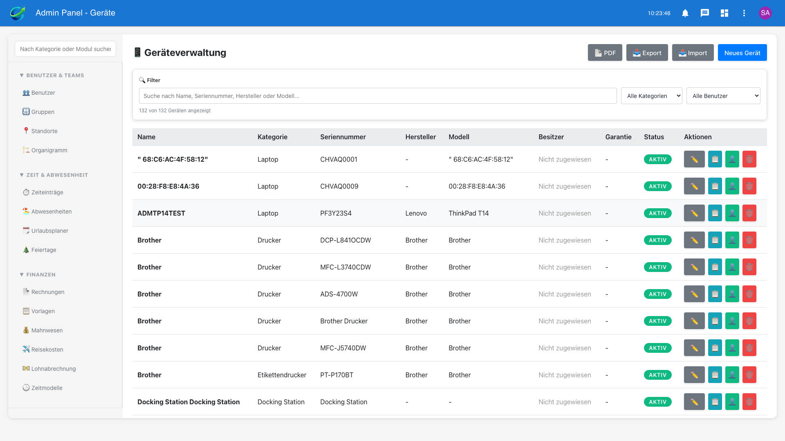

**Geräteverwaltung und -zuordnung:**

### Gerät erfassen

1. Gehen Sie zu **"Verwaltung" → Tab "Geräte"**
2. Klicken Sie auf **"+ Neues Gerät"**
3. Füllen Sie aus:
   - 📋 **Bezeichnung:** z.B. "MacBook Pro 16 Zoll"
   - 🔢 **Seriennummer**
   - 🏷️ **Kategorie:** Laptop, Monitor, Telefon, etc.
   - 📅 **Anschaffungsdatum**
   - 💰 **Anschaffungswert**
   - 📍 **Standort**
4. Klicken Sie auf **"Erstellen"**

### Gerät zuweisen

1. In der **Geräteliste:** Klicken Sie auf ein Gerät
2. Wählen Sie **"Zuweisen"**
3. Wählen Sie den **Mitarbeiter** aus
4. Speichern

**Geräteinformationen:**
- 👤 **Zugewiesen an:** Aktueller Nutzer
- 📅 **Zuweisungsdatum**
- 📊 **Status:** Verfügbar, Zugewiesen, In Reparatur, Ausgemustert
- 📝 **Notizen:** Zustand, Zubehör, etc.

✅ **Vollständige Nachverfolgbarkeit aller Firmengeräte!**

## Kostenstellen

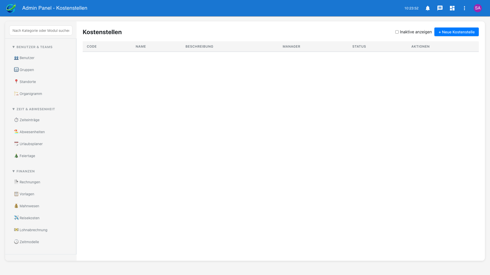

**Kostenstellenverwaltung für die Buchhaltung:**

### Kostenstelle erstellen

1. Gehen Sie zu **"Verwaltung" → Tab "Kostenstellen"** oder direkt zur **Kostenstellen-Seite**
2. Klicken Sie auf **"+ Neue Kostenstelle"**
3. Füllen Sie aus:
   - 🔢 **Nummer:** Kostenstellennummer (z.B. 1000, 2000)
   - 📋 **Bezeichnung:** z.B. "Verwaltung", "Produktion", "Vertrieb"
   - 📝 **Beschreibung:** Erläuterung (optional)
   - 👤 **Verantwortlicher:** Kostenstellenleiter
4. Klicken Sie auf **"Erstellen"**

### Kostenstellen zuordnen

Kostenstellen können zugeordnet werden zu:
- 👤 **Mitarbeiter** (über Benutzer-Detail)
- 📁 **Projekte** (über Projekt-Einstellungen)
- 📦 **Bestellungen** (bei Bestellerfassung)
- 🧾 **Rechnungen** (bei Rechnungspositionen)

✅ **Ermöglicht detaillierte Kostenauswertungen pro Kostenstelle!**

## Lagerbestand

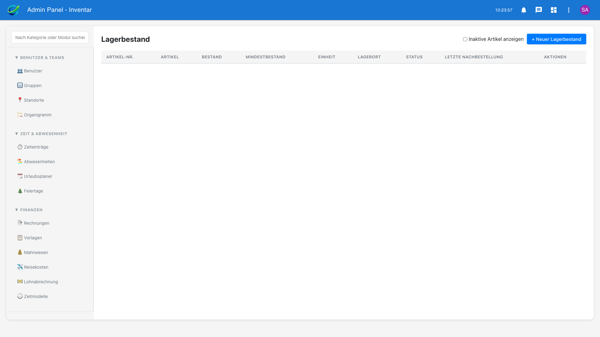

**Inventar- und Bestandsverwaltung:**

### Bestand einsehen

1. Gehen Sie zu **"Verwaltung" → Tab "Lagerbestand"**
2. Sie sehen alle **Artikel mit aktuellem Bestand**

**Angezeigt werden:**
- 📦 **Artikel:** Name und Nummer
- 🔢 **Aktueller Bestand:** Stückzahl
- ⚠️ **Mindestbestand:** Schwellenwert
- 📊 **Status:** OK / Niedrig / Kritisch (farbcodiert)
- 📍 **Lagerort**

### Bestandsbewegungen

- **Wareneingang:** Bestand erhöhen (z.B. bei Lieferung)
- **Warenausgang:** Bestand reduzieren (z.B. bei Verbrauch)
- **Inventur:** Bestand manuell korrigieren
- **Umlagerung:** Zwischen Lagerorten verschieben

### Bestandswarnungen

- ⚠️ Bei Unterschreiten des **Mindestbestands** wird eine Warnung angezeigt
- 📧 Optional: Automatische E-Mail-Benachrichtigung
- 📊 Bestandshistorie und Verlaufsdiagramme

## Lohnabrechnung

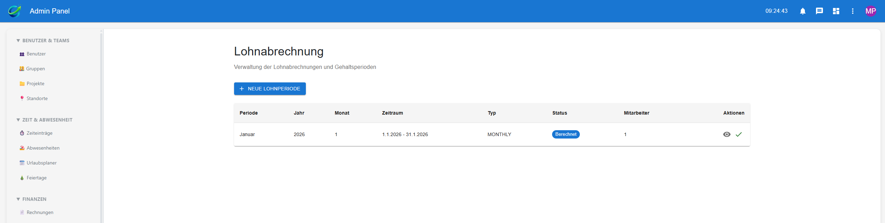

**Lohn- und Gehaltsabrechnung:**

- 💰 Lohndaten erfassen
- 📊 Abrechnungen erstellen
- 📄 Lohnausweise generieren
- 🧾 Steuerabzüge (Schweiz)
- 📈 Sozialversicherungen (AHV, ALV, etc.)
- 📧 Versand an Mitarbeiter

**Verwendung:**
- Monatliche Lohnabrechnung
- Jahresabschlüsse
- Lohnausweise für Steuerbehörden

## Mahnwesen

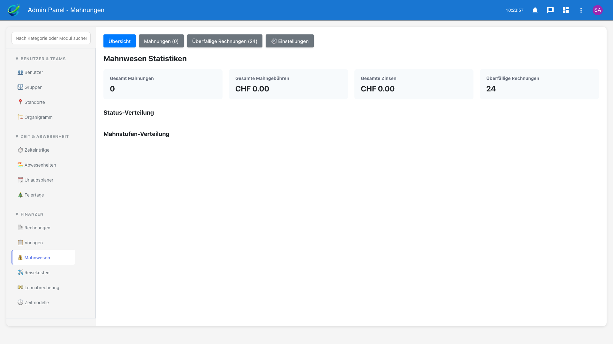

**Automatisiertes Mahnwesen für überfällige Rechnungen:**

### Mahnstufen

CFlux unterstützt ein mehrstufiges Mahnsystem:

| Stufe | Tage nach Fälligkeit | Aktion |
|-------|---------------------|--------|
| **Erinnerung** | 7 Tage | Freundliche Zahlungserinnerung |
| **1. Mahnung** | 14 Tage | Erste Mahnung |
| **2. Mahnung** | 30 Tage | Zweite Mahnung mit Gebühr |
| **3. Mahnung** | 45 Tage | Letzte Mahnung vor Inkasso |

### Mahnungen verwalten

1. Gehen Sie zu **"Verwaltung" → Tab "Mahnwesen"**
2. Sie sehen alle **überfälligen Rechnungen**
3. **Aktionen:**
   - 📧 **Mahnung senden** (E-Mail)
   - 📄 **Mahnung als PDF** generieren
   - ✅ **Als bezahlt markieren**
   - 📝 **Notiz hinzufügen**

✅ **Überfällige Rechnungen werden automatisch erkannt und markiert!**

## Reisekosten

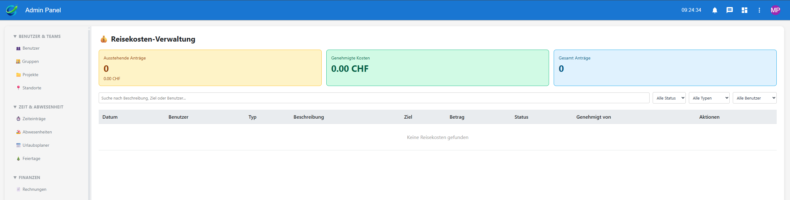

**Spesenabrechnung:**

- 🚗 Reisekosten erfassen
- 🍽️ Verpflegung, Übernachtung
- 🚆 Transportkosten (km-Geld, Tickets)
- 📎 Belege hochladen (Scan/Foto)
- ✅ Genehmigungsprozess
- 💰 Auszahlung verfolgen

**Verwendung:**
- Geschäftsreisen
- Kundenbesuche
- Außendienstmitarbeiter

## Workflows

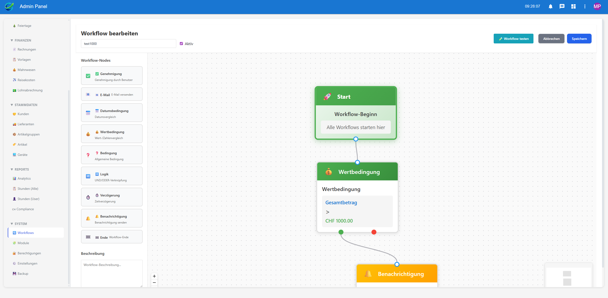

**Automatisierte Geschäftsprozesse:**

- 🔄 Workflow-Engine
- 📋 Sequenzielle Genehmigungsschritte
- 🎯 Trigger (z.B. "Rechnung versendet")
- 🔔 Automatische Benachrichtigungen
- ✅ Status-Tracking

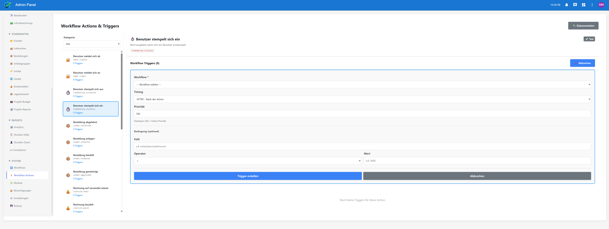

**Beispiel-Workflows:**
- Rechnungs-Freigabe (mehrstufig)
- Urlaubsgenehmigung (Vorgesetzter → HR)
- Bestellungen (Anfrage → Genehmigung → Bestellung)
- Dokument-Review (Autor → Reviewer → Genehmiger)

**Visueller Editor:**
- Drag & Drop Workflow-Schritte
- Bedingungen definieren
- Aktionen zuweisen
- Testen und aktivieren

## Compliance

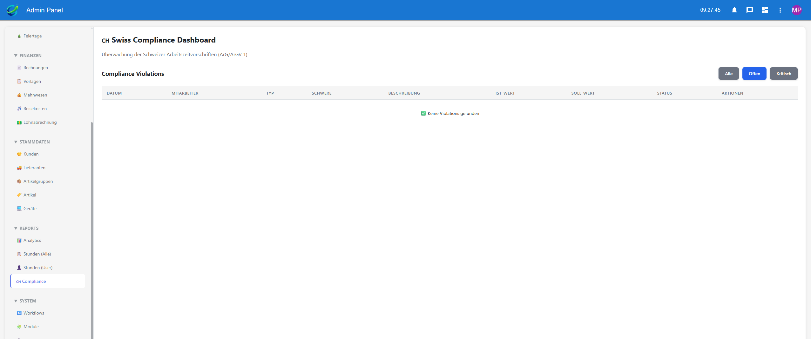

**Gesetzliche Vorgaben überwachen:**

- ⚖️ Schweizer Arbeitsgesetz (ArG)
- 📋 Arbeitsverordnung 1 (ArGV 1)
- ✅ Automatische Compliance-Checks:
  - Max. Arbeitszeit (45/50h/Woche)
  - Ruhezeiten (11h zwischen Arbeitstagen)
  - Pausen (mind. 30 Min bei >6h)
  - Sonntags-/Nachtarbeit (Bewilligungen)
- 🚨 Verstöße protokollieren
- 📊 Compliance-Reports für Behörden

**Verwendung:**
- Rechtssicherheit
- Arbeitsinspektion vorbereiten
- Mitarbeiter schützen

## Standorte

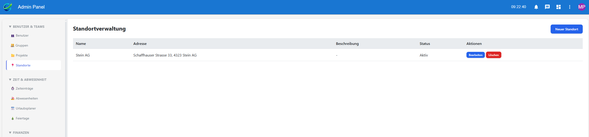

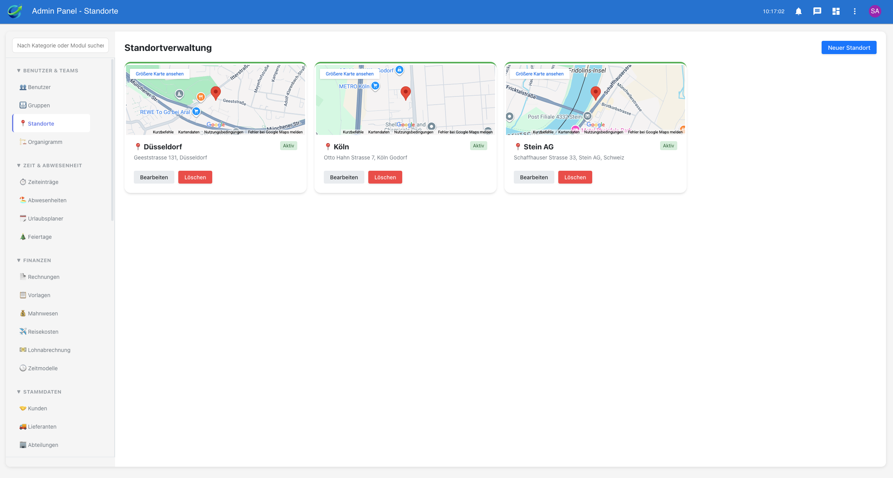

**Mehrere Firmenstandorte verwalten:**

### Standort erstellen

1. Gehen Sie zu **"Verwaltung" → Tab "Standorte"**
2. Klicken Sie auf **"+ Neuer Standort"**
3. Füllen Sie aus:
   - 📍 **Name:** z.B. "Hauptsitz Zürich", "Filiale Bern"
   - 🏢 **Adresse:** Strasse, PLZ, Ort
   - 🇨🇭 **Kanton:** Für kantonale Feiertage
   - 📞 **Telefon** (optional)
   - 📧 **E-Mail** (optional)
4. Klicken Sie auf **"Erstellen"**

### Standort-Funktionen

- 📍 **Standorte definieren** - Mehrere Büros/Filialen verwalten
- 👥 **Mitarbeiter zuweisen** - Im Benutzer-Detail den Standort setzen
- 🎉 **Feiertage pro Standort** - Kantonale Feiertage automatisch zuordnen
- ⏰ **Zeitmodelle pro Standort** - Unterschiedliche Arbeitszeiten
- 📊 **Auswertungen pro Standort** - Standort-spezifische Reports

### Ansichtsmodus

**Auch Standorte unterstützen Tabellen- und Kartenansicht:**
- **☰ Tabellenansicht** - Kompakte Liste
- **▦ Kartenansicht** - Visuelle Karten mit Standort-Details

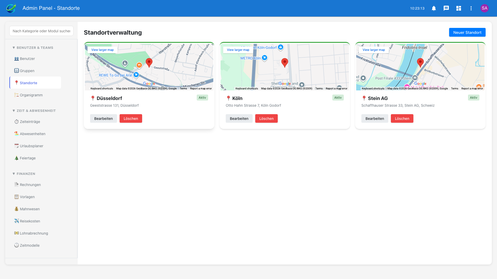

## Geschäftsbericht

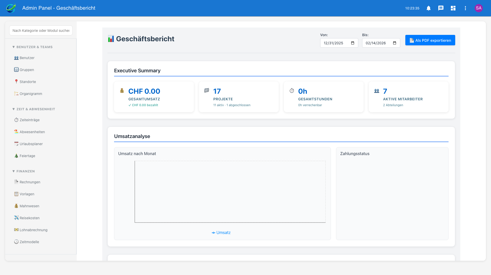

**Unternehmenskennzahlen auf einen Blick:**

### Bericht einsehen

1. Gehen Sie zu **"Verwaltung" → Tab "Geschäftsbericht"**
2. Sie sehen eine Zusammenfassung der wichtigsten Kennzahlen

**Verfügbare Kennzahlen:**
- 👥 **Mitarbeiter:** Gesamtzahl, aktive/inaktive
- ⏱️ **Arbeitsstunden:** Gesamt, Durchschnitt pro Mitarbeiter
- 📁 **Projekte:** Aktive, abgeschlossene
- 💰 **Umsatz:** Fakturiert, offen, überfällig
- 📊 **Auslastung:** Team-Auslastungsquote
- 🏥 **Abwesenheiten:** Krankenquote, Urlaubsquote
- 📈 **Trends:** Vergleich zu Vormonat/-jahr

**Zeitraum wählen:**
- Monat, Quartal, Jahr oder benutzerdefiniert

## Projektplanung

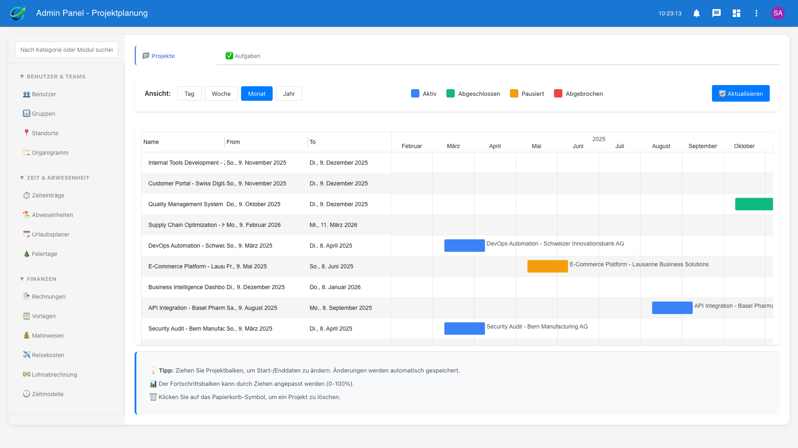

**Erweiterte Projektplanung mit Gantt-Diagrammen:**

### Projektplan erstellen

1. Navigieren Sie zu **"Projektplanung"** oder **"Verwaltung" → Tab "Projektplanung"**
2. Wählen Sie ein **Projekt** aus
3. Erstellen Sie **Meilensteine** und **Aufgaben**

**Planungsfunktionen:**
- 📊 **Gantt-Diagramm** - Visuelle Zeitplanung
- 🎯 **Meilensteine** - Wichtige Projektziele
- 📋 **Aufgaben** - Detaillierte Arbeitspakete
- 🔗 **Abhängigkeiten** - Aufgaben verknüpfen
- 👤 **Zuweisungen** - Mitarbeiter zuordnen
- 📅 **Zeitachse** - Start-/Enddaten pro Aufgabe
- 💰 **Budgetplanung** - Kosten pro Arbeitspaket

### Fortschritt verfolgen

- ✅ Aufgaben als erledigt markieren
- 📊 Fortschrittsbalken pro Aufgabe und Meilenstein
- 🔴 Verzögerungen werden farblich hervorgehoben
- 📧 Automatische Benachrichtigungen bei Fristüberschreitungen

<div style="page-break-before: always;"></div>

# 13. Tipps & Tricks

## Tastenkombinationen

### Globale Shortcuts

| Tastenkombination | Aktion |
|-------------------|--------|
| **Strg + S** | Speichern (in Formularen) |
| **Strg + Q** | Einstempeln / Ausstempeln (auf Dashboard) |
| **Strg + M** | Neue Nachricht schreiben |
| **Strg + /** | Hilfe anzeigen |
| **Esc** | Dialog schließen |

### Navigation

| Tastenkombination | Aktion |
|-------------------|--------|
| **Alt + D** | Dashboard |
| **Alt + Z** | Zeiterfassung |
| **Alt + U** | Urlaub |
| **Alt + P** | Projekte |
| **Alt + B** | Berichte |
| **Alt + N** | Nachrichten |
| **Alt + E** | E-Learning |

### Formulare

| Tastenkombination | Aktion |
|-------------------|--------|
| **Tab** | Nächstes Feld |
| **Shift + Tab** | Vorheriges Feld |
| **Enter** | Formular absenden |
| **Esc** | Abbrechen |

## Best Practices

### Zeiterfassung

✅ **Empfehlungen:**
- Stempeln Sie **täglich** ein und aus
- Buchen Sie Zeit **sofort auf Projekte**
- Fügen Sie **Notizen** zu Zeiteinträgen hinzu (woran haben Sie gearbeitet?)
- Überprüfen Sie **wöchentlich** Ihre Zeiteinträge
- Bei Fehlern: **Sofort Admin informieren**

❌ **Zu vermeiden:**
- Vergessen, auszustempeln (→ lange "Eingestempelt"-Zeit)
- Zeit nachträglich erfassen (→ Ungenauigkeiten)
- Projekte nicht zuordnen (→ Admin muss manuell zuordnen)
- Pausenzeiten nicht einhalten (→ Compliance-Verstöße)

### Urlaubsplanung

✅ **Empfehlungen:**
- Urlaub **frühzeitig** beantragen (mind. 2 Wochen vorher)
- **Koordinieren** Sie sich mit Team (nicht alle gleichzeitig!)
- Beantragen Sie Urlaub in **größeren Blöcken** (nicht einzelne Tage)
- Prüfen Sie **Resturlaub** regelmäßig
- Planen Sie Urlaub über **Feiertage** (spart Urlaubstage!)

❌ **Zu vermeiden:**
- Kurzfristige Anträge (am selben Tag)
- Urlaub in Stoßzeiten (ohne Absprache)
- Resturlaub verfallen lassen (Ende Jahr)

### Projektverwaltung

✅ **Empfehlungen:**
- Dokumentieren Sie **Projektfortschritt** in Notizen
- Buchen Sie Zeit **detailliert** (z.B. "Bug-Fix", "Meeting", "Code-Review")
- Überprüfen Sie **Projekt-Budget** regelmäßig (nicht überziehen!)
- Melden Sie **Probleme** frühzeitig

❌ **Zu vermeiden:**
- Generische Notizen ("Arbeit am Projekt")
- Budget-Überschreitungen ohne Warnung
- Fehlende Dokumentation

### E-Learning

✅ **Empfehlungen:**
- Reservieren Sie **feste Zeiten** für Kurse (z.B. Freitagnachmittag)
- Schließen Sie Kurse **vollständig ab** (nicht pausieren)
- **Wiederholen** Sie Lektionen bei Unklarheiten
- **Testen** Sie Ihr Wissen vor Quizzes (Lektionen nochmal durchgehen)
- **Laden Sie Zertifikate** sofort herunter

❌ **Zu vermeiden:**
- Kurse "auf Vorrat" buchen (ohne sie zu bearbeiten)
- Quizzes "durchklicken" (ohne zu lernen)
- Mehrfache fehlgeschlagene Quiz-Versuche (lieber wiederholen!)

### Nachrichten

✅ **Empfehlungen:**
- **Aussagekräftige Betreffe** verwenden
- **Höflicher Ton** (auch intern!)
- **Zeitnahe Antworten** (innerhalb 24h)
- **Wichtige Infos** auch in E-Mails (nicht nur CFlux)
- **Papierkorb regelmäßig leeren** (Speicherplatz)

❌ **Zu vermeiden:**
- Vage Betreffe ("Frage", "Hallo")
- Zu lange Nachrichten (lieber Telefonat)
- Sensible Daten (Passwörter, etc.)

## Häufige Fragen

### 🤔 Ich habe mein Passwort vergessen!

**Lösung:**
1. Wenden Sie sich an Ihren **Administrator**
2. Admin kann Ihr Passwort **zurücksetzen**
3. Sie erhalten ein **neues Passwort**
4. Beim nächsten Login: **Passwort ändern**

---

### 🤔 Ich habe vergessen, auszustempeln!

**Lösung:**
1. Stempeln Sie **jetzt aus** (falls Sie noch eingestempelt sind)
2. Wenden Sie sich an **Admin**
3. Admin kann den Zeiteintrag **korrigieren**:
   - Ausstempelzeit auf tatsächliche Arbeitsende setzen

**Prävention:**
- Stellen Sie **Erinnerung** ein (Smartphone-Wecker)
- Nutzen Sie **Browser-Benachrichtigungen**

---

### 🤔 Mein Urlaubsantrag wurde abgelehnt!

**Gründe für Ablehnung:**
- Zu kurze Vorlaufzeit
- Zu viele Kollegen bereits im Urlaub
- Wichtiges Projekt / Deadline
- Unzureichendes Kontingent

**Was tun:**
1. **Sprechen Sie mit Ihrem Vorgesetzten** (Grund erfragen)
2. **Alternatives Datum** wählen
3. **Neuen Antrag** stellen

---

### 🤔 Ich sehe ein Projekt nicht in der Auswahl!

**Mögliche Ursachen:**
- Projekt ist **inaktiv** (abgeschlossen)
- Sie sind dem Projekt **nicht zugewiesen**
- Projekt existiert nicht

**Lösung:**
1. Überprüfen Sie in **"Projekte"**, ob Sie das Projekt sehen
2. Falls nicht: **Admin kontaktieren**
3. Admin weist Sie dem Projekt zu

---

### 🤔 Ich kann mich nicht einloggen!

**Checkliste:**
1. **E-Mail-Adresse korrekt?** (Groß-/Kleinschreibung beachten)
2. **Passwort korrekt?** (Caps Lock?)
3. **Account aktiv?** (Admin fragen)
4. **Browser-Cache leeren** (Strg+Shift+Entf)
5. **Anderer Browser** versuchen

**Immer noch Probleme:**
- Administrator kontaktieren

---

### 🤔 Wie ändere ich meine E-Mail-Adresse?

**Lösung:**
1. Gehen Sie zu **"Mein Profil"**
2. Klicken Sie auf **"✏️ Bearbeiten"**
3. Ändern Sie die **E-Mail-Adresse**
4. Klicken Sie auf **"Speichern"**

**Wichtig:** Die neue E-Mail wird Ihre **Login-E-Mail**!

---

### 🤔 Wie lade ich mein Profilbild hoch?

**Lösung:**
1. Wenden Sie sich an Ihren **Administrator**
2. Admin öffnet Ihr **Benutzer-Detail** (Verwaltung → Benutzer → Bearbeiten)
3. Im Tab **"Basis"** klickt der Admin auf **"📷 Avatar hochladen"**
4. Ein **Bild** wird ausgewählt (JPEG, PNG, WebP, GIF)
5. Das Bild wird **automatisch** auf **200 × 200 Pixel** zugeschnitten und ins WebP-Format konvertiert

**Ergebnis:**
- Ihr Avatar erscheint in der **Benutzer-Kartenansicht** (72px, rund)
- Ihr Avatar wird im **Organigramm** angezeigt
- Ohne Avatar werden Ihre **Initialen** als Platzhalter verwendet

**Empfohlenes Format:** Quadratisch, mind. 200×200px, JPEG oder PNG (max. 5 MB)

---

### 🤔 Ich finde eine Funktion nicht!

**Mögliche Gründe:**
- Sie haben keine **Berechtigung** für diese Funktion
- Das Modul ist **nicht aktiviert**
- Die Funktion ist nur für **Admins** sichtbar

**Lösung:**
- Fragen Sie Ihren **Administrator**
- Administrator kann:
  - **Berechtigung** erteilen
  - **Modul** aktivieren
  - Sie zur entsprechenden **Gruppe** hinzufügen

---

### 🤔 Wie exportiere ich meine Daten?

**Zeiteinträge exportieren:**
1. Gehen Sie zu **"Zeiterfassung"**
2. Wählen Sie **Zeitraum**
3. Klicken Sie auf **"📥 Exportieren"**
4. Wählen Sie **Format** (Excel, PDF, CSV)

**Andere Daten:**
- Die meisten Listen haben einen **"📥 Export"-Button**
- Alternativ: **Administrator** fragen

---

### 🤔 Kann ich CFlux auf dem Smartphone nutzen?

**Ja, aber:**
- CFlux ist **mobile-optimiert** (Responsive Design)
- Öffnen Sie CFlux im **Smartphone-Browser**
- **Alle Funktionen** verfügbar
- **Kein App-Download** nötig

**Empfohlene Browser:**
- Android: Chrome
- iOS: Safari

**Tipp:**
- Fügen Sie CFlux zum **Homescreen** hinzu:
  - Android: Chrome-Menü → "Zum Startbildschirm hinzufügen"
  - iOS: Safari-Menü → "Zum Home-Bildschirm"

---

### 🤔 Wie melde ich einen Bug / Fehler?

**Fehler melden:**

1. **Screenshot** machen (zeigt das Problem)
2. **Administrator** kontaktieren mit:
   - Beschreibung des Problems
   - Was haben Sie gemacht? (Schritte zum Reproduzieren)
   - Wann ist es passiert? (Datum, Uhrzeit)
   - Screenshot anhängen
3. Admin leitet den Fehler an **Support** weiter

**Beispiel gute Fehler-Meldung:**
```
Betreff: Fehler beim Ausstempeln

Beschreibung:
Ich konnte heute um 17:00 Uhr nicht ausstempeln.

Schritte:
1. Dashboard geöffnet
2. Auf "Ausstempeln" geklickt
3. Fehlermeldung: "Interner Serverfehler"

Screenshot: [angehängt]

Browser: Chrome 119, Windows 11
```

---

### 🤔 Werden meine Daten gesichert?

**Ja!**

- **Automatische Backups:** Täglich um 02:00 Uhr
- **Aufbewahrung:** 30 Tage
- **Speicherort:** Sicherer Server
- **Verschlüsselt:** Ja

**Zusätzlich:**
- Sie können **eigene Exporte** machen (Excel, PDF)
- Archivieren Sie wichtige Reports lokal

---

### 🤔 Wer hat Zugriff auf meine Daten?

**Zugriffsrechte:**

**Ihre eigenen Daten:**
- ✅ Sie selbst
- ✅ Ihr Vorgesetzter
- ✅ HR-Abteilung
- ✅ Administratoren

**Zeiteinträge:**
- ✅ Sie selbst: Alle Ihre Einträge
- ✅ Admin: Alle Einträge (für Reports)

**Urlaubsanträge:**
- ✅ Sie selbst: Ihre Anträge
- ✅ Admin/Vorgesetzter: Alle Anträge (Genehmigung)

**Nachrichten:**
- ✅ Nur Sie und der Empfänger
- ❌ Admins haben **keinen Zugriff** auf Nachrichten

**E-Learning:**
- ✅ Sie selbst: Ihre Kurse und Zertifikate
- ✅ Admin: Fortschritte (für Reporting)

---

### 🤔 Ist CFlux DSGVO-konform?

**Ja!**

CFlux erfüllt die **Datenschutz-Grundverordnung (DSGVO)**:

- ✅ **Datensparsamkeit:** Nur notwendige Daten
- ✅ **Verschlüsselung:** HTTPS, Passwort-Hashing
- ✅ **Zugriffskontrolle:** Rollenbasierte Berechtigungen
- ✅ **Recht auf Auskunft:** Daten-Export verfügbar
- ✅ **Recht auf Löschung:** Soft Delete (Daten anonymisiert)
- ✅ **Audit-Trail:** Änderungen nachvollziehbar

**Schweiz:**
- Entspricht auch dem **Schweizer Datenschutzgesetz (DSG)**

---

## Support & Hilfe

### Support kontaktieren

**Bei Problemen oder Fragen:**

**1. Administrator (erste Anlaufstelle):**
- Ihr interner IT-Admin
- Kann meiste Probleme lösen
- Kennt Ihre Firma-Konfiguration

**2. Handbuch:**
- Dieses Dokument
- Vollständige Anleitungen

**3. Technischer Support:**
- Falls Admin nicht weiterhelfen kann
- E-Mail: support@cflux.ch
- Telefon: +41 XX XXX XX XX

**Informationen bereithalten:**
- Ihr Name, Firma
- Problembeschreibung
- Screenshots
- Browser & Betriebssystem

---

## Glossar

**ArG** - Schweizer Arbeitsgesetz  
**ArGV 1** - Verordnung 1 zum Arbeitsgesetz  
**Compliance** - Einhaltung gesetzlicher Vorgaben  
**CSV** - Comma-Separated Values (Dateiformat)  
**Dashboard** - Übersichtsseite nach Login  
**DSGVO** - Datenschutz-Grundverordnung  
**EHS** - Environment, Health, Safety (Arbeitssicherheit)  
**ERP** - Enterprise Resource Planning  
**IBAN** - International Bank Account Number  
**JWT** - JSON Web Token (Authentifizierung)  
**MWST** - Mehrwertsteuer  
**OR** - Schweizer Obligationenrecht  
**PDF** - Portable Document Format  
**QR-Code** - Quick Response Code (2D-Barcode)  
**SMTP** - Simple Mail Transfer Protocol (E-Mail)  
**Soft Delete** - Logisches Löschen (Daten bleiben in DB)  

---

## Änderungshistorie

**Version 2.1 - Februar 2026**
- ✅ Benutzer-Avatare mit automatischer Größenanpassung (200×200px, WebP)
- ✅ Kartenansicht für Benutzerliste (umschaltbar mit Tabellenansicht)
- ✅ Avatar-Anzeige im Organigramm
- ✅ Bestellungen mit 8-Stufen-Workflow (BO-XXXXXX)
- ✅ Checklisten-Modul (Vorlagen und Instanzen)
- ✅ News-Verwaltung für interne Ankündigungen
- ✅ Medien-Modul (zentrale Medienverwaltung)
- ✅ Geräte-Verwaltung und -Zuordnung
- ✅ Kostenstellen-Verwaltung
- ✅ Lagerbestand und Inventar-Modul
- ✅ Stellenfunktionen-Verwaltung
- ✅ Mahnwesen für überfällige Rechnungen
- ✅ Geschäftsbericht mit Unternehmenskennzahlen
- ✅ Projektplanung mit Gantt-Diagrammen
- ✅ System-Logs für Audit-Trail
- ✅ Abteilungsverwaltung
- ✅ Erweiterte Standortverwaltung mit Kartenansicht

**Version 2.0 - Januar 2026**
- ✅ Bewerber-Portal und Onboarding hinzugefügt
- ✅ E-Learning-Plattform integriert
- ✅ Internes Nachrichten-System implementiert
- ✅ Erweiterte Workflow-Engine
- ✅ Incident Management (EHS) hinzugefügt
- ✅ Modulbasiertes Berechtigungssystem
- ✅ Zeitmodelle mit Gleitzeit
- ✅ Erweiterte Compliance-Prüfungen

**Version 1.0 - Januar 2025**
- Erste Version des Systems

---

## Impressum

**CFlux ERP & Zeitmanagement System**  
Version 2.1

© 2026 CFlux Software GmbH  
Alle Rechte vorbehalten.

**Kontakt:**  
E-Mail: info@cflux.ch  
Web: www.cflux.ch  
Telefon: +41 XX XXX XX XX

<div style="page-break-before: always;"></div>

# Ende des Handbuchs

<div style="text-align: center; padding-top: 100px;">

<br><br><br>

## Vielen Dank, dass Sie CFlux nutzen! 🎉

<br>

Bei Fragen oder Anregungen wenden Sie sich gerne an Ihren Administrator oder unseren Support.

<br><br>

**Viel Erfolg mit CFlux!** 💼⏱️

<br><br><br>

---

*CFlux ERP & Zeitmanagement System*  
*Version 2.1 — Februar 2026*  
*© 2026 CFlux Software GmbH*

</div>
