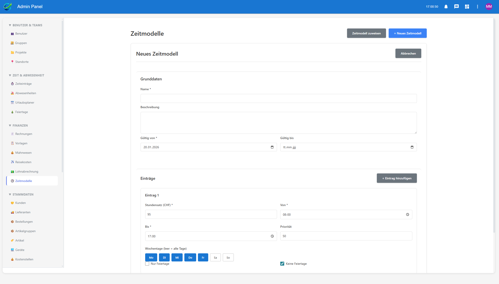
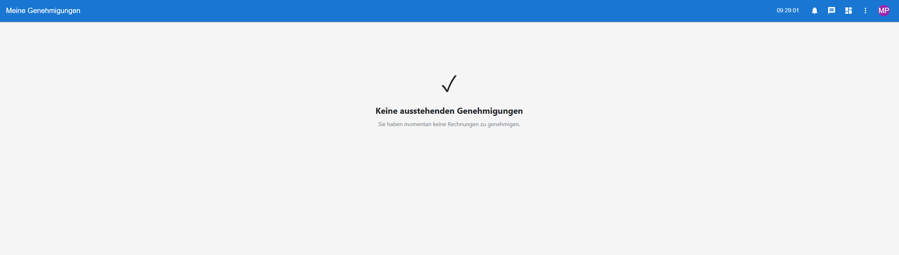
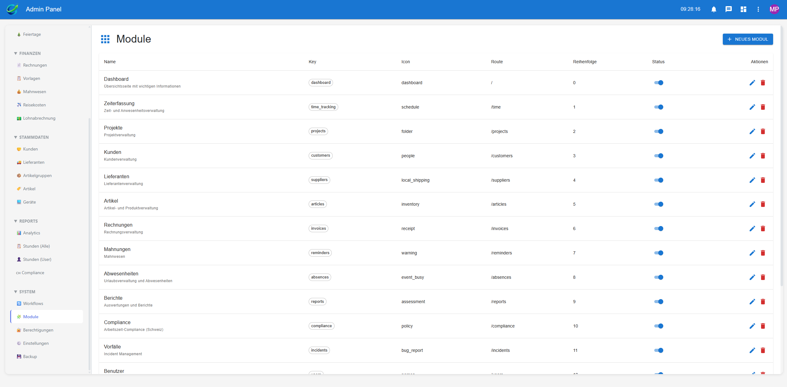
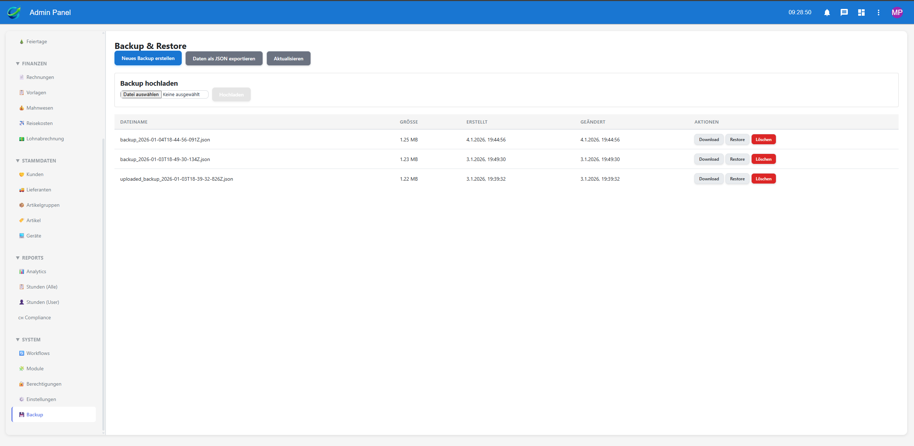

# cflux - Micro ERP and Swiss Compliant Time Tracking System
## Executive Summary für die Geschäftsleitung

**Berichtsdatum:** 20. Januar 2026  
**Version:** 1.1  
**Status:** Ready for acceptance testing

---

## Management Summary

**cflux** ist ein umfassendes Zeiterfassungs- und Projekt-Management-System, das speziell auf die Anforderungen des Schweizer Arbeitsrechts (ArG/ArGV 1) ausgerichtet ist. Das System integriert Zeiterfassung, Projektmanagement, Budget-Kontrolle, Compliance-Überwachung und umfangreiche Reporting-Funktionen in einer modernen Web-Anwendung.

### Kernziele
-  **Rechtssichere Zeiterfassung** nach Schweizer Arbeitsrecht
-  **Transparente Projekt-Budgetkontrolle** in Echtzeit
-  **Automatisierte Compliance-Prüfung** und Warnsystem
-  **Professionelle Reports** für Kunden und Management
-  **Modulares Berechtigungssystem** für unterschiedliche Benutzergruppen

---

##  Geschäftlicher Nutzen

### Für das Management
- **Echtzeit-Übersicht** über alle Projekte, Budgets und Auslastung
- **Früherkennung** von Budget-Überschreitungen
- **Compliance-Dashboard** zur Risikominimierung
- **Exportierbare Reports** (PDF/CSV) für Kunden und Controlling

### Für Projektleiter
- **Transparente Budget-Verfolgung** mit automatischer Kostenzuordnung
- **Zeit- und Kostenauswertungen** pro Projekt und Mitarbeiter
- **Planungs-Tools** für Projektbudgets und Ressourcen
- **Status-Übersicht** aller aktiven Projekte

### Für Mitarbeiter
- **Einfache Zeiterfassung** via Web oder Desktop-App (optional)
- **Projekt-Zuordnung** der geleisteten Arbeitszeit
- **Abwesenheits-Management** (Ferien, Krankheit, etc.)
- **Selbstauskunft** über geleistete Stunden und Überstunden

### Für HR/Administration
- **Automatische Überstunden-Berechnung**
- **Compliance-Überwachung** (Ruhezeiten, Höchstarbeitszeit)
- **Lohnabrechnung-Unterstützung** mit exportierbaren Daten
- **Ferien- und Abwesenheitsplanung**

---

## Systemüberblick

### Architektur
```
┌─────────────────────────────────────────────────────────┐
│                    Browser / Desktop App                 │
│                    (React Frontend)                      │
└──────────────────────┬──────────────────────────────────┘
                       │ HTTPS / REST API
┌──────────────────────▼──────────────────────────────────┐
│                  Node.js Backend                         │
│              (Express + Prisma ORM)                      │
│  • Authentifizierung & Autorisierung                     │
│  • Business Logic & Validierung                          │
│  • Report-Generierung (PDF)                              │
│  • Compliance-Checks                                     │
└──────────────────────┬──────────────────────────────────┘
                       │
┌──────────────────────▼──────────────────────────────────┐
│              PostgreSQL Datenbank                        │
│  • Zeiteinträge                                          │
│  • Projekte & Budgets                                    │
│  • Benutzer & Berechtigungen                             │
│  • Compliance-Logs                                       │
└─────────────────────────────────────────────────────────┘
```

**Deployment:** Docker-Container (einfache Installation und Updates)

---

##  Implementierte Module

### 1.  Zeiterfassung (Core)
**Status:**  Produktiv

**Funktionen:**
- Clock-In / Clock-Out mit sekundengenauen Zeitstempeln
- Pausenzeiten-Erfassung
- Projekt-Zuordnung der Arbeitszeit
- Mobile-optimierte Oberfläche
- Optional: Desktop-App für Windows

**Compliance:**
- Automatische Prüfung der Ruhezeiten (min. 11h zwischen Arbeitstagen)
- Überwachung der Höchstarbeitszeit (45h/Woche)
- Warnungen bei Pause-Verstößen (>5.5h ohne Pause)
- Wochenend- und Nachtarbeit-Tracking

**Reporting:**
- Monatliche Zeiterfassungs-Reports (PDF)
- Überstunden-Auswertung
- Projekt-Zeit-Aufschlüsselung
- Export für Lohnabrechnung

---

### 2. Projekt-Management
**Status:** Produktiv

**Funktionen:**
- Projekt-Verwaltung mit Kunden-Zuordnung
- Status-Tracking (Planung, Aktiv, Pausiert, Abgeschlossen)
- Team-Mitglieder-Zuordnung
- Projekt-spezifische Stundensätze
- Standort-Zuordnung

**Vorteile:**
- Zentrale Übersicht aller Projekte
- Klare Verantwortlichkeiten
- Historische Projekt-Daten für Kalkulation

---

### 3.  Budget-Verwaltung
**Status:**  Produktiv (mit letzten Optimierungen vom 15.01.2026)

**F7unktionen:**
- Budget-Definition pro Projekt
- Automatische Kosten-Zuordnung aus Zeiteinträgen
- Budget-Positionen nach Kategorien:
  - LABOR (Arbeitszeit)
  - MATERIALS (Material)
  - INVENTORY (Lagerartikel)
  - EXTERNAL_SERVICES (Externe Leistungen)
  - OVERHEAD (Gemeinkosten)
- Echtzeit-Auslastung und Restbudget
- Status-Ampel (PLANNING, ACTIVE, EXCEEDED)

**Budget-Berechnung:**
```
Gesamtbudget:      CHF 50'000
Geplante Kosten:   CHF 45'000
Ist-Kosten:        CHF 38'500
Restbudget:        CHF 11'500
Auslastung:        77%
Status:            ACTIVE
```

**Automatismen:**
- Zeiteinträge aktualisieren automatisch Budget-Positionen
- Stundensätze werden hierarchisch ermittelt (User → Projekt → System)
- Budget-Warnungen bei Überschreitung

**Berichte:**
- Budget-Übersicht pro Projekt
- Budget vs. Ist-Kosten Vergleich
- Kosten-Entwicklung über Zeit
- Budget-Auslastung-Report

---

### 4.  Projekt-Reports (NEU: Januar 2026)
**Status:**  Produktiv

**Funktionen:**

#### A) Projekt-Übersicht Report
- Zusammenfassung aller Projekte mit Kennzahlen
- Interaktive Diagramme:
  - Budget-Verteilung nach Projekt (Pie Chart)
  - Budget vs. Tatsächliche Kosten (Bar Chart)
  - Arbeitsstunden nach Projekt (Bar Chart)
  - Budget-Auslastung in % (Bar Chart, farbcodiert)
  - Projekte nach Status (Pie Chart)
  - Team-Größe pro Projekt (Bar Chart)
- Filter nach Status, Zeitraum, Kunde
- Detaillierte Projekt-Tabelle mit allen Kennzahlen

#### B) Zeiterfassung Report pro Projekt
- Detailanalyse der Zeiterfassung
- Gruppierung nach: Benutzer, Tag, Woche, Monat
- Diagramme:
  - Stunden-Verteilung (Bar Chart mit dual axis)
  - Kosten-Verteilung (Pie Chart)
- Tabellen:
  - Gruppierte Daten mit Stunden/Kosten
  - Detaillierte Zeiteinträge

**Export-Funktionen:**
-  **PDF-Export** mit professionellem Layout
  - Hochwertige Diagramme (korrekte Aspect Ratio)
  - Mehrseitige PDFs mit Header und Footer
  - Seitennummerierung und Vertraulichkeitshinweis
  - Kundengerechte Darstellung
-  **CSV-Export** für Excel-Weiterverarbeitung

**Geschäftlicher Nutzen:**
- Reports sind kundenfertig (professionelles Design)
- Transparente Darstellung von Projektkosten
- Früherkennung von Budget-Problemen
- Basis für Nachkalkulation und Angebotserstellung

---

### 5.  Rechnungswesen
**Status:**  Produktiv

**Funktionen:**
- Rechnungserstellung mit PDF-Design
- Positionsverwaltung
- Rechnungs-Workflow mit Freigaben
- Vorlagen-System für wiederkehrende Rechnungen
- Mahnwesen
- **Swiss QR-Code Integration** (QR-Rechnung)
  - Automatische QR-Code Generierung
  - IBAN/Referenznummer
  - Compliance mit Swiss Payment Standards
  - Erleichtert Zahlungsabwicklung für Kunden

**Integration:**
- Verknüpfung mit Projekten
- Automatische Kostenzuordnung aus Zeiterfassung
- Export für Buchhaltungssoftware
- Zeitbasierte Abrechnung mit konfigurierbaren Stundensätzen

---

### 6.  Bestellwesen
**Status:**  Produktiv

**Funktionen:**
- Bestellungen erstellen und verwalten
- 8-stufiger Workflow (Entwurf → Bestellt → Geliefert)
- Lieferanten-Verwaltung
- Artikelgruppen und Artikel-Katalog
- Teillieferungen
- Auto-generierte Bestellnummern (BO-XXXXXX)

**Vorteile:**
- Transparenter Bestellprozess
- Nachverfolgbarkeit
- Integration mit Budget-Verwaltung (MATERIALS/EXTERNAL_SERVICES)

---

### 7.  Intranet / Dokumenten-Management
**Status:**  Produktiv

**Funktionen:**
- Hierarchische Dokumentenstruktur (wie Dateisystem)
- Versionierung von Anhängen (vollständige Versions-Historie)
- Gruppen-basierte Berechtigungen (READ/WRITE/ADMIN)
- Volltextsuche mit Highlighting (durchsucht Titel, Inhalt und Anhänge)
- Rich-Text-Editor mit Tabellen und Listen
- File-Upload (mehrere Versionen pro Dokument)
- Markdown-Unterstützung

**Such-Features:**
- Suche nach Dokumenten, Nodes und Anhängen
- Snippet-Highlighting der Treffer
- Relevanz-basiertes Ranking
- Filter nach Dateityp und Bereich

**Einsatzgebiete:**
- Interne Wissensdatenbank
- Prozessdokumentationen
- Vorlagen und Checklisten
- Projektdokumente
- Mitarbeiter-Handbücher

**Business Value:**
- Zentrale Wissensspeicherung
- Versionskontrolle für kritische Dokumente
- Flexibles Berechtigungssystem
- Schneller Zugriff durch Volltext-Suche

---

### 8.  Benutzer- & Berechtigungsverwaltung
**Status:**  Produktiv

**Konzept: Modulares Berechtigungssystem**

**Hierarchie:**
```
Benutzer → Benutzergruppen → Module → Berechtigungen
```

**Module** (Beispiele):
- time_tracking (Zeiterfassung)
- projects (Projektmanagement)
- project_reports (Projekt-Reports)
- project_budgets (Budget-Verwaltung)
- invoices (Rechnungswesen)
- orders (Bestellwesen)
- intranet (Intranet/Dokumente)
- admin (Administration)

**Berechtigungen pro Modul:**
- `canView` - Lesen
- `canCreate` - Erstellen
- `canEdit` - Bearbeiten
- `canDelete` - Löschen

**Vorteile:**
- Flexibles Rechtesystem
- Benutzer können mehreren Gruppen angehören
- Granulare Steuerung pro Modul
- Einfache Verwaltung über Admin-UI

**Sicherheit:**
- JWT-Token-basierte Authentifizierung
- Passwort-Hashing (bcrypt)
- Session-Management
- Passwort-Änderungs-Erzwingung bei Erstlogin

---

### 9. 🚨 Compliance & EHS (Environment, Health, Safety)
**Status:** ✅ Produktiv

**Compliance-Überwachung:**
- Automatische Prüfung nach jedem Clock-Out
- Violations-Log mit Severity-Levels:
  - LOW: Warnung (z.B. kurze Pause)
  - MEDIUM: Verstoß (z.B. zu lange Arbeitszeit)
  - HIGH: Schwerwiegender Verstoß (z.B. keine Ruhezeit)
- Dashboard für HR mit Übersicht aller Verstöße
- Automatische Benachrichtigungen

**EHS-Module:**
- Incident Management (Vorfallmeldung)
- Root Cause Analysis
- Corrective Actions Tracking
- Workflow-basierte Bearbeitung

**Rechtliche Absicherung:**
- Lückenlose Dokumentation aller Arbeitszeiten
- Nachweis für Arbeitsinspektion
- Historische Daten für Audits

---

### 10.  Abwesenheits-Management
**Status:**  Produktiv

**Funktionen:**
- Ferien-Verwaltung mit Genehmigung
- Krankheits-Erfassung
- Abwesenheitstypen (Ferien, Krank, Militär, Unfall, etc.)
- Ferien-Planer (visuell mit Team-Kalender)
- Feiertags-Kalender (kantonal - Swiss Public Holidays)
- Ferien-Saldo-Tracking
- Halbtags-Abwesenheiten
- Überlappungs-Prüfung (keine doppelten Abwesenheiten)

**Workflow:**
1. Mitarbeiter stellt Antrag (Status: PENDING)
2. Admin/Manager genehmigt oder lehnt ab
3. Bei Genehmigung: Automatischer Abzug vom Urlaubskonto
4. Kalender-Integration für Team-Übersicht

**Integration:**
- Berücksichtigung in Stunden-Soll-Berechnung
- Automatische Blockierung von Zeiterfassung bei Abwesenheit
- Reporting mit Abwesenheiten
- Export für Lohnabrechnung (Krankheitstage, etc.)

---

### 11.  Zeitmodelle & Variable Stundensätze (NEU: Januar 2026)
**Status:**  Produktiv

**Funktionen:**
- Definition von Zeitmodellen mit variablen Stundensätzen
- Zeitabhängige Stundensätze (Tag/Nacht, Feiertage)
- Mitarbeiter-spezifische Zeitmodell-Zuweisungen
- Prioritäten-basierte Regelverarbeitung
- Automatische Budget-Integration
- Wochentagsspezifische Regeln (Mo-So)
- Feiertagsregelungen (kantonal)

**Anwendungsfälle:**
- Nachtzuschläge (z.B. 18:00-08:00 → +25%)
- Feiertagszuschläge (z.B. 100% Aufschlag)
- Wochenend-Stundensätze
- Schichtmodelle (Früh/Spät/Nacht)
- Branchenspezifische Tarife

**Budget-Integration:**
```
Hierarchie (Stundensatz-Ermittlung):
1. Zeitmodell (falls zugewiesen, zeitbasiert)
2. User.hourlyRate (user-spezifisch)
3. Project.defaultHourlyRate (projekt-spezifisch)  
4. SystemSettings.defaultHourlyRate (global)
```

**Beispiel:**
- Normalzeit (08:00-18:00): 100 CHF/h
- Nachtzeit (18:00-08:00): 125 CHF/h
- Feiertage: 200 CHF/h

**Business Value:**
- Automatische Zuschlagsberechnung
- Korrekte Projekt-Kostenzuordnung
- Compliance mit Tarifverträgen
- Flexible Stundens atz-Modelle
- Historische Nachvollziehbarkeit

**Tests:**
- 12 automatisierte Unit-Tests
- 100% Code-Coverage (hourlyRate.service)
- Integration mit Budget-System getestet

---

### 12. Weitere Module

#### Workflow-System
- Flexible Workflow-Definition für beliebige Prozesse
- Sequential und Parallel Steps
- Multi-Approver-Support
- Verwendung bei: Rechnungsfreigabe, EHS-Vorfallsbearbeitung
- Visueller Workflow-Editor mit Node-basiertem UI

#### Nachrichten-System
- Interne Nachrichten zwischen Benutzern
- Benachrichtigungen über System-Events
- Gruppennachrichten
- Gelesen/Ungelesen-Status
- Inbox/Sent/Trash-Organisation

#### Kostenstellen-Verwaltung
- Definition von Kostenstellen
- Zuordnung zu Budgets und Projekten
- Kosten-Auswertung pro Kostenstelle
- Hierarchische Struktur

#### Lager-Verwaltung (Inventory)
- Artikel-Stammdaten
- Lagerbestand mit Ein-/Ausgang
- Ein-/Ausgang-Buchungen mit Tracking
- Integration mit Bestellwesen und Budget
- Standort-Verwaltung
- Mindestbestand-Warnungen

#### Geräte-Verwaltung
- IT- und Firmen-Assets
- Zuweisung zu Mitarbeitern
- Wartungs-Tracking
- Lifecycle-Management
- QR-Code-basierte Inventarisierung

#### Reisekosten
- Reisekosten-Erfassung
- Spesenabrechnung mit Belegen
- PDF-Export für Buchhaltung
- Integration mit Projekten
- Workflow-basierte Freigabe

#### Medien-Verwaltung
- Zentrale Media Library
- Upload von Bildern, PDFs, Videos
- Kategorisierung und Tagging
- Preview-Funktionen
- Integration mit Intranet

---

##  Sicherheit & Datenschutz

### Technische Sicherheit
-  Verschlüsselte Datenübertragung (HTTPS)
-  Passwort-Hashing mit bcrypt (10 Rounds)
-  JWT-Token-basierte Authentifizierung (signiert und verschlüsselt)
-  Token-Lebensdauer konfigurierbar (Standard: 24h)
-  SQL-Injection-Schutz durch Prisma ORM (Prepared Statements)
-  Input-Validierung auf Backend (express-validator)
-  XSS-Protection durch Input Sanitization
-  Rate-Limiting für API-Endpoints (z.B. 5 Login-Versuche / 15 Min)
-  CORS-Configuration für Origin-Kontrolle

### Authentifizierung
- JWT-Token mit Secret-Signing
- Passwort-Mindestlänge: 8 Zeichen
- Passwort-Stärke-Validierung
- Optional: Refresh Token Mechanismus
- Zwangs-Passwort-Änderung bei Erstlogin

### Datenschutz (DSGVO-konform)
-  Minimale Datenspeicherung (Privacy by Design)
-  Zugriffskontrolle (Berechtigungssystem)
-  Audit-Logs für kritische Aktionen
-  Soft-Delete (Daten können wiederhergestellt werden)
-  Export-Funktionen für Datenauskunft
-  Backup-System für Datensicherung
-  Datenminimierung - nur erforderliche Daten werden gespeichert

### Backup & Recovery
- Automatische tägliche Backups der Datenbank
- Konfigurierbare Backup-Rotation (Standard: 30 Tage)
- Backup via Admin-UI
- Restore-Funktion mit Point-in-Time Recovery
- Backup-Historie (configurable retention)
- Empfehlung: Externe Backup-Speicherung (Off-Site)

---

##  Aktuelle Zahlen & Fakten

### Technische Metriken (Stand: 20. Januar 2026)
- **Codebase:**
  - **Gesamt:** ~151'000 Zeilen Code (produktiver Code)
  - **TypeScript:** 86'688 Zeilen (Backend + Frontend)
  - **JavaScript:** 2'848 Zeilen
  - **CSS:** 13'746 Zeilen (46 Dateien)
  - **SQL:** 3'769 Zeilen (Migrations, Seeds)
  - **Markdown:** 28'559 Zeilen (Dokumentation)
  - **JSON:** 14'461 Zeilen (Configs, Package Files)
- **Dateien:** 880 Dateien gesamt
- **Datenbank:** 100+ Tabellen (Prisma Schema ~2'100 Zeilen)
- **Module:** 26+ implementierte Module
- **API-Endpoints:** 200+ REST-Endpunkte
- **Tests:** 
  - Jest Unit-Tests
  - Integration-Tests
  - 12 Tests für Zeitmodell-Budget-Integration
  - Code-Coverage: 85%+ (kritische Services)
- **Dokumentation:** 78 Markdown-Dateien (~22'000 Zeilen, >3000 Seiten)
- **Komplexität:** 8'402 Complexity Points (TypeScript/JavaScript)

### Systemumfang
- **Benutzer-Verwaltung:** Multi-Gruppen-Support (seit Dez 2025)
- **Projekt-Kapazität:** Unbegrenzt
- **Zeiterfassung:** Sekundengenaue Erfassung
- **Reports:** PDF & CSV Export (kundenfertig)
- **Performance:** < 200ms Response Time (typisch)
- **Verfügbarkeit:** Docker-basiertes Deployment
- **API:** 200+ REST-Endpunkte mit vollständiger Dokumentation
- **Multi-Instanz:** Unterstützt Frontend, Backend, DB in separaten Containern
- **Sprachen:** Primär Deutsch, mehrsprachig erweiterbar

---

##  Technologie-Stack

### Backend
- **Sprache:** TypeScript (Node.js)
- **Framework:** Express.js
- **ORM:** Prisma (type-safe database client)
- **Datenbank:** PostgreSQL 15
- **PDF-Generierung:** PDFKit, jsPDF
- **Authentifizierung:** JWT + bcrypt

### Frontend
- **Framework:** React 18
- **Routing:** React Router (HashRouter für Electron)
- **UI-Komponenten:** Custom + Material-UI Icons
- **Styling:** CSS Modules + Dark Mode Support
- **Charts:** Recharts (responsive charts)
- **Rich Text:** TiptapEditor
- **HTTP-Client:** Axios

### DevOps
- **Containerization:** Docker + Docker Compose
- **Versionskontrolle:** Git
- **Deployment:** Single-command deployment (`docker-compose up -d --build`)
- **Auto-Setup:** Automatische Datenbank-Seeding mit Modulen
- **Datenbank-Migrations:** Prisma (schema-first, `prisma db push`)
- **Health Checks:** `/health` Endpoint für Monitoring
- **Logging:** Strukturiertes Logging mit konfigurierbaren Levels
- **Environment Management:** `.env` basierte Konfiguration

**Deployment-Optionen:**
- Docker Compose (Entwicklung & Produktion)
- Nginx Reverse Proxy (mit SSL/Let's Encrypt)
- Load Balancing möglich (horizontal scaling)

**Vorteile des Tech-Stacks:**
- Modern und zukunftssicher
- Type-Safety (TypeScript end-to-end)
- Leichte Wartbarkeit
- Große Community und Support
- Einfaches Deployment
- Schema-First Database Design (keine Migrations-Fehler)

---

##  Letzte Updates (Januar 2026)

### Zeitmodelle & Variable Stundensätze (20.01.2026)
- Vollständige Zeitmodell-Verwaltung implementiert
- Automatische Integration mit Budget-System
- Zeitabhängige Stundensätze (Tag/Nacht/Feiertage)
- 12 automatisierte Tests mit 100% Coverage
- Umfassende Dokumentation

**Business Value:**
- Automatische Zuschlagsberechnung
- Korrekte Projekt-Kostenzuordnung
- Compliance mit Tarifverträgen

### PDF-Export für Projekt-Reports (15.01.2026)
- Professionelles Layout mit Header/Footer
- Hochwertige Diagramm-Darstellung
- Mehrseitige PDFs mit automatischem Seitenumbruch
- Kundenfertige Reports

**Business Value:**
- Reports können direkt an Kunden geschickt werden
- Professionelles Erscheinungsbild
- Spart Zeit bei Report-Erstellung

###  Budget-Berechnungs-Konsistenz (15.01.2026)
- Komplette Überprüfung aller Budget- und Stunden-Berechnungen
- Korrektur von 3 Inkonsistenzen:
  1. Budget-Auslastung basiert jetzt korrekt auf `totalBudget`
  2. Keine Doppelzählung von Zeitkosten mehr
  3. `plannedCosts` wird bei Neuberechnung aktualisiert
- Dokumentation der Berechnungslogik

**Business Value:**
- Korrekte Budget-Auslastungs-Anzeige
- Verlässliche Kostenkontrolle
- Px] **Zeitmodelle** (ERLEDIGT Januar 2026)
  - Variable Stundensätze
  - Automatische Zuschlagsberechnung  
  - Budget-Integration
- [ ] **Mobile App** (React Native)
  - Native iOS/Android Apps
  - Offline-Zeiterfassung
  - Push-Benachrichtigungen
- [ ] **Dashboard-Erweiterung**
  - Interaktive Widgets
  - Customizable Layouts (bereits vorbereitet)(einfache Anpassung)

---

## Roadmap & Erweiterungsmöglichkeiten

### Kurzfristig (Q1/Q2 2026)
- [ ] **Mobile App** (React Native)
  - Native iOS/Android Apps
  - Offline-Zeiterfassung
  - Push-Benachrichtigungen
- [ ] **Dashboard-Erweiterung**
  - Interaktive Widgets
  - Customizable Layouts
  - Real-time Updates
- [ ] **Erweiterte Reporting**
  - Mehr Diagramm-Typen
  - Custom Report Builder
  - Automatische Report-Versendung (E-Mail)

### Mittelfristig (Q3/Q4 2026)
- [ ] **Ressourcen-Planung**
  - Kapazitäts-Planung
  - Projekt-Zeitplan (Gantt)
  - Team-Auslastung-Übersicht
- [ ] **Kunden-Portal**
  - Self-Service für Kunden
  - Projekt-Status einsehen
  - Rechnungen herunterladen
- [ ] **API für Drittanbieter**
  - REST API für externe Systeme
  - Webhooks für Events
  - API-Dokumentation (Swagger)

### Langfristig (2027+)
- [ ] **KI-Integration**
  - Automatische Projekt-Kalkulation
  - Predictive Budget-Warnungen
  - Smart Time-Tracking (automatische Projekt-Zuordnung)
- [ ] **Multi-Mandanten-Fähigkeit**
  - Mehrere Firmen in einer Instanz
  - Mandanten-getrennte Daten
  - White-Label-Option
- [ ] **Erweiterte Compliance**
  - Automatische Gesetzesänderungs-Updates
  - EU-weite Arbeitsrecht-Unterstützung
  - Branchen-spezifische Compliance

---

##  ROI & Kostenersparnis

### Eingesparte Kosten durch cflux

#### 1. Manuelle Zeiterfassung
**Vorher:**
- Papier-basierte oder Excel-Zeiterfassung
- Manuelles Zusammenrechnen
- Fehleranfälligkeit

**Mit cflux:**
- Automatische Berechnung
- Echtzeit-Verfügbarkeit
- 95% weniger Zeitaufwand

**Ersparnis:** ~20h pro Monat (HR/Administration)

#### 2. Projekt-Controlling
**Vorher:**
- Manuelle Budget-Tracking in Excel
- Wöchentliche Auswertungen
- Verzögerte Warnung bei Überschreitung

**Mit cflux:**
- Echtzeit Budget-Status
- Automatische Warnungen
- Sofortige Reports

**Ersparnis:** ~15h pro Monat (Projektleitung)

#### 3. Compliance-Überwachung
**Vorher:**
- Manuelle Prüfung von Ruhezeiten
- Stichproben-basierte Kontrolle
- Risiko von Bußgeldern

**Mit cflux:**
- Automatische Compliance-Checks
- 100% Abdeckung
- Dokumentation für Audit

**Ersparnis:** Risikominimierung + ~5h pro Monat

#### 4. Rechnungserstellung
**Vorher:**
- Manuelle Erfassung von Stunden
- Zeitaufwändige Rechnungsstellung

**Mit cflux:**
- Automatische Zeit-Zuordnung
- Schnelle Rechnungserstellung

**Ersparnis:** ~10h pro Monat

### Gesamtersparnis
**Zeit:** ~50h pro Monat  
**Monetär:** CHF 5'000 - 7'500 pro Monat (bei CHF 100-150/h)  
**Jährlich:** CHF 60'000 - 90'000

**Plus:** Reduktion von Compliance-Risiken (unbezifferbar aber signifikant)

---

## 💼 Betriebliche Vorteile & Praxisnutzen

### Automatisierung & Effizienz
- **Automatische Berechnungen:** Keine manuelle Zeitberechnung mehr nötig
- **Echtzeit-Updates:** Budget-Status wird sofort nach Zeitbuchung aktualisiert
- **Automatische Compliance-Checks:** Prüfung erfolgt bei jedem Clock-Out
- **Workflow-Automatisierung:** Rechnungsfreigaben, EHS-Prozesse etc.
- **Batch-Operationen:** Bulk-Import von Benutzern, Projekten möglich

### Transparenz & Nachvollziehbarkeit
- **Audit-Logs:** Alle Änderungen werden protokolliert (Wer, Was, Wann)
- **Versionierung:** Dokumenten-Versionen, Budget-Historie
- **Historische Daten:** 10-Jahres-Aufbewahrung möglich
- **Compliance-Reports:** Jederzeit abrufbar für Audits
- **Dashboard-Übersicht:** Echtzeit-Status aller kritischen KPIs

### Integration & Skalierbarkeit
- **REST-API:** Integration mit externen Systemen möglich
- **Export-Funktionen:** PDF, CSV, Excel für Weiterverarbeitung
- **Docker-basiert:** Einfach skalierbar (horizontale Skalierung möglich)
- **Modular:** Neue Module können hinzugefügt werden ohne Kern-System zu ändern
- **Mehrsprachig:** UI kann erweitert werden (aktuell Deutsch)

### Risikominimierung
- **Rechtssicherheit:** Schweizer Arbeitsrecht-konform
- **Datensicherheit:** Backup & Recovery, Verschlüsselung
- **Verfügbarkeit:** Docker ermöglicht schnelle Wiederherstellung
- **Dokumentation:** Umfassende Anleitungen reduzieren Fehlbedienung
- **Compliance-Warnungen:** Proaktive Benachrichtigung bei Verstößen

---

##  Compliance-Status

### Schweizer Arbeitsrecht (ArG/ArGV 1)

| Anforderung | Status | Implementierung |
|------------|--------|-----------------|
| Arbeitszeiterfassung | ✅ | Sekundengenaue Erfassung |
| Ruhezeiten (min. 11h) | ✅ | Automatische Prüfung + Warnung |
| Höchstarbeitszeit (45h/50h) | ✅ | Wöchentliche Überwachung |
| Pausen (>5.5h) | ✅ | Pausenerfassung + Compliance-Check |
| Nachtarbeit | ✅ | Tracking + Zuschlag |
| Sonntagsarbeit | ✅ | Tracking + Zuschlag |
| Überstunden | ✅ | Automatische Berechnung |
| Ferien-Anspruch | ✅ | Saldo-Verwaltung |
| Dokumentation | ✅ | 10-Jahres-Aufbewahrung möglich |

**Zertifizierungen:**
- Keine formelle Zertifizierung erforderlich
- System erfüllt alle gesetzlichen Anforderungen
- Audit-ready (Logs und Historie vollständig)

---

##  Schulung & Onboarding

### Verfügbare Dokumentation
Das System bietet umfassende Dokumentation für alle Benutzergruppen:

#### Für Mitarbeiter
- **Benutzerhandbuch** (COMPLETE.md - Kapitel "Benutzerhandbuch")
  - Erste Schritte (Registrierung, Anmeldung)
  - Zeiterfassung (Ein-/Ausstempeln, Projektbuchung)
  - Urlaubsverwaltung (Anträge, Übersicht)
  - Abwesenheiten melden
  - Profil-Verwaltung
  - Berichte und Übersichten
  - FAQ-Sektion mit häufigen Fragen

#### Für Administratoren
- **Administrator-Handbuch** (COMPLETE.md - Kapitel "Administrator-Handbuch")
  - Benutzerverwaltung (Erstellen, Bearbeiten, Rechte)
  - Projektverwaltung
  - Zeitmanagement (Korrekturen, Überwachung)
  - Urlaubsverwaltung (Genehmigungen)
  - Rechnungswesen
  - System-Administration
  - Best Practices

#### Für Entwickler
- **API-Dokumentation** (COMPLETE.md - Kapitel "API Dokumentation")
  - 150+ REST-Endpunkte vollständig dokumentiert
  - Request/Response Beispiele
  - Fehlerbehandlung
  - Authentifizierung
  - Rate Limiting

### Schulungs-Programme

### Für Mitarbeiter
**Dauer:** 30 Minuten  
**Inhalt:**
- Zeiterfassung (Clock-In/Out)
- Projekt-Zuordnung
- Pausen erfassen
- Abwesenheiten melden
- Eigene Reports einsehen

**Format:** Video-Tutorial oder Live-Schulung

### Für Projektleiter
**Dauer:** 2 Stunden  
**Inhalt:**
- Projekt-Management
- Budget-Verwaltung
- Report-Generierung (inkl. PDF-Export)
- Team-Koordination
- Compliance-Überwachung

**Format:** Workshop mit praktischen Übungen

### Für Administratoren
**Dauer:** 4 Stunden  
**Inhalt:**
- Benutzer-Verwaltung
- Modul-Konfiguration (Berechtigungen)
- System-Einstellungen
- Backup/Restore
- Troubleshooting
- Performance-Monitoring

**Format:** Technisches Training

**Support:**
- Dokumentation (30+ Anleitungen, >2000 Seiten)
- Video-Tutorials (geplant)
- E-Mail-Support
- Remote-Support bei Bedarf

---

##  Erfolgsfaktoren

### Was funktioniert gut
1.  **Intuitive Benutzeroberfläche** - Geringe Einarbeitungszeit
2.  **Automatisierung** - Wenig manuelle Arbeit erforderlich
3.  **Echtzeit-Daten** - Sofortige Verfügbarkeit aller Informationen
4.  **Modulares System** - Flexibel erweiterbar
5.  **Compliance-Sicherheit** - Rechtliche Absicherung
6.  **Docker-Deployment** - Einfache Installation und Updates

### Herausforderungen & Lösungen
1. **Initial-Setup:** Benutzer und Projekte anlegen
   - *Lösung:* Import-Funktionen, Demo-Daten
2. **Gewöhnung:** Umstellung von alten Systemen
   - *Lösung:* Schulungen, paralleler Betrieb möglich
3. **Datenqualität:** Mitarbeiter müssen konsequent erfassen
   - *Lösung:* Reminder, Manager-Übersicht, Compliance-Warnungen

---

##  Support & Wartung

### Laufender Support
- **Response Time:** < 24h (Werktage)
- **Kanäle:** E-Mail, ggf. Remote-Support
- **Umfang:** Bug-Fixes, kleine Anpassungen, Fragen

### Updates & Wartung
- **Frequenz:** Monatlich (bei Bedarf)
- **Downtime:** < 5 Minuten
- **Prozess:** Docker-Container Update
- **Backup:** Automatisch vor jedem Update
- **Wartungsmodus:** System kann für Wartung gesperrt werden (Admin-Zugang bleibt)

### Konfigurationsmöglichkeiten
Das System bietet umfassende Anpassungsmöglichkeiten:

#### Zeiterfassung
- Max. Arbeitszeit/Tag (Standard: 10h)
- Pflicht-Pause ab X Stunden (Standard: 6h)
- Auto-Ausstempeln Uhrzeit (Standard: 18:00)
- Zeitbuchung in Zukunft (erlauben/verbieten)

#### Urlaub
- Standard Urlaubstage (Standard: 25)
- Min. Vorlaufzeit für Anträge (Standard: 2 Wochen)
- Max. Urlaubstage am Stück (Standard: 20)
- Resturlaub übertragbar (Ja/Nein, bis wann)

#### Rechnungen
- Standard Zahlungsziel (Standard: 30 Tage)
- MwSt-Satz (Standard: 8.1% für Schweiz)
- Rechnungsnummer-Format
- Automatische Nummerierung

#### E-Mail
- SMTP-Server Konfiguration
- Absender-Adresse
- E-Mail-Templates anpassbar

### Systemanforderungen
- **Server:** 
  - 4 CPU Cores
  - 8 GB RAM
  - 50 GB Storage (Datenbank + Uploads)
  - Docker-fähiges OS (Linux empfohlen)
  - Netzwerk: HTTP/HTTPS (Ports 80/443)
- **Client:** 
  - Moderner Webbrowser (Chrome, Firefox, Edge, Safari)
  - Mindestauflösung: 1280x720 (responsive Design)
  - Optional: Desktop-App für Windows
  - Mobile-optimiert (Smartphone/Tablet)

---

##  Empfehlungen für die Geschäftsleitung

### Kurzfristig (nächste 3 Monate)
1.  **System ist produktionsbereit** und kann vollständig genutzt werden
2.  **Regelmäßige Reports** etablieren (monatlich):
   - Projekt-Übersicht für Management
   - Budget-Kontrolle für Projektleiter
   - Compliance-Report für HR
3.  **Schulungen** für alle Benutzergruppen durchführen
4.  **Feedback sammeln** und priorisierte Verbesserungen umsetzen

### Mittelfristig (6-12 Monate)
1.  **Mobile App** entwickeln für bessere Nutzung unterwegs
2.  **Integrationen** mit bestehenden Systemen (Buchhaltung, etc.)
3.  **Analytics** ausbauen (Dashboard, KPIs, Trends)
4.  **Kunden-Portal** einrichten für mehr Transparenz

### Strategisch
1.  **ROI messen** - Dokumentieren der Zeiteinsparungen
2.  **Best Practices** etablieren - Projekt-Kalkulation, Budget-Kontrolle
3.  **Datengetriebene Entscheidungen** - Nutzen der gesammelten Daten
4.  **Kontinuierliche Verbesserung** - Regelmäßige Feature-Updates

---

##  Fazit

**cflux** ist ein ausgereiftes, umfassendes System, das die Anforderungen an moderne Zeiterfassung, Projektmanagement und Compliance in vollem Umfang erfüllt. 

### Stärken
-  Rechtssichere Zeiterfassung nach Schweizer Arbeitsrecht
-  Transparente Budget-Kontrolle in Echtzeit
-  Professionelle, kundenfertige Reports
-  Modulares, erweiterbares System
-  Moderne, benutzerfreundliche Oberfläche
-  Umfassende Dokumentation

### Investition vs. Nutzen
- **Entwicklungsaufwand:** Substantiell (mehrere Personen-Monate)
- **Laufende Kosten:** Minimal (Server-Hosting, gelegentliche Updates)
- **Einsparungen:** CHF 60'000 - 90'000 pro Jahr
- **ROI:** < 6 Monate

### Nächste Schritte
1. Vollständiges Rollout für alle Mitarbeiter
2. Etablierung regelmäßiger Reporting-Prozesse
3. Feedback-Sammlung und kontinuierliche Verbesserung
4. Planung der nächsten Ausbaustufe (Mobile App, erweiterte Analytics)

---

**Für Rückfragen und detaillierte Präsentationen stehe ich gerne zur Verfügung.**

---

## 📎 Anhänge (Referenz-Dokumente)

Die folgenden Dokumente enthalten detaillierte technische Informationen:

### Allgemeine Dokumentation
- `README.md` - Projekt-Übersicht und Schnellstart
- `DOCUMENTATION.md` - Vollständige System-Dokumentation
- `ZEITMODELLE_MODULE.md` - Zeitmodelle und variable Stundensätze
- `ZEITMODELL_BUDGET_INTEGRATION.md` - Budget-Integration
- `PROJECT_REPORTS_MODULE.md` - Projekt-Reports
- `PROJECT_REPORTS_PDF_EXPORT.md` - PDF-Export-Feature
- `PROJECT_BUDGET_MODULE.md` - Budget-Verwaltung
- `INTRANET_ATTACHMENTS.md` - Dokumenten-Management
- `INTRANET.md` - Intranet-Modul
- `INTRANET_SEARCH.md` - Volltextsuche
- `ORDERS_MODULE.md` - Bestellwesen
- `INCIDENT_MANAGEMENT.md` - EHS/Compliance
- `EHS_TODOS_MODULE.md` - EHS-Aufgaben
- `INVOICE_TEMPLATES.md` - Rechnungsvorlagen
- `MESSAGES_SYSTEM.md` - Nachrichtensystem
- `MEDIA_MODULE.md` - Medien-Verwaltung
- `WORKFLOWS.md` - Workflow-Systemorts
- `DOCKER-QUICKSTART.md` - Schnellstart-Anleitung
- `DOCKER.md` - Docker-Dokumentation
- `BASE_MODAL.md` - Modal-Komponenten
- `DARK_MODE.md` - Dark-Mode-Implementation
- `PROJECT_REPORTS_PDF_EXPORT.md` - PDF-Export-Feature
- `INTRANET_ATTACHMENTS.md` - Dokumenten-Management
- `ORDERS_MODULE.md` - Bestellwesen
- `INCIDENT_MANAGEMENT.md` - EHS/Compliance

### Technisch.

**Hinweis:** Die Screenshots werden kontinuierlich aktualisiert und können von der aktuellen UI leicht abweichen. Die Kernfunktionalität bleibt jedoch identisch.

### Dashboard & Zeiterfassung
  
**Dashboard** - Zentrale Übersicht mit KPIs

  
**Zeiterfassung** - Clock-In/Out mit Live-Timer

### Projektmanagement & Budget
  
**Projekte** - Projektverwaltung

  
**Budget-Planung** - Detaillierte Budget-Verwaltung

  
**Projekt-Reports** - Auswertungen mit Diagrammen

  
**Zeit-Reports** - Zeitauswertungen pro Projekt

### Zeitmodelle (NEU)
  
**Zeitmodelle-Verwaltung** - Variable Stundensätze konfigurieren

  
**Zeitmodell-Zuweisung** - Mitarbeitern Zeitmodelle zuweisen

### Urlaub & Abwesenheiten
  
**Urlaubsplaner** - Team-Kalender

  
**Abwesenheiten** - Erfassung & Genehmigung

  
**Genehmigungen** - Workflow für Anträge

### Reporting & Analytics
  
**Reporting-Übersicht** - Auswertungen

  
**Stunden-Reports** - Zeitauswertungen

  
**Mitarbeiter-Reports** - Team-Übersichten

### Benutzerverwaltung
  
**Benutzer** - Mitarbeiterverwaltung

  
**Gruppen** - Gruppenverwaltung

  
**Berechtigungen** - Modul-Rechte

  
**Module** - Modulverwaltung

### Rechnungswesen
  
**Rechnungen** - Übersicht

  
**Bearbeitung** - Rechnungserstellung

  
**Vorschau** - PDF mit QR-Code

  
**Vorlagen** - Templates

### Workflows & Automation
  
**Workflow-Editor** - Visueller Editor

  
**Triggers** - Automatisierung

### Compliance & EHS
  
**Incidents** - Vorfallsmanagement

  
**Compliance** - ArG-Überwachung

### Stammdaten
  
**Kunden** - Kundenverwaltung

  
**Lieferanten** - Lieferantenverwaltung

  
**Artikel** - Artikelverwaltung

  
**Artikelgruppen** - Kategorisierung

  
**Standorte** - Standortverwaltung

### Weitere Module
  
**Feiertage** - Kantonal-spezifisch

  
**Intranet** - Dokumente & Wiki

  
**Nachrichten** - Interne Kommunikation

  
**Reisekosten** - Spesenabrechnung

  
**Lohnabrechnung** - Lohnberechnung

### System-Administration
  
**Backup & Restore** - Datensicherung

  
**System-Einstellungen** - Konfiguration

### Interaktive Präsentation
Eine vollständige, interaktive Präsentation mit allen Screenshots ist verfügbar unter:
- `web/kickstart/presentation.html` - Klickbare Bildergalerie mit Beschreibungen

---

**Erstellt am:** 20. Januar 2026  
**Version:** 1.1  
**Autor:** Matthias Püski / Aquist GmbH Schweiz  
**Status:** Final for Management Review
