# cflux - Modernes Micro ERP und Zeiterfassung

**Website:** https://cflux.org  
**Version:** 1.0  
**Stand:** Dezember 2025

---

## Übersicht

cflux ist eine moderne, webbasierte ERP- und Zeiterfassungslösung für Teams jeder Größe. Die Software kombiniert intuitive Bedienung mit professionellen Features für Projektbuchung, Urlaubsverwaltung, Rechnungsstellung und automatisierte Workflows.

### Kernaussage

**ERP und Zeiterfassung. Einfach gemacht.**

Moderne, übersichtliche Micro-ERP-Lösung mit Zeiterfassung für Teams jeder Größe. Projektbuchung, Urlaubsverwaltung, automatisierte Workflows und Reports – alles an einem Ort.

---

## Leistungsmerkmale im Überblick

### Zeiterfassung
- ⏱️ **Ein-/Ausstempeln** - Erfassen Sie Arbeitszeit mit einem Klick
- 📊 **Projekt-Tracking** - Buchem Sie  Zeit direkt auf Projekte
- 📈 **Reports & Analytics** - Detaillierte Auswertungen deiner Arbeitszeiten
- 📅 **Zeitverwaltung** - Komfortable Bearbeitung aller Zeiteinträge

### Team-Management
- 👥 **Benutzerverwaltung** - Verwalten Sie Benutzer, Rollen und Berechtigungen zentral
- 🏖️ **Urlaubsverwaltung** - Digitale Urlaubsanträge mit Genehmigungsprozess
- 📅 **Urlaubsplaner** - Jahresübersicht aller Abwesenheiten
- 🎄 **Feiertags-Planer** - Verwaltung regionaler Feiertage

### Rechnungsstellung
- 🧾 **Rechnungserstellung** - Professionelle Rechnungen aus erfassten Zeiten
- 🎨 **Design-Editor** - Individuelle Rechnungsvorlagen mit Logo und Farben
- 👁️ **Live-Vorschau** - Prüfen Sie Rechnungen vor dem Versand
- 📦 **Artikelverwaltung** - Zentrale Verwaltung von Artikeln und Dienstleistungen
- 🏢 **Kundenverwaltung** - Alle Kundendaten an einem Ort

### Automatisierung
- 🔄 **Workflow-Automation** - Node-basierter Editor mit Drag & Drop
- ✉️ **E-Mail-Benachrichtigungen** - Automatische Benachrichtigungen bei Ereignissen
- 📊 **Wertbedingungen** - Workflows basierend auf Rechnungsbeträgen
- 📅 **Datumsbedingungen** - Zeitbasierte Automatisierungen

### Compliance & Sicherheit
- 🇨🇭 **Swiss Compliance** - Automatische Überwachung gesetzlicher Arbeitszeit-Vorschriften
- 🔄 **Backup & Restore** - Sichern Sie Ihre Daten regelmäßig
- 🔒 **DSGVO-konform** - Verschlüsselt und unter Ihrer Kontrolle

### Support-Funktionen
- 🚨 **Incident Management** - Strukturierte Verwaltung von Vorfällen
- 📊 **Erweiterte Analysen** - Tiefe Einblicke in Zeitverteilungen
- 📈 **Detaillierte Reports** - Exportierbare Daten für Buchhaltung

---

## Statistiken

| Merkmal | Wert |
|---------|------|
| **Benutzer** | Unbegrenzt |
| **Preis** | 149€/Monat (Cloud) |
| **Features** | 100% inklusive |
| **Versteckte Kosten** | 0 |

---

## Feature-Details

### 1. Zeiterfassung & Projekt-Tracking

**Ein-/Ausstempeln**
- Erfassen Sie Ihre Arbeitszeit mit einem Klick
- Starten und stoppen Sie die Zeiterfassung direkt über das Dashboard
- Live-Anzeige der aktuellen Arbeitszeit
- Übersichtliche Tagesansicht

**Projekt-Tracking**
- Buchen Sie Ihre Zeit direkt auf Projekte
- Behalten Sie den Überblick über Projektzeiten und Ressourcen
- Automatische Zusammenfassung pro Projekt
- Detaillierte Projektberichte

**Zeitverwaltung**
- Verwalten Sie Ihre Zeiteinträge komfortabel
- Bearbeiten, ergänzen oder korrigieren Sie Buchungen nachträglich
- Übersichtliche Kalenderansicht
- Filterung nach Projekten und Zeiträumen

### 2. Team-Management & Urlaubsverwaltung

**Benutzerverwaltung**
- Verwalten Sie alle Benutzer Ihres Teams zentral
- Legen Sie Rollen und Berechtigungen fest
- Passen Sie Urlaubskontingente an
- Detaillierte Benutzerprofile mit Stammdaten

**Urlaubsverwaltung**
- Stellen Sie Urlaubsanträge digital
- Verwalten Sie Abwesenheiten zentral
- Admins können Anträge direkt genehmigen
- Transparenter Genehmigungsprozess

**Urlaubsplaner**
- Jahresübersicht aller Abwesenheiten
- Kalenderansicht für optimale Planung
- Vermeidung von Personalengpässen
- Farbcodierung nach Abwesenheitstyp

**Feiertags-Planer**
- Verwaltung regionaler Feiertage
- Automatische Berücksichtigung bei Zeiterfassung
- Unterschiedliche Standorte unterstützt
- Import von Feiertagskalendern

### 3. Projekt-Management

**Projekt-Verwaltung**
- Verwalten Sie alle Projekte an einem zentralen Ort
- Erstellen Sie neue Projekte mit Details
- Weisen Sie Teammitglieder zu
- Behalten Sie den Überblick über investierte Zeit

**Projekt-Manager**
- Detaillierte Übersicht über alle Projekte
- Verwalte Budgets und Deadlines
- Teammitglieder-Verwaltung
- Status-Tracking (laufend/abgeschlossen)

### 4. Rechnungsstellung

**Rechnungserstellung**
- Erstellen Sie professionelle Rechnungen direkt aus erfassten Zeiten
- Kundenauswahl oder Neuanlage
- Positions-basierte Abrechnung
- Automatische Berechnung von Summen und MwSt.

**Rechnungsvorschau**
- Prüfen Sie Rechnungen vor dem Versand
- Live-Vorschau mit finalem Design
- Logo, Farben und Layout
- Direkt druckbar aus dem Browser

**Rechnungsvorlagen**
- Gestalten Sie individuelle Vorlagen
- Visueller Editor mit Drag & Drop
- Logo-Platzierung und Farbauswahl
- Live-Vorschau während der Gestaltung

**Artikelverwaltung**
- Verwalten Sie Artikel und Dienstleistungen
- Organisiere in Gruppen
- Definiere Preise und MwSt-Sätze zentral
- Schneller Zugriff bei Rechnungserstellung

**Kundenverwaltung**
- Alle Kundendaten an einem Ort
- Adressen und Kontaktinformationen
- Zahlungskonditionen
- Schnelle Rechnungserstellung

### 5. Workflow-Automation

**Node-basierter Editor**
- Drag & Drop Interface für Workflows
- Visuelles Erstellen von Geschäftsprozessen
- Intuitive Bedienung ohne Programmierkenntnisse

**Workflow-Komponenten**
- **Start/Ende-Nodes** - Klare Struktur
- **Genehmigungen** - Benutzer- oder Gruppenzuweisung
- **E-Mail-Benachrichtigungen** - Automatischer Versand
- **Wertbedingungen** - Logik basierend auf Beträgen (>, <, =)
- **Datumsbedingungen** - Zeitbasierte Automatisierung
- **UND/ODER-Verknüpfungen** - Komplexe Logik

**Anwendungsfälle**
- Rechnungsgenehmigungen ab bestimmten Beträgen
- Automatische Benachrichtigungen bei Status-Änderungen
- Mehrstufige Genehmigungsprozesse
- Zeitbasierte Eskalationen

### 6. Reporting & Analytics

**Detaillierte Reports**
- Erstellen Sie aussagekräftige Reports über Arbeitszeiten
- Projektfortschritte und Ressourcenauslastung
- Filterung nach Zeitraum, Projekt oder Mitarbeiter
- Export für Buchhaltung und Controlling

**Erweiterte Analysen**
- Visualisierung von Zeitverteilungen
- Identifikation von Trends
- Optimierung der Ressourcenplanung
- Fundierte Datengrundlage für Entscheidungen

### 7. Incident Management

**Vorfallsverwaltung**
- Erfassen und verwalten Sie Incidents strukturiert
- Kategorisierung nach Typ und Schweregrad
- Zuweisung von Verantwortlichen
- Status-Tracking bis zur Lösung

**Priorisierung**
- Setzen Sie Prioritäten (Niedrig, Mittel, Hoch, Kritisch)
- Definieren Sie Fälligkeitstermine
- Übersichtliche Dashboard-Ansicht
- Benachrichtigungen bei Änderungen

### 8. Swiss Compliance

**Automatische Überwachung**
- Einhaltung gesetzlicher Arbeitszeit-Vorschriften
- Speziell für Schweizer Unternehmen entwickelt
- Automatische Prüfung bei jeder Zeitbuchung

**Compliance Dashboard**
- Echtzeit-Statistiken zu Verstößen
- Kritische vs. Warnungs-Violations
- Top-Benutzer mit Verstößen
- Detaillierte Violations-Tabelle

**Geprüfte Vorschriften**
- Ruhezeit (min. 11h zwischen Arbeitstagen)
- Tägliche Höchstarbeitszeit (max. 12.5h)
- Wöchentliche Höchstarbeitszeit (45h/50h)
- Pausenregelung (15min/30min/60min)
- Überstundenlimits

### 9. Backup & Restore

**Datensicherung**
- Sichern Sie Ihre Daten regelmäßig
- Vollständige Datenbank-Backups
- Automatische oder manuelle Erstellung
- Sichere Speicherung

**Wiederherstellung**
- Einfache Wiederherstellung mit einem Klick
- Point-in-Time Recovery
- Test-Restore vor Produktiv-Einsatz
- Detaillierte Restore-Logs

---

## Preismodelle

### Cloud-Hosted (Empfohlen)

**149€ pro Monat**

✓ Unbegrenzte Benutzer  
✓ Alle Features inklusive  
✓ Hosting & Wartung inklusive  
✓ Automatische Updates  
✓ Backup & Security  
✓ Email-Support  
✓ 99,9% Uptime  
✓ Monatlich kündbar

**Perfekt für Teams, die sofort loslegen wollen**

---

### Self-Hosted

**129€ pro Monat**

✓ Unbegrenzte Benutzer  
✓ Alle Features inklusive  
✓ Installation auf eigener Infrastruktur  
✓ Volle Datenkontrolle  
✓ Docker-Images & Dokumentation  
✓ Email-Support  
✓ Einmalige Setup-Hilfe  
✓ Update-Benachrichtigungen

**Für Unternehmen mit eigener IT-Infrastruktur**

---

### Zusätzliche Services

| Service | Preis |
|---------|-------|
| **Setup-Service** | 290€ einmalig |
| **On-Premise für Behörden/Banken** | Individuelles Angebot |

---

## Screenshots

Die cflux-Plattform bietet eine intuitive und moderne Benutzeroberfläche:

### Zeiterfassung & Management

#### 1. Zeiterfassung Dashboard
Erfassen Sie Ihre Arbeitszeit mit nur einem Klick. Die übersichtliche Dashboard-Ansicht zeigt Ihnen alle wichtigen Informationen auf einen Blick: aktuelle Buchungen, Tagessummen und Projektzuordnungen.

---

#### 2. Zeitverwaltung
Verwalten Sie Ihre Zeiteinträge komfortabel. Bearbeiten, ergänzen oder korrigieren Sie Buchungen nachträglich. Die übersichtliche Kalenderansicht hilft Ihnen, den Überblick über Ihre Arbeitszeiten zu behalten.

---

#### 3. Projekt-Management
Verwalten Sie alle Ihre Projekte an einem zentralen Ort. Erstellen Sie neue Projekte, weisen Sie Teammitglieder zu und behalten Sie den Überblick über die investierte Zeit pro Projekt.

---

#### 4. Projekt-Manager
Der Projekt-Manager bietet eine detaillierte Übersicht über alle laufenden und abgeschlossenen Projekte. Verwalte Budgets, Deadlines und Teammitglieder effizient an einem zentralen Ort.

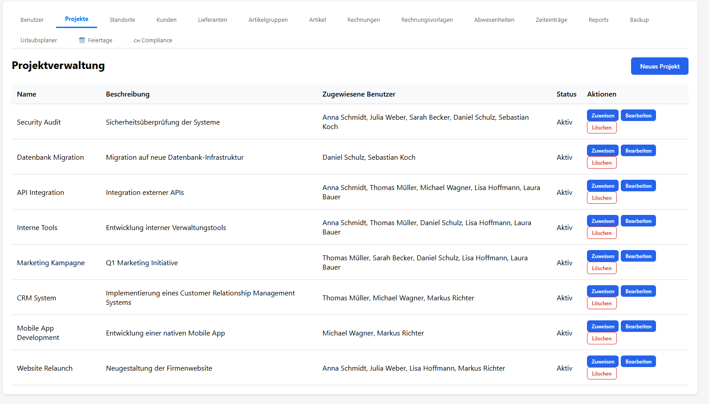

---

### Team & Urlaubsverwaltung

#### 5. Abwesenheits-Verwaltung
Stelle Urlaubsanträge digital und verwalte Abwesenheiten zentral. Admins können Anträge direkt genehmigen oder ablehnen. Der Genehmigungsprozess ist transparent und nachvollziehbar.

---

#### 6. Urlaubsplaner
Der Jahresüberblick zeigt alle Abwesenheiten Ihres Teams in einer Kalenderansicht. Planen Sie Urlaubszeiten optimal und vermeiden Sie Personalengpässe durch intelligente Visualisierung.

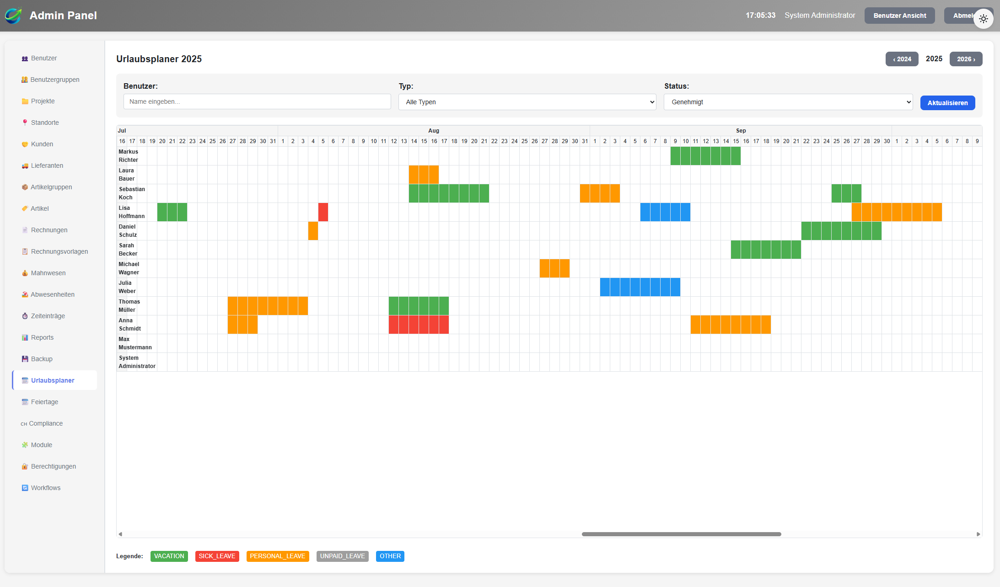

---

#### 7. Feiertags-Planer
Verwalte Feiertage und Sondertermine für verschiedene Standorte. Der Feiertags-Planer berücksichtigt automatisch regionale Unterschiede und erleichtert die Planung.

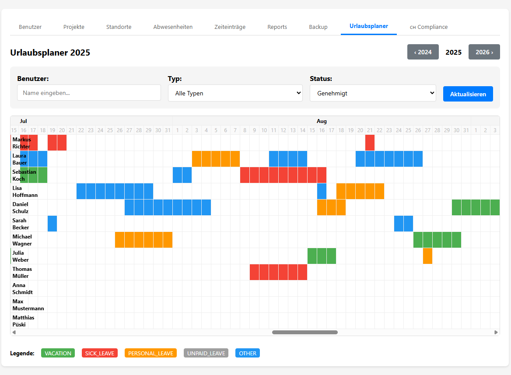

---

#### 8. Benutzerverwaltung
Verwalten Sie alle Benutzer Ihres Teams zentral. Legen Sie Rollen und Berechtigungen fest, passen Sie Urlaubskontingente an und behalten Sie den Überblick über alle Teammitglieder.

---

#### 9. Benutzer bearbeiten
Detaillierte Bearbeitungsansicht für Benutzerprofile. Verwalte Stammdaten, Urlaubskontingente, Berechtigungen und weitere Einstellungen pro Benutzer.

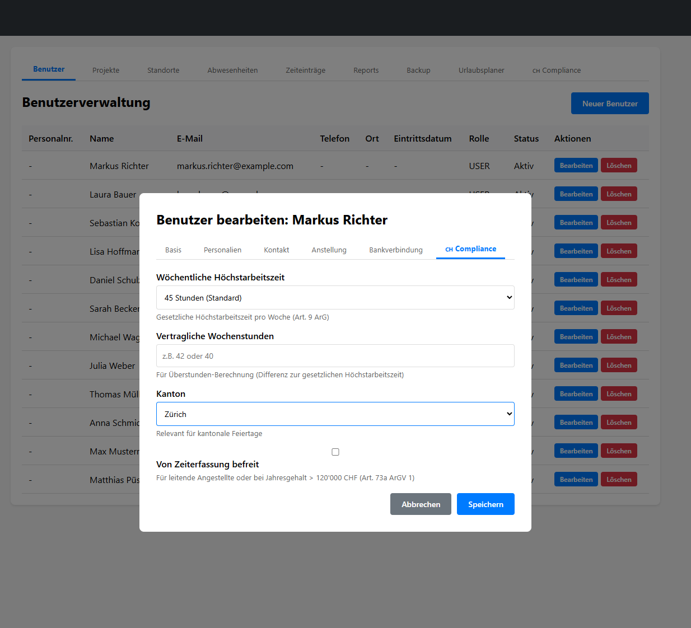

---

### Reporting & Analytics

#### 10. Detaillierte Reports
Erstelle aussagekräftige Reports über Arbeitszeiten, Projektfortschritte und Ressourcenauslastung. Filtere nach Zeitraum, Projekt oder Mitarbeiter und exportiere die Daten für Buchhaltung und Controlling.

---

#### 11. Erweiterte Analysen
Nutze erweiterte Analysefunktionen für tiefere Einblicke. Visualisiere Zeitverteilungen, identifiziere Trends und optimiere deine Ressourcenplanung basierend auf fundierten Daten.

---

### Rechnungsstellung

#### 12. Rechnungsverwaltung
Erstelle und verwalte Rechnungen direkt aus erfassten Arbeitszeiten. Professionelle Rechnungsstellung mit anpassbaren Vorlagen, Artikelverwaltung und automatischer Berechnung.

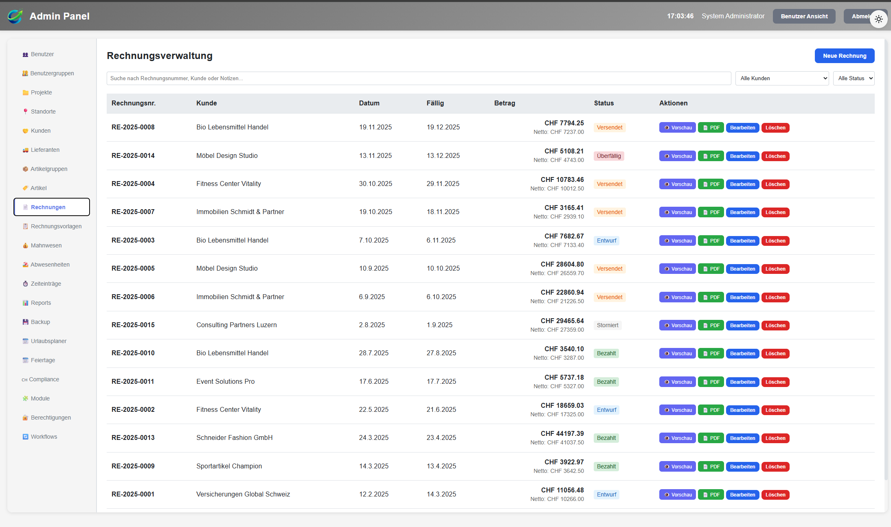

---

#### 13. Rechnungsvorschau
Prüfen Sie Ihre Rechnungen vor dem Versand in einer Live-Vorschau. Zeigt das finale Design mit allen Details – inklusive Logo, Farben und Layout. Direkt druckbar aus dem Browser.

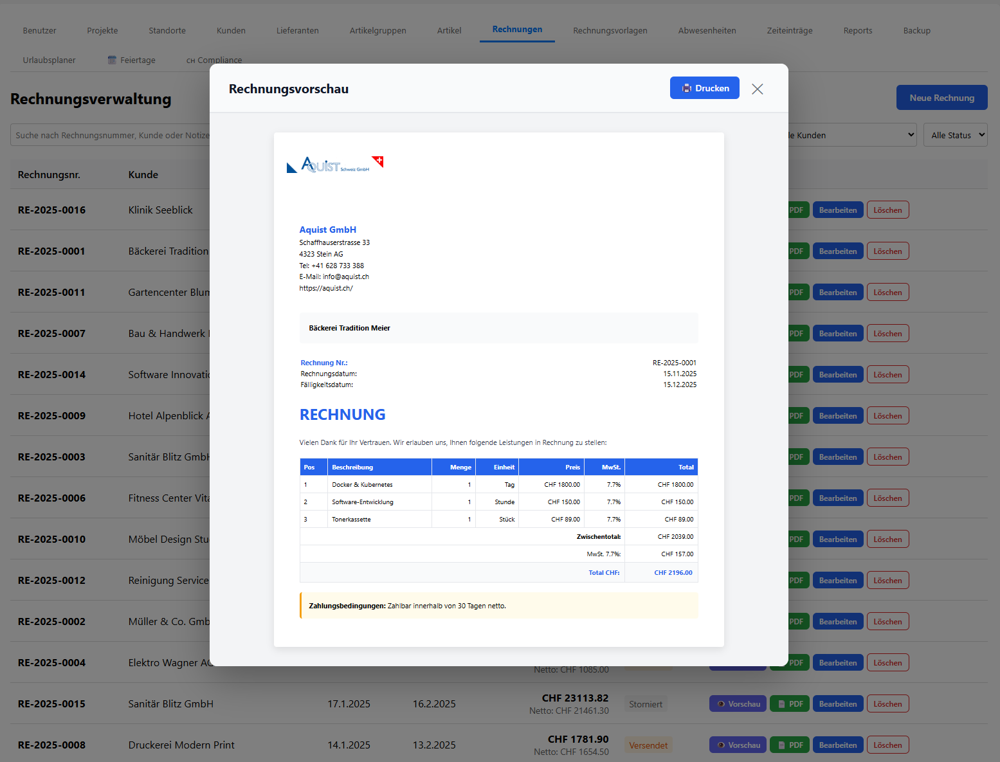

---

#### 14. Rechnungsvorlagen
Gestalten Sie individuelle Rechnungsvorlagen mit visuellem Editor. Platzieren Sie Ihr Logo per Drag & Drop, wählen Sie Farben und passen Sie Texte an – mit Live-Vorschau.

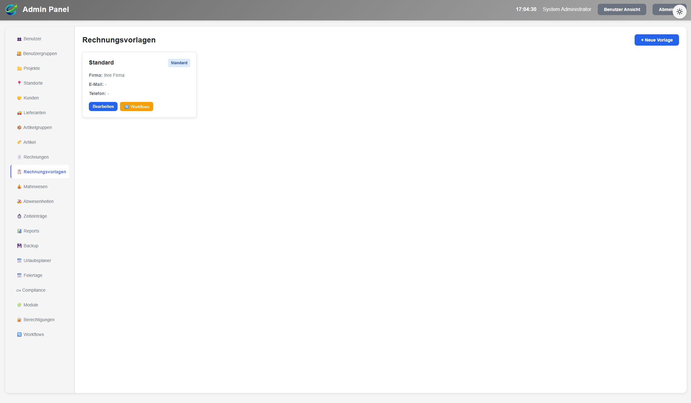

---

#### 15. Artikelverwaltung
Verwalte Artikel, Dienstleistungen und Produkte für deine Rechnungen. Organisiere sie in Gruppen, definiere Preise und MwSt-Sätze zentral.

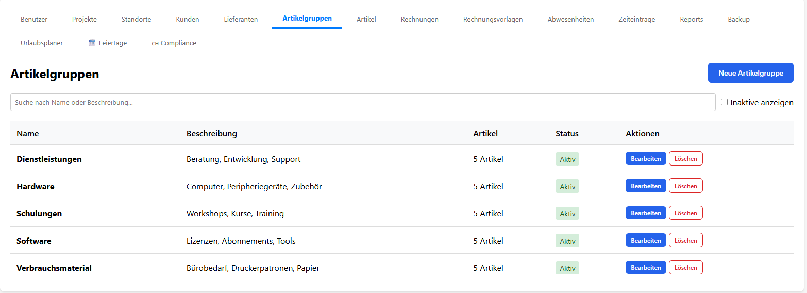

---

#### 16. Artikel bearbeiten
Detaillierte Bearbeitung von Artikeln mit Beschreibung, Preisgestaltung, MwSt-Sätzen und Gruppenzuordnung. Alle Änderungen wirken sich automatisch auf neue Rechnungen aus.

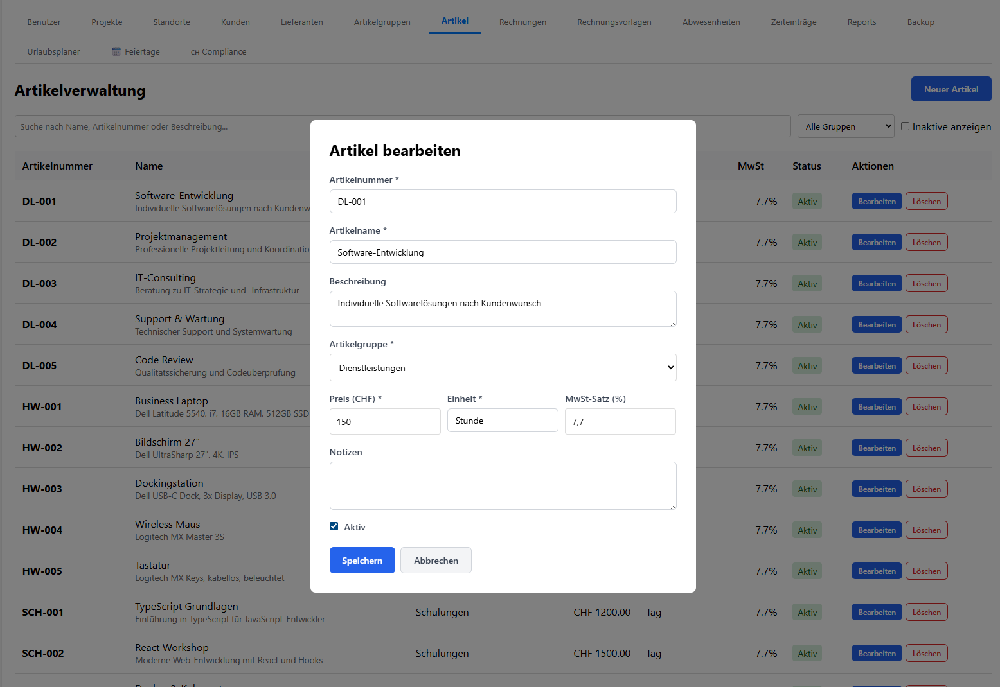

---

#### 17. Kundenverwaltung
Verwalte alle Kundendaten zentral. Speichere Adressen, Kontaktinformationen und Zahlungskonditionen für eine schnelle Rechnungserstellung.

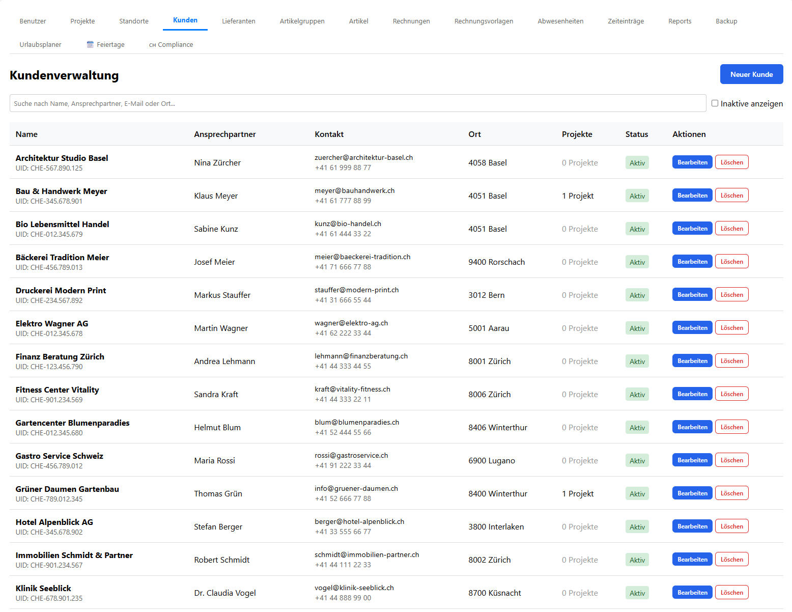

---

### Workflows & Automation

#### 18. Node-basierter Workflow-Editor
Erstelle komplexe Genehmigungsworkflows mit unserem intuitiven Drag & Drop Editor. Ziehe Nodes wie Genehmigungen, E-Mail-Benachrichtigungen, Datums- und Wertbedingungen in den Canvas und verbinde sie visuell. Mit dem Start-Node als klarem Einstiegspunkt und erweiterten Bedingungen (Datumsvergleiche, Betragslogik, UND/ODER-Verknüpfungen) können komplexe Geschäftsprozesse abgebildet werden.

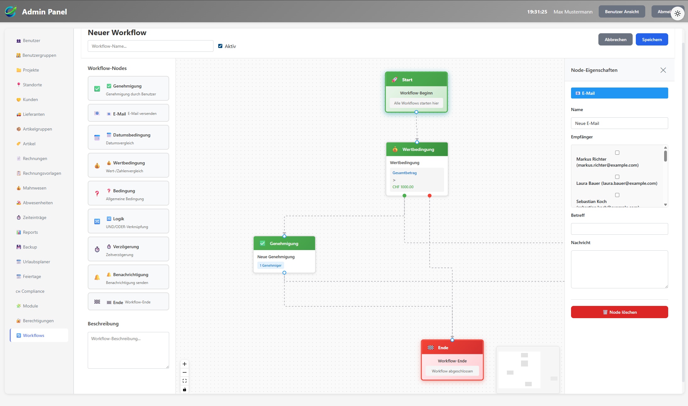

---

### Support & Compliance

#### 19. Backup & Restore
Sichern Sie Ihre Daten regelmäßig mit der integrierten Backup-Funktion. Erstellen Sie vollständige Datenbank-Backups und stellen Sie sie bei Bedarf mit einem Klick wieder her.

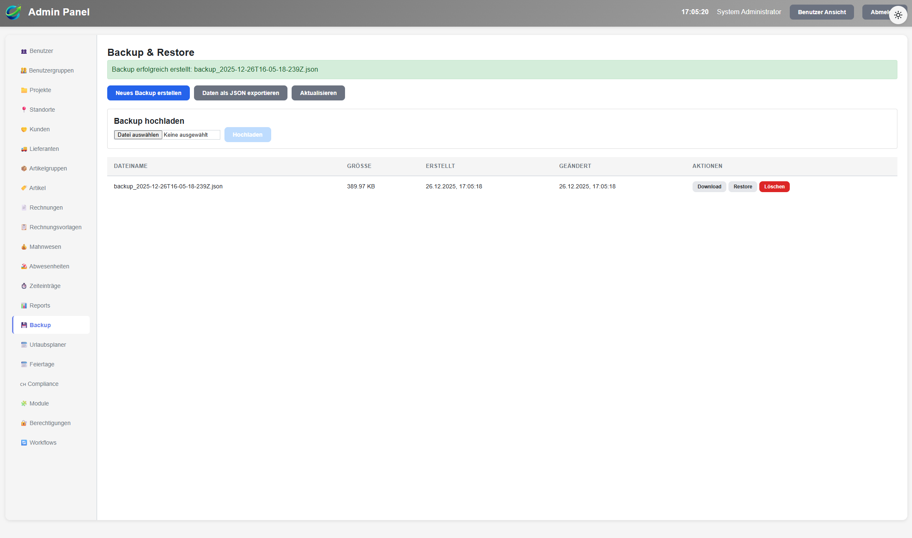

---

#### 20. Incident Management
Verwalten Sie Vorfälle und Incidents strukturiert. Erfassen Sie Probleme, weisen Sie Verantwortliche zu, setzen Sie Prioritäten und tracken Sie den Bearbeitungsstatus. Mit Kategorisierung nach Typ und Schweregrad behalten Sie den Überblick über alle laufenden Incidents.

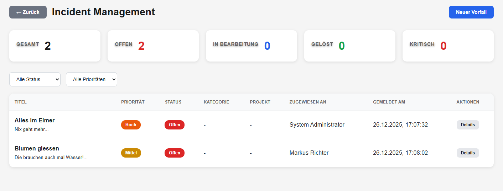

---

#### 21. Neuer Incident
Erstelle neue Incidents mit detaillierten Informationen. Erfasse Titel, Beschreibung, Typ, Priorität und Schweregrad. Weise direkt einen Verantwortlichen zu und definiere einen Fälligkeitstermin für eine effiziente Bearbeitung.

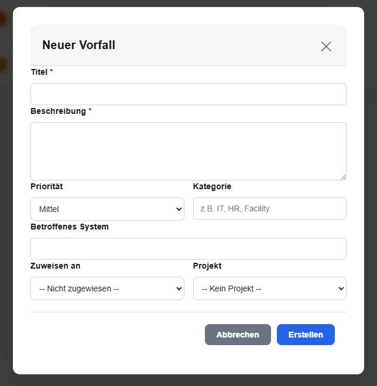

---

#### 22. Swiss Compliance Dashboard
Speziell für Schweizer Unternehmen: Überwache die Einhaltung gesetzlicher Arbeitszeit-Vorschriften. Das Dashboard zeigt Verstöße gegen Ruhezeiten, Überstunden und Pausen automatisch an.

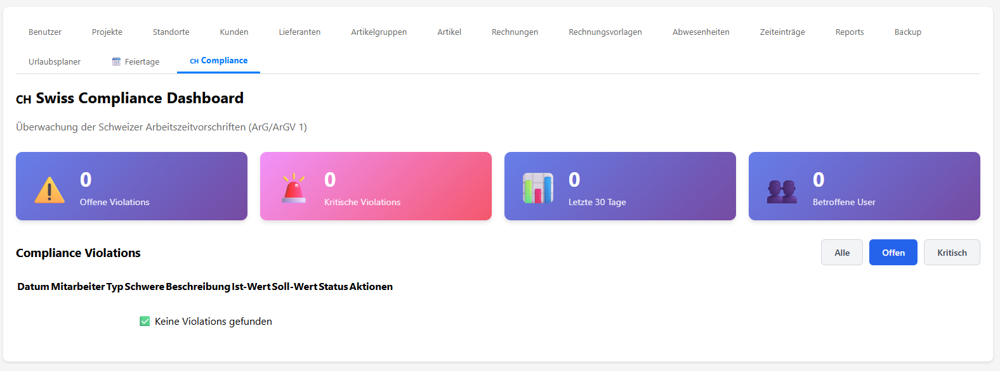

---

#### 23. Compliance Details
Detaillierte Ansicht aller Compliance-Verstöße mit Filteroptionen und Export-Funktion. Identifiziere kritische Fälle und dokumentiere Maßnahmen für Behörden.

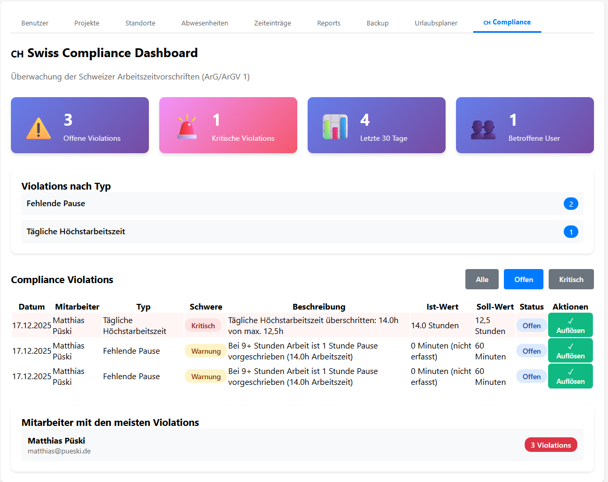

---

## Technische Eigenschaften

### Plattform
- **Webanwendung** - Kein Download erforderlich
- **Browser-basiert** - Läuft in allen modernen Browsern
- **Responsive Design** - Optimiert für Desktop, Tablet und Smartphone
- **Progressive Web App** - Installierbar auf Mobilgeräten

### Technologie
- **Frontend:** React mit TypeScript
- **Backend:** Node.js mit Express
- **Datenbank:** PostgreSQL
- **Containerisierung:** Docker & Docker Compose
- **API:** RESTful JSON API

### Sicherheit
- **Verschlüsselte Übertragung** - HTTPS/SSL
- **Passwort-Hashing** - bcrypt mit Salt
- **JWT-Authentication** - Sichere Token-basierte Anmeldung
- **DSGVO-konform** - Volle Datenkontrolle
- **Backup-Funktion** - Regelmäßige Datensicherung
- **Rollen-basierte Zugriffskontrolle** - Granulare Berechtigungen

### Integration
- **Email-Versand** - SMTP-Integration für Benachrichtigungen
- **PDF-Generierung** - Server-seitige Rechnungs-PDFs
- **Export-Funktionen** - CSV, Excel, PDF
- **API-Zugriff** - RESTful API für Integrationen

---

## Einsatzszenarien

### Kleine Unternehmen (5-20 Mitarbeiter)
- Einfache Zeiterfassung ohne Overhead
- Urlaubsverwaltung digital
- Rechnungsstellung an Kunden
- Projektbasierte Abrechnung

### Mittelständische Unternehmen (20-100 Mitarbeiter)
- Multi-Projekt-Management
- Abteilungs-übergreifende Workflows
- Compliance-Überwachung
- Detaillierte Auswertungen

### Dienstleister & Agenturen
- Stundenbasierte Abrechnung
- Kunden- und Projektverwaltung
- Workflow-Automatisierung
- Professionelle Rechnungsstellung

### Schweizer Unternehmen
- Swiss Compliance mit ArG/ArGV 1
- Automatische Violations-Erkennung
- Kantonale Feiertage
- Überstunden-Tracking

---

## Erste Schritte

### 1. Kostenlos testen
14 Tage kostenlos testen – keine Kreditkarte erforderlich

**Kontakt:** info@cflux.org

### 2. Setup wählen
- **Cloud-Hosted:** Sofort starten, wir übernehmen alles
- **Self-Hosted:** Installation auf eigener Infrastruktur

### 3. Benutzer anlegen
- Admin-Account erstellen
- Team-Mitglieder einladen
- Rollen und Berechtigungen festlegen

### 4. System konfigurieren
- Projekte anlegen
- Standorte definieren
- Rechnungsvorlagen erstellen
- Workflows einrichten

### 5. Loslegen
- Zeiterfassung starten
- Erste Rechnungen erstellen
- Reports generieren
- Workflows aktivieren

---

## Support & Kontakt

### Email-Support
**Support:** support@cflux.org  
**Allgemein:** info@cflux.org  
**Vertrieb:** sales@cflux.org

### Verfügbarkeit
- **Cloud-Hosted:** 99,9% Uptime
- **Support-Zeiten:** Mo-Fr 9:00-17:00 (CET)
- **Notfall-Support:** Verfügbar für Enterprise-Kunden

### Dokumentation
- Vollständige Benutzer-Dokumentation
- Video-Tutorials
- FAQ und Knowledge Base
- API-Dokumentation

---

## Rechtliches

### Datenschutz
- DSGVO-konform
- Datenverarbeitung in der EU
- Keine Weitergabe an Dritte
- Vollständige Datenkontrolle

### Sicherheit
- ISO 27001 orientiert
- Regelmäßige Security-Audits
- Verschlüsselte Datenübertragung
- Backup-Strategie

### Impressum
**Betreiber:** Matthias Püski  
**Website:** https://cflux.org  
**Jahr:** 2025

---

## Fazit

cflux ist die ideale Lösung für Unternehmen, die eine moderne, intuitive und leistungsstarke ERP- und Zeiterfassungslösung suchen. Mit unbegrenzten Benutzern, allen Features inklusive und einem fairen Preis-Leistungs-Verhältnis bietet cflux alles, was Sie für effizientes Team-Management benötigen.

### Warum cflux?

✅ **Einfach** - Intuitive Bedienung ohne Schulungsaufwand  
✅ **Komplett** - Alle Features ohne Zusatzkosten  
✅ **Fair** - Ein Preis für unbegrenzte Benutzer  
✅ **Sicher** - DSGVO-konform und verschlüsselt  
✅ **Modern** - Aktuelle Technologien und Design  
✅ **Flexibel** - Cloud oder Self-Hosted  
✅ **Zuverlässig** - 99,9% Uptime garantiert  
✅ **Transparent** - Keine versteckten Kosten

### Jetzt starten

**14 Tage kostenlos testen**  
Keine Kreditkarte erforderlich

📧 **Kontakt:** info@cflux.org  
🌐 **Website:** https://cflux.org

---

*Stand: Dezember 2025*  
*© 2025 Matthias Püski. Alle Rechte vorbehalten.*
